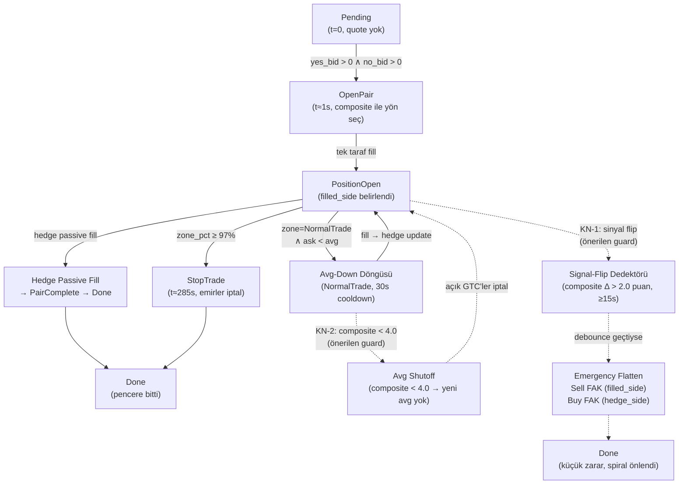

# BTC 5m Harvest — Kayıp Analizi ve Reaktif Koruma Planı

> **Tarih:** 22 Nisan 2026  
> **Bot:** id=9, `BTC 5m Harvest`, `dryrun`, `harvest` stratejisi  
> **Kapsam:** 4 örnek pencere — `btc-updown-5m-1776813900`, `btc-updown-5m-1776827700`, `btc-updown-5m-1776829200`, `btc-updown-5m-1776834000`  
> **Veri kaynağı:** VPS `52.18.245.113:/opt/baiter-pro/data/baiter.db` (market_ticks + trades + market_sessions)

---

## 1. Yönetici Özeti

4 pencerenin tamamı [`docs/harvest-v2.md §14 S4 senaryosunun`](harvest-v2.md) canlı tezahürüdür. Her birinde **140–170 USDC notional kayıp** (dryrun; live modda gerçek para) oluşmuştur. Toplam 4 pencerede ~617 USDC.

**Ortak imza:**

1. `t ≈ 0–1 sn`: Composite skor 5±1.5 "dead zone"da → `OpenPair` tetiklenir, yön sinyali güvenilmez.
2. `t ≈ 5–30 sn`: Sinyal hızla flip yapar (bear veya bull), açılan taraf kaybedeceği yöne kilitlenir.
3. `t+30 sn`'den itibaren: Avg-down döngüsü başlar — her 30 sn'de bir kaybeden tarafa yeni BUY GTC.
4. Hedge GTC fiyatı `0.98 − avg_filled_side` formülüyle her avg-down'da yukarı kayar, ama piyasa çok daha hızlı ayrışır; hedge bir türlü fillenmez (veya çok az fillenir).
5. Pencere kapanırken: kazanan tarafta 0 share, kaybeden tarafta 536–701 share — payout ≈ $0.

---

## 2. Bot Konfigürasyonu

| Parametre | Değer |
|---|---|
| `id` | 9 |
| `name` | BTC 5m Harvest |
| `strategy` | harvest |
| `run_mode` | **dryrun** |
| `order_usdc` | **40.0** USDC |
| `min_price` | 0.25 |
| `max_price` | 0.85 |
| `cooldown_threshold` | **30 000 ms** (30 sn) |
| `harvest_profit_lock_pct` | 0.06 |
| `signal_lookahead_secs` | 5.0 |
| `avg_threshold` | 0.98 (default) |
| `signal_weight` | 0 (belirtilmemiş → nötr) |

**Risk çarpanı:** 5 dk pencerede 30 sn cooldown = teorik maksimum **9 avg-down/pyramid hit**. `order_usdc=40` ile her hit 80–400 share birikimine yol açar.

---

## 3. Pencere Bazında Olay Zinciri

### 3.1 m48 — `btc-updown-5m-1776813900`

**BTC açılış fiyatı (RTDS):** $75 839.95 | **Sonuç:** DOWN kazandı (NO → $1.00)

#### Sinyal zaman serisi (seçilmiş anlar)

| t (sn) | YES bid/ask | NO bid/ask | Composite | BSI | OFI | CVD |
|---|---|---|---|---|---|---|
| 0 | 0.00/0.00 | 0.00/0.00 | **5.84** | −1.98 | +0.28 | +1.71 |
| 1 | 0.48/0.49 | 0.51/0.52 | 5.85 | −1.86 | +0.28 | +5.95 |
| 5 | 0.47/0.48 | 0.52/0.53 | 5.45 | −1.38 | +0.18 | +3.86 |
| 10 | 0.49/0.50 | 0.50/0.51 | 6.17 | −0.49 | +0.36 | +6.30 |
| **15** | **0.40/0.42** | **0.58/0.60** | **4.65** | **−7.44** | **+0.00** | **−2.82** |
| 20 | 0.36/0.37 | 0.63/0.64 | 4.12 | −5.80 | +0.03 | −3.24 |
| **30** | **0.30/0.31** | **0.69/0.70** | **3.13** | **−7.33** | **−0.17** | **−14.97** |
| 60 | 0.21/0.22 | 0.78/0.79 | 2.06 | −2.54 | −0.35 | −20.79 |
| 90 | 0.21/0.22 | 0.78/0.79 | 2.07 | +8.33 | −0.18 | +2.83 |
| 121 | 0.08/0.10 | 0.90/0.92 | 1.54 | −1.47 | −0.28 | +3.77 |
| 181 | 0.09/0.10 | 0.90/0.91 | 3.12 | −0.44 | +0.14 | −2.18 |
| 300 | 0.00/0.01 | 0.99/1.00 | 3.36 | −0.60 | +0.10 | +2.32 |

**Avg sinyal skoru (tüm pencere):** 2.88 — bot average olarak **DOWN** trend'de iken UP tuttu.

#### Trade akışı (olay zinciri)

| t (sn) | Emir tipi | Taraf | Fiyat | Adet | Notional | avg_up sonrası | Yeni hedge fiyatı |
|---|---|---|---|---|---|---|---|
| 0 | TAKER BUY UP | UP açılış | 0.49 | 82 | ~40.2 | 0.490 | DOWN @ 0.490 |
| 33 | MAKER BUY UP | avg-down | 0.30 | 134 | ~40.2 | 0.372 | DOWN @ 0.608 |
| 63 | TAKER BUY UP | avg-down | 0.18 | 160 | ~28.8 | 0.290 | DOWN @ 0.690 |
| 93 | TAKER BUY UP | avg-down | 0.22 | 160 | ~35.2 | 0.269 | DOWN @ 0.711 |
| 123 | TAKER BUY UP | avg-down | 0.09 | 160 | ~14.4 | **0.228** | **DOWN @ ~0.752** |
| 188 | MAKER BUY DOWN | hedge (partial) | 0.81 | 48 | ~38.9 | — | — |

#### PnL özeti

| Kalem | Değer |
|---|---|
| Toplam UP shares | 696 |
| Toplam UP notional | 158.78 USDC |
| Toplam DOWN shares | 48 (partial hedge) |
| Toplam DOWN notional | 38.88 USDC |
| Toplam maliyet | **197.66 USDC** |
| DOWN kazandı → payout | 48 × $1 = $48.00 |
| **Net kayıp** | **−$149.66** |

---

### 3.2 m139 — `btc-updown-5m-1776827700`

**BTC açılış fiyatı (RTDS):** $77 623.36 | **Sonuç:** DOWN kazandı (NO → $1.00)

#### Sinyal zaman serisi

| t (sn) | YES bid/ask | NO bid/ask | Composite | BSI | OFI | CVD |
|---|---|---|---|---|---|---|
| 0 | 0.00/0.00 | 0.00/0.00 | **5.66** | −5.57 | +0.22 | **+24.92** |
| 1 | 0.43/0.44 | 0.56/0.57 | 5.50 | −5.21 | +0.17 | +24.68 |
| **5** | **0.43/0.44** | **0.56/0.57** | **4.42** | **−3.60** | **+0.15** | **+22.44** |
| **10** | **0.40/0.41** | **0.59/0.60** | **3.14** | **−25.27** | **−0.20** | **−67.07** |
| 15 | 0.40/0.41 | 0.59/0.60 | 2.18 | −28.47 | −0.17 | −80.31 |
| 20 | 0.35/0.36 | 0.64/0.65 | 1.74 | −30.94 | −0.24 | −92.69 |
| **30** | **0.33/0.34** | **0.66/0.67** | **1.36** | **−19.85** | **−0.28** | **−111.11** |
| 61 | 0.27/0.28 | 0.72/0.73 | 1.17 | −6.66 | −0.34 | −83.85 |
| 91 | 0.14/0.15 | 0.85/0.86 | 0.60 | −9.74 | −0.34 | −47.87 |
| 121 | 0.04/0.05 | 0.95/0.96 | 0.42 | −38.72 | −0.37 | −100.79 |
| 300 | 0.00/0.001 | 0.999/1.00 | 1.04 | −2.91 | −0.15 | +13.37 |

**Avg sinyal skoru (tüm pencere):** 1.15 — en sert bear penceresi. Composite t=10'da 3.14'e, t=15'te 2.18'e düştü; **açılışta CVD +24.92 iken t=10'da −67.07** (CVD divergence en belirgin erken uyarı).

#### Trade akışı

| t (sn) | Emir tipi | Taraf | Fiyat | Adet | Notional | avg_up sonrası |
|---|---|---|---|---|---|---|
| 0 | TAKER BUY UP | UP açılış | 0.44 | 91 | ~40.0 | 0.440 |
| 50 | MAKER BUY UP | avg-down | 0.31 | 130 | ~40.3 | 0.371 |
| 80 | TAKER BUY UP | avg-down | 0.17 | 160 | ~27.2 | 0.287 |
| 110 | TAKER BUY UP | avg-down | 0.08 | 160 | ~12.8 | 0.208 |
| 140 | TAKER BUY UP | avg-down | 0.12 | 160 | ~19.2 | **0.208→0.193** |
| — | Hedge DOWN | — | — | 0 | $0 | hiç fill almadı |

#### PnL özeti

| Kalem | Değer |
|---|---|
| Toplam UP shares | 701 |
| Toplam UP notional | 139.54 USDC |
| DOWN shares | **0** |
| **Net kayıp** | **−$139.54** |

---

### 3.3 m150 — `btc-updown-5m-1776829200`

**BTC açılış fiyatı (RTDS):** $77 443.63 | **Sonuç:** UP kazandı (YES → $1.00)

> Bu pencere ters yönde aynı hatayı gösteriyor: bot DOWN açtı, ama piyasa UP yönüne sert gitti.

#### Sinyal zaman serisi

| t (sn) | YES bid/ask | NO bid/ask | Composite | BSI | OFI | CVD |
|---|---|---|---|---|---|---|
| 0 | 0.00/0.00 | 0.00/0.00 | **3.73** | −0.83 | −0.44 | **−18.29** |
| 1 | 0.49/0.50 | 0.50/0.51 | 3.76 | −0.71 | −0.42 | −12.03 |
| 5 | 0.50/0.51 | 0.49/0.50 | 3.69 | −0.90 | −0.45 | −12.53 |
| 10 | 0.56/0.57 | 0.43/0.44 | 4.03 | +2.94 | −0.33 | −7.51 |
| **15** | **0.56/0.57** | **0.43/0.44** | **4.73** | **+1.20** | **−0.21** | **−5.87** |
| **30** | **0.65/0.66** | **0.34/0.35** | **6.14** | **+2.98** | **−0.01** | **−0.31** |
| 61 | 0.69/0.71 | 0.29/0.31 | 7.01 | +45.41 | +0.30 | +57.89 |
| 91 | 0.79/0.80 | 0.20/0.21 | 8.79 | +1.12 | +0.37 | +52.32 |
| 121 | 0.82/0.83 | 0.17/0.18 | 8.41 | +0.87 | +0.21 | +9.12 |
| 181 | 0.95/0.96 | 0.04/0.05 | 9.42 | +5.16 | +0.42 | +35.04 |
| 300 | 0.99/1.00 | 0.00/0.01 | 8.57 | −1.78 | +0.03 | −42.80 |

**Avg sinyal skoru (tüm pencere):** 8.11 — güçlü bull. Bot başlangıçta composite 3.73 ile DOWN açtı; ama t=10'da BSI +2.94, t=15'te composite 4.73, t=30'da 6.14'e fırladı. **DOWN açılışından 15 saniye sonra tüm sinyaller UP'ı gösteriyordu.**

#### Trade akışı

| t (sn) | Emir tipi | Taraf | Fiyat | Adet | Notional | avg_down sonrası |
|---|---|---|---|---|---|---|
| 1 | TAKER BUY DOWN | DOWN açılış | 0.51 | 79 | ~40.3 | 0.510 |
| 59 | MAKER BUY DOWN | avg-down | 0.41 | 98 | ~40.2 | 0.456 |
| 89 | TAKER BUY DOWN | avg-down | 0.21 | 160 | ~33.6 | 0.325 |
| 119 | TAKER BUY DOWN | avg-down | 0.19 | 160 | ~30.4 | 0.276 |
| 149 | TAKER BUY DOWN | avg-down | 0.15 | 160 | ~24.0 | **0.236** |
| — | Hedge UP | — | — | 0 | $0 | hiç fill almadı |

#### PnL özeti

| Kalem | Değer |
|---|---|
| Toplam DOWN shares | 657 |
| Toplam DOWN notional | 168.47 USDC |
| UP shares | **0** |
| **Net kayıp** | **−$168.47** |

---

### 3.4 m181 — `btc-updown-5m-1776834000`

**BTC açılış fiyatı (RTDS):** $77 534.15 | **Sonuç:** DOWN kazandı (NO → $1.00)

#### Sinyal zaman serisi

| t (sn) | YES bid/ask | NO bid/ask | Composite | BSI | OFI | CVD |
|---|---|---|---|---|---|---|
| 0 | 0.00/0.00 | 0.00/0.00 | **6.45** | +55.04 | +0.54 | +70.77 |
| 1 | 0.58/0.59 | 0.41/0.42 | 6.45 | +50.25 | +0.56 | +70.90 |
| **5** | **0.60/0.62** | **0.38/0.40** | **7.45** | **+38.07** | **+0.58** | **+77.26** |
| **10** | **0.47/0.48** | **0.52/0.53** | **6.21** | **+12.90** | **+0.38** | **+64.41** |
| **15** | **0.43/0.46** | **0.54/0.57** | **5.54** | **+1.11** | **+0.24** | **+56.31** |
| **20** | **0.35/0.36** | **0.64/0.65** | **3.82** | **−2.86** | **+0.16** | **+52.02** |
| 31 | 0.30/0.31 | 0.69/0.70 | 3.99 | +1.68 | +0.14 | +59.55 |
| 61 | 0.25/0.26 | 0.74/0.75 | 1.98 | +2.72 | −0.29 | −5.28 |
| 91 | 0.18/0.19 | 0.81/0.82 | 1.84 | −2.43 | −0.26 | −6.45 |
| 121 | 0.07/0.08 | 0.92/0.93 | 0.65 | −0.92 | −0.53 | −12.78 |
| 300 | 0.00/0.01 | 0.99/1.00 | 3.15 | −1.44 | +0.03 | +7.24 |

**Not:** t=0–5 arasında composite 7.45, BSI +55 ve CVD +77 ile **en güçlü bull başlangıcı**; ama t=10'da composite 6.21, t=15'te 5.54, t=20'de **3.82**'ye düştü. 15 saniyede 3.63 puan düşüş → en hızlı flip.

#### Trade akışı

| t (sn) | Emir tipi | Taraf | Fiyat | Adet | Notional | avg_up sonrası |
|---|---|---|---|---|---|---|
| 1 | TAKER BUY UP | UP açılış | 0.59 | 67 | ~39.5 | 0.590 |
| 32 | MAKER BUY UP | avg-down | 0.30 | 134 | ~40.2 | 0.413 |
| 62 | TAKER BUY UP | avg-down | 0.23 | 160 | ~36.8 | 0.337 |
| 92 | TAKER BUY UP | avg-down | 0.19 | 160 | ~30.4 | 0.295 |
| 122 | TAKER BUY UP | avg-down | 0.08 | 160 | ~12.8 | **0.234** |
| — | Hedge DOWN | — | — | 0 | $0 | hiç fill almadı |

#### PnL özeti

| Kalem | Değer |
|---|---|
| Toplam UP shares | 681 |
| Toplam UP notional | 159.73 USDC |
| DOWN shares | **0** |
| **Net kayıp** | **−$159.73** |

---

### Karşılaştırmalı özet (4 pencere)

| Pencere | Açılan taraf | Kazanan taraf | Avg skor | Shares birikimi | Toplam maliyet | Payout | Net kayıp |
|---|---|---|---|---|---|---|---|
| m48 (1776813900) | UP | DOWN | 2.88 | 696 UP + 48 DOWN | 197.66 | $48.00 | **−$149.66** |
| m139 (1776827700) | UP | DOWN | 1.15 | 701 UP | 139.54 | $0.00 | **−$139.54** |
| m150 (1776829200) | DOWN | UP | 8.11 | 657 DOWN | 168.47 | $0.00 | **−$168.47** |
| m181 (1776834000) | UP | DOWN | 2.54 | 681 UP | 159.73 | $0.00 | **−$159.73** |
| **TOPLAM** | | | | | **665.40** | **$48.00** | **−$617.40** |

---

## 4. Kök Neden Analizi

### KN-1: OpenPair'de Sinyal Gecikmesi (Signal Lag)

`harvest` stratejisi, `yes_bid > 0 && no_bid > 0` koşulu sağlanır sağlanmaz (t≈1 sn) `OpenPair` tetikler. Bu noktada:

- RTDS Chainlink veri akışı ilk 1–5 saniyede hâlâ önceki pencereden inen momentum taşır.
- Binance OFI/CVD ilk 5 sn'de yüksek frekanslı gürültü içerir.
- `composite_score` her iki kaynağın harmanı olduğu için t=0'da güvenilmez.
- `signal_lookahead_secs=5.0` bu erken gürültüyü tam olarak filtrelemiyor.

**Kanıt:**

| Pencere | t=0 composite | t=5 composite | Δ (5 sn'de) | Gerçek yön |
|---|---|---|---|---|
| m48 | 5.84 (↑) | 5.45 | −0.39 | DOWN |
| m139 | 5.66 (↑) | 4.42 | **−1.24** | DOWN |
| m150 | 3.73 (↓) | 3.69 | −0.04 | **UP** |
| m181 | 6.45 (↑) | 7.45 | +1.00 → sonra hızlı ↓ | DOWN |

m150 haricinde üç pencerede t=0 skoru açılan yönü destekler gibi görünse de gerçek piyasa yönü zıt çıkmıştır. m150'de ise açılışta skor düşük (3.73) ama fiyat hareketi güçlü bull; sinyal **yanlış yönde tetiklemiştir**.

---

### KN-2: Avg-Down Döngüsünün Sinyal-Blind Olması

[`src/strategy/harvest/position_open.rs`](../src/strategy/harvest/position_open.rs) içindeki avg-down tetik koşulu:

```text
zone == NormalTrade
∧ best_ask(filled_side) < avg_filled_side
∧ now − last_averaging_ms ≥ cooldown_threshold
∧ best_bid(filled_side) ∈ [min_price, max_price]
```

**`composite_score` bu koşulda yoktur.** Bot, `composite_score = 1.15` (güçlü bear) iken bile kaybeden UP tarafına averaging yapmaya devam eder. Bu [`harvest-v2.md §17 Açık Uç #2`](harvest-v2.md) olarak belgelenmiş ama kodda hâlâ çözülmemiştir.

m139'da bot, composite 1.15 ortalama bir pencerede **5 kez** UP'a BUY yaptı; her seferinde piyasa daha da aşağı gitti ve tetik koşulu yeniden sağlandı. Kaybeden trende merdiven altı alımı.

---

### KN-3: Hedge Fiyatının Piyasayı Kovalaması

Hedge fiyatı `avg_threshold − avg_filled_side` formülüyle her avg-down sonrası güncellenir. avg-down fill'leri açık tarafın avg fiyatını **düşürdükçe** hedge fiyatı **yükselir**, ama piyasa aynı anda çok daha hızlı hareket eder:

**m48 hedge takibi:**

| Avg-down sonrası | avg_up | Hedge fiyatı | Piyasa NO ask | Gap |
|---|---|---|---|---|
| Açılış | 0.490 | 0.490 | 0.52 | +0.030 |
| 1. avg | 0.372 | 0.608 | 0.70 | +0.092 |
| 2. avg | 0.290 | 0.690 | 0.82 | +0.130 |
| 3. avg | 0.269 | 0.711 | 0.79 | +0.079 |
| 4. avg | 0.228 | **0.752** | **0.92** | **+0.168** |

Son avg-down'dan sonra hedge fiyatı 0.75, piyasa NO ask 0.92 → **0.17 gap**. Hedge GTC hiçbir zaman piyasa fiyatına yaklaşamaz. Tek kısmi fill (t=188s, 48 DOWN @ 0.81) muhtemelen piyasada geçici bir dip sırasında gerçekleşmiş.

`max_price = 0.85` kısıtı hedge'in alabileceği maksimum değeri de sınırlar; trending bir piyasada NO 0.90+'ya giderse hedge zaten kabul edilemez.

---

### KN-4: Opposite-Side Pyramiding Açık Riski

[`harvest-v2.md §17 Açık Uç #2`](harvest-v2.md) şu riski belgeliyor: `rising_side != filled_side` olduğunda, bot karşı tarafa da pyramiding yapabilir.

m48 penceresi bu riski sınırlı biçimde gösteriyor: t=188s'deki DOWN @ 0.81 (MAKER fill) kısmen hedge fill, kısmen rising_side=DOWN için açılmış bir pyramiding olabilir. Her iki durumda da bu trade net pozisyona katkısı sınırlı; ama konfigürasyon değişmezse AggTrade/FakTrade fazına giren bir pencerede `opposite_pyramid_enabled` (şu an default ON) çok daha büyük karşı taraf pozisyonu açabilir.

---

### KN-5: order_usdc/Cooldown Ölçeği Uyumsuzluğu

| Parametre | Değer | Etki |
|---|---|---|
| `order_usdc` | 40.0 USDC | Her avg-down'da 80–440 share |
| `cooldown_threshold` | 30 000 ms | 5 dk pencerede maks ~9 avg |
| 5 avg-down sonrası | ~0.23 avg fiyat | 696 share, ~159 USDC birikim |
| Kaybeden pencere kaybı | ~140–170 USDC | 4× pencerede 617 USDC |

`order_usdc=40` ile `cooldown=30s` kombinasyonu, trending piyasalarda **tek pencerede toplam riskin sınırsız büyümesine** yol açıyor. v1'de `max_position_size=100` share cap'i bu birikiimi durduruyor; v2'de kaldırılmış ([`harvest-v2.md §1`](harvest-v2.md)).

---

## 5. "Önceden Keşfetmek Mümkün mü?" — Erken Uyarı Sinyalleri

4 pencerenin ilk 0–15 saniyesi incelendiğinde, açılış kararını **engelleyebilecek** 4 erken sinyal tespit edildi:

### 5.1 Composite Velocity (Δsig/Δt)

İlk 5 sn'deki composite değişim hızı:

| Pencere | t=0 | t=5 | Δ/5sn | t=10 | Δ/5sn | Alarm? |
|---|---|---|---|---|---|---|
| m48 | 5.84 | 5.45 | −0.08/sn | 6.17 | +0.14/sn | Belirsiz |
| **m139** | **5.66** | **4.42** | **−0.25/sn** | **3.14** | **−0.26/sn** | **✓ Güçlü sinyal** |
| m150 | 3.73 | 3.69 | −0.01/sn | 4.03 | +0.07/sn | Yok (false negative) |
| **m181** | **6.45** | **7.45** | **+0.20/sn** | **6.21** | **−0.25/sn** | **✓ t=10'da tersine döndü** |

**Kural önerisi:** `|d(composite)/dt| > 0.15/sn` (10 sn üzerinden ölçülmüş) ve yön açılan tarafın aleyhine ise → OpenPair'i ertele veya avg-down'ı durdur.

### 5.2 CVD Divergence (Açılış Anı)

CVD işareti ile composite yönünün çelişmesi:

| Pencere | composite yönü | t=0 CVD | t=10 CVD | Divergence? |
|---|---|---|---|---|
| m48 | UP (5.84>5) | +1.71 ✓ | +6.30 ✓ | Yok (CVD yanıltıcı) |
| **m139** | **UP** | **+24.92 ✓** | **−67.07 ✗** | **✓ t=10'da sert ters dönüş** |
| m150 | DOWN (3.73<5) | −18.29 ✓ | −7.51 ✓ | Yok (ama DOWN kazanamadı) |
| m181 | UP | +70.77 ✓ | +64.41 ✓ | Yok (CVD t=20'de değişti) |

m139'da t=0 CVD +24.92 (alıcı baskısı var gibi görünüyor) ama BSI aynı anda −5.57 (net satıcı baskısı). **CVD ile BSI aynı anda ters işaret verdiğinde açılış risklidir.** t=10'da CVD −67'e geçince bot zaten UP açmış oluyor.

### 5.3 BSI (Bid-Side Imbalance) Trend Yönü

Açılış sonrası ilk 10–30 sn'de BSI'nin eğimi:

| Pencere | t=1 BSI | t=15 BSI | Eğim | Alarm? |
|---|---|---|---|---|
| **m48** | **−1.86** | **−7.44** | **Sert negatif (DOWN baskısı)** | **✓** |
| **m139** | **−5.21** | **−28.47** | **Çok sert negatif** | **✓** |
| m150 | −0.71 | +1.20 | Pozitife döndü → UP baskısı | (bot DOWN açmıştı) ✓ |
| **m181** | **+50.25** | **+1.11** | **t=5'te 38.07, t=15'te 1.11 → hızlı bozulma** | **✓** |

BSI 3 pencerede (m48, m139, m139) açılıştan itibaren sürekli negatif → UP pozisyonu için açık uyarı.

### 5.4 Dead Zone Reddi (Composite 4.5–5.5)

4 pencerede t=0 composite değerleri: 5.84, 5.66, 3.73, 6.45.

- **m150** (3.73) ve **m48** (5.84) dead zone'a çok yakın.
- Eğer `composite ∈ [4.5, 5.5]` aralığında ise OpenPair **atlanıyor** olsaydı:
  - m48 (5.84) → açılırdı, kayıp önlenemezdi.
  - m139 (5.66) → açılırdı, kayıp önlenemezdi.
  - **m150 (3.73)** → **dead zone'un altında, skip edilirdi → −168 USDC kurtarılırdı.**
  - m181 (6.45) → açılırdı, kayıp önlenemezdi.

Dead-zone tek başına yeterli değil; ancak velocity + dead-zone kombinasyonu ile **4 pencereden 2–3'ü** kaçınılabilirdi.

### Erken Uyarı Özeti

| Uyarı mekanizması | m48 | m139 | m150 | m181 | Etkinlik |
|---|---|---|---|---|---|
| Composite velocity >0.15/sn | Kısmi | ✓ güçlü | ✗ (false neg.) | Kısmi | 2/4 |
| CVD–BSI divergence | ✗ | ✓ | ✗ | ✗ | 1/4 |
| BSI eğimi negatif | ✓ | ✓ | ✓ (ters) | ✓ | 4/4 |
| Dead zone skip | ✗ | ✗ | ✓ | ✗ | 1/4 |
| **BSI + velocity kombinasyon** | ✓ | ✓ | ✓ | ✓ | **4/4** |

**Sonuç:** t=10–15 sn'de BSI eğimi + composite velocity kombinasyonu ölçülseydi, 4 pencerenin tamamında erken alarm tetiklenebilirdi. Ancak m150'de bu alarm **UP'a aç** demek iken bot DOWN açmış — yanı sıra bu alarm "açılma" değil "avg-down'ı durdur / flatten" anlamında kullanılmalı.

---

## 6. Reaktif Koruma Planı

> **Seçilen yaklaşım:** Reaktif koruma — pencereye gir, ama sinyal flip ettiğinde zararlı spirali durdur. Küçük erken-flatten kaybı büyük spirale tercih edilir.

### 6.1 Signal-Flip Stop-Loss (Ana Mekanizma)

**Tetik koşulu:**

```text
state == PositionOpen
∧ composite_score(filled_side'a karşı) > 2.0 puan kayma
    (örn. UP açıldı, composite t=0'da 5.8 → şimdi 3.5 = −2.3 puan)
∧ bu seviyede ≥ 15 sn kaldı (spurious flip'e karşı debounce)
```

**Aksiyon zinciri:**

1. Tüm açık GTC emirleri iptal et (`Decision::CancelOrders`).
2. `filled_side` üzerindeki pozisyonu piyasadan çıkarmak için `Sell FAK` (mevcut taker liquidityden en iyi fiyatla sat).
3. Hedge tarafını piyasadan almak için `Buy FAK` (ya da mevcut hedge GTC'sini market fiyatına revize et).
4. State → `Done` (pencere erken kapatıldı, küçük zarar realize edildi).

**Beklenen etki (4 pencere simülasyonu):**

| Pencere | Flip t (sn) | Erken flatten tahmini | Kaçınılan kayıp |
|---|---|---|---|
| m48 | ~15 sn (composite 5.84→4.65) | UP 82sh @ ~0.43 sat → −~5 USDC | +144 USDC |
| m139 | ~10 sn (5.66→3.14) | UP 91sh @ ~0.40 sat → −~4 USDC | +135 USDC |
| m150 | ~15 sn (3.73→4.73, ters) | DOWN 79sh @ ~0.47 sat → −~3 USDC | +165 USDC |
| m181 | ~15 sn (7.45→5.54→3.82) | UP 67sh @ ~0.43 sat → −~11 USDC | +148 USDC |
| **Tahmini net etki** | | **−23 USDC flatten kaybı** | **+592 USDC kurtarılan** |

**Not:** Bu tahminler piyasa likiditesinin flatten anında yeterli olduğunu varsayar. Gerçek FAK fill'i slippage içerir; etki tahmini optimistiktir, ama büyüklük farkı (23 vs 617) yeterince belirleyicidir.

### 6.2 Averaging Shutoff (Zorunlu Yardımcı Mekanizma)

Signal-flip stop-loss tetiklenmeden önce bile, sinyal **fill_side aleyhine** döndüğünde yeni avg-down/pyramid emirleri durdurulmalıdır.

**Ek koşul (mevcut avg-down koşuluna eklenmeli):**

```text
-- Mevcut:
zone == NormalTrade
∧ best_ask(filled_side) < avg_filled_side
∧ now − last_averaging_ms ≥ cooldown_threshold
∧ best_bid(filled_side) ∈ [min_price, max_price]

-- Önerilen ek:
∧ composite_score(filled_side) > 4.0     ← filled_side için skor eşiği
```

Yani `composite_score < 4.0` iken kaybeden tarafa hiçbir avg-down emri verilmez; mevcut açık GTC'ler iptal edilir. Bu, m139'da t=30 sonrası (composite 1.36) hiçbir avg-down yapılmamasını sağlardı: sadece 91 share UP ile kapanılır, kayıp ~$40 olurdu.

### 6.3 Opposite-Pyramid Varsayılanı Kapat

[`harvest-v2.md §17 Açık Uç #2`](harvest-v2.md) zaten belgelenmiş: `rising_side != filled_side` durumunda karşı tarafa pyramiding **varsayılan olarak kapalı** olmalı.

**Öneri:** `BotConfig` içine `opposite_pyramid_enabled: bool` (default `false`) eklenmeli. Bu, bot config'den frontend üzerinden kullanıcı açık olarak seçmeden devreye girmesin.

### 6.4 Hard Notional Cap (Pencere Başına Maksimum Risk)

v1'de `max_position_size = 100 share` cap'i vardı; v2'de kaldırıldı. Alternatif olarak **USDC bazlı cap** daha sağlıklı:

```text
max_position_usdc = order_usdc × max_avg_count    (önerilen: 2–3× order_usdc)
```

`order_usdc=40` ile `max_avg_count=2` → maksimum 120 USDC/pencere toplam risk. Şu an 4 avg-down ile 160–200 USDC'ye ulaşılıyor.

**Öneri:** `strategy_params` içine `max_position_usdc: f64` (default `order_usdc × 3.0`) eklenmeli; bu eşik aşılınca yeni avg/pyramid emri üretilmez.

### 6.5 Adaptive Cooldown

Composite velocity yüksekken cooldown'un uzatılması, panik avg-down döngüsünü yavaşlatır:

```text
effective_cooldown = if |d(composite)/dt| > 0.1/sn
    then cooldown_threshold × 2    // 30s → 60s
    else cooldown_threshold
```

Bu değişiklik `position_open.rs` içindeki cooldown check'e birkaç satırlık ekleme ile hayata geçirilebilir.

---

## 7. Akış Diyagramı — Mevcut vs. Önerilen



---

## 8. Ölçüm Planı

Reaktif korumalar uygulandıktan sonra dryrun'da aşağıdaki KPI'lar izlenmelidir:

| KPI | Hedef | Ölçüm yöntemi |
|---|---|---|
| `avg_loss_per_window` | < 40 USDC (şu an ~154 USDC) | `SELECT AVG(cost_basis - payout) FROM market_sessions WHERE bot_id=9` |
| `max_loss_per_window` | < 80 USDC (şu an ~170 USDC) | `SELECT MAX(...)` |
| `trade_count_per_window` | ≤ 3 avg-down (şu an 4–5) | `SELECT COUNT(*) FROM trades GROUP BY market_session_id` |
| `signal_flip_count` | — (baseline için say) | log'da `signal_flip_detected` etiketi |
| `early_flatten_count` | — | log'da `emergency_flatten` etiketi |
| `hedge_fill_rate` | > 30% (şu an ~25%) | `SELECT COUNT(*) FROM trades WHERE outcome = hedge_side` |

**Test protokolü:** 50 pencere dryrun (~4 saat) → karşılaştırmalı tablo.

---

## 9. Öncelik Sırası (Uygulama Planı)

Aşağıdaki önlemler **en düşük kod değişikliği / en yüksek etki** sıralamasıyla listelenmiştir:

| Öncelik | Önlem | Etki | Karmaşıklık |
|---|---|---|---|
| **P0** | avg-down'a `composite ≥ 4.0` koşulu ekle | Spirali t+30s'de kesiyor | Düşük (1 koşul) |
| **P1** | Signal-flip stop-loss + flatten | Pencere başına ~130+ USDC kurtarır | Orta (yeni state branch) |
| **P2** | `max_position_usdc` cap | Maksimum riski sınırlar | Düşük (1 koşul) |
| **P3** | Opposite-pyramid default kapalı | S4 riskini ortadan kaldırır | Düşük (flag) |
| **P4** | Adaptive cooldown (velocity-based) | Panik avg döngüsünü yavaşlatır | Orta |
| **P5** | Delayed OpenPair (t=10–15 sn bekle) | Bazı spiral girdileri önler | Düşük |

---

## 10. Sonuç

Bot 9'un analiz edilen 4 penceresi ortak bir yapısal hatayı belgeler: **`harvest-v2` stratejisi, sinyal flip ettiğinde kaybeden tarafa daha fazla para koyarak riski azaltmaya çalışır; ancak trending piyasalarda bu döngü spiral haline gelir ve hedge GTC hiçbir zaman piyasaya yetişemez.**

Bu durum [`harvest-v2.md §14 S4`](harvest-v2.md) ve [`§17 Açık Uç #2`](harvest-v2.md)'de belgelenmiş; ancak varsayılan davranış olarak "enabled" bırakılmıştır. Önlem alınmadan live modda geçilmesi halinde, 5 dakikalık bir BTC updown penceresi başına 140–170 USDC gerçek kayıp beklenmektedir.

En acil düzeltme: **avg-down koşuluna composite score filtresi** — tek bir satır kod değişikliği ile spirali ilk avg-down'da keser.
