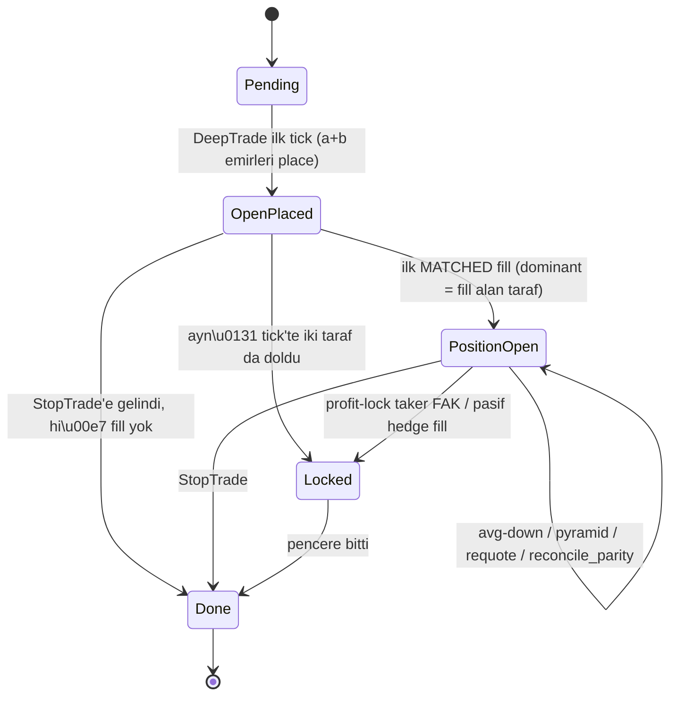

## 1. Yüksek seviye akış

Pencere %0-10 (DeepTrade) → OpenPair (opener + hedge), %10-50 (NormalTrade) → max 1 avg-down + hedge re-align, %50-90 (AggTrade) → max 1 pyramid + hedge re-align, %90-97 (FakTrade) → max 1 ek pyramid (x1.5 delta) + hedge re-align, %97+ (StopTrade) → tüm açık emirleri iptal et, `Done`. Her tick'te en üstte profit-lock taker FAK kontrolü.



## 2. State genişletme — [src/strategy/alis.rs](src/strategy/alis.rs)

Etiketler (opener/hedge) sadece niyet; kitapta iki BUY emri var ve hangisi ilk MATCHED fill alırsa o dominant olur. State bunu yansıtır:

```rust
pub enum AlisState {
    Pending,
    OpenPlaced {
        intent_dir: Outcome,        // skora göre seçilen niyet (UP veya DOWN)
        a_order_id: Option<String>, // UP tarafındaki emir id'si
        b_order_id: Option<String>, // DOWN tarafındaki emir id'si
        a_price: f64,               // UP emir son re-quote fiyatı
        b_price: f64,               // DOWN emir son re-quote fiyatı
        size: f64,                  // her iki emrin parity size'ı (her re-align'da güncellenir)
        opened_at_ms: u64,
    },
    PositionOpen {
        dominant_dir: Outcome,      // ilk MATCHED fill alan taraf
        avg_down_used: bool,
        agg_pyramid_used: bool,
        fak_pyramid_used: bool,
        score_sum: f64,
        score_samples: u32,
    },
    Locked,
    Done,
}
```

`score_sum` + `score_samples` her tick'te `decide()` içinde güncellenir; AggTrade'e geçişte trend tetikleme için "pencere başından beri ortalama skor >5" hesabını verir.

**Dominant seçimi:** OpenPlaced state'inde herhangi bir tarafta `metrics.up_filled > 0` veya `metrics.down_filled > 0` görülürse → dominant = ilk fill alan taraf, state `PositionOpen{dominant_dir}` olur. Eğer aynı tick'te ikisi de fill aldıysa zaten profit-lock şartı sağlanır → direkt `Locked`.

## 3. Karar sırası — `decide()` iskeleti

Her tick'te bu sıra (ilk eşleşen aksiyon kazanır):

1. **StopTrade** → tüm `open_orders`'ı `CancelOrders` + `next_state = Done`.
2. **Profit-lock taker FAK fırsatı** → karşı tarafı `best_ask`'tan FAK ile alıp pair'i tamamlamak `avg_dom + best_ask_opp ≤ 1 - avg_threshold` ise yap. `next_state = Locked`. Cooldown=0, her tick.
3. **`Locked` veya `Done`** → `NoOp`.
4. **Re-quote dolmamış emirler** (yeni — Kural A): herhangi bir kitaptaki BUY emrimiz için `best_ask(side) + delta < o emrin fiyatı` ise (yani pazar bizim lehimize ucuzladı) → o emri iptal + aynı size'la güncel best_ask+delta'dan yeniden bas. Tek tick'te tek `CancelAndPlace`. Hedge için: `(1 - avg_threshold) - dominant_avg < hedge_price` ise iptal + yenisini bas.
5. **Parity re-align** (yeni — Kural B): `metrics` ile `open_orders` karşılaştır. Bir tarafta partial fill var ve eş tarafta hala dolmamış emir size > partial fill size ise → eş emri iptal + size = partial fill size ile yenisini bas. Aynı zamanda yeni avg ile hedge fiyatını da güncelle gerekirse.
6. **Stale GTC iptali** (sadece avg-down/pyramid GTC'leri 30sn'den eski + 0 fill ise `CancelOrders`).
7. **State'e göre aksiyon**:
   - `Pending` + `DeepTrade` → `place_open_pair()` → `OpenPlaced`.
   - `OpenPlaced` → kural 4-5 işini yapar; ek aksiyon yok (NoOp).
   - `PositionOpen` + `NormalTrade` + `!avg_down_used` → `try_avg_down()` (cooldown + ask < avg + hedef tutturulabilir mi?).
   - `PositionOpen` + `AggTrade` + `!agg_pyramid_used` + trend OK → `try_pyramid(agg)`.
   - `PositionOpen` + `FakTrade` + `!fak_pyramid_used` + trend OK → `try_pyramid(fak)`.

Her başarılı `try_*` action öncesi/sonrası gerekirse hedge re-align yapılır (atomic `CancelAndPlace`).

## 4. Alt rutinler

- **`place_open_pair(ctx)`**: yön = `score >= 5 ? Up : Down` (eşik yok, signal_ready=false ise 1 tick bekle).
  - **Asıl emir** (intent yönünde): `BUY {dir} @ best_ask(dir) + open_delta` GTC, size = `order_usdc / price`.
  - **Eş emir** (karşı yönde): `BUY {opp} @ (1 - avg_threshold) - asıl_emir_price` GTC, size = aynı (parity).
  - Notla: ikisi de GTC; "asıl" ve "eş" sadece niyet etiketi. Kim ilk dolarsa o dominant.
  - `Decision::PlaceOrders([a, b])`, `next_state = OpenPlaced{intent_dir, a/b id'leri ve fiyatları, size}`.
- **`requote_open_pair(ctx, st)`** (Kural A — her tick OpenPlaced ve PositionOpen'da çalışır):
  - Bekleyen `BUY UP` emri var ve `best_ask_up + open_delta < o emrin fiyatı` ise → iptal + aynı size'la `BUY UP @ best_ask_up + open_delta` yeniden bas.
  - Bekleyen `BUY DOWN` emri var (hedge görevinde) ve dominant tanımlıysa: hedef fiyat = `(1 - avg_threshold) - avg_dominant`, eğer `hedef < o emrin fiyatı` ise → iptal + size = `imbalance.abs()` ile yeniden bas.
  - Dominant henüz tanımlı değilken (OpenPlaced) hedge için hedef = `(1 - avg_threshold) - eş emrin asıl fiyatı`; karşı taraf ucuzladıysa iptal + güncel best_ask+delta ile yeniden bas, yeni eş emir fiyatı buna göre güncellenir.
- **`reconcile_parity(ctx, st)`** (Kural B — her tick): `metrics.up_filled` ve `down_filled` ile `open_orders` karşılaştır.
  - Bir taraf partial fill aldı (örn. `up_filled = 4`) ve eş emir hala kitapta `size = 9` ise → eş emri iptal + size = 4 ile yeni eş emir bas (parity).
  - Bu durum hem OpenPair'in partial fill'inde hem de avg-down'un partial fill'inde tetiklenir.
  - Yeni avg ile hedge fiyatı da güncellenirse aynı `CancelAndPlace`'te birleştirilir.
- **`try_avg_down(ctx, st)`**: cooldown geçti mi (`now - last_averaging_ms ≥ cooldown_threshold`), `best_ask(dom) < avg_dom`, `target = (1 - avg_threshold) - best_ask(opp)`, `target > best_bid(dom)` (yani lock matematiksel olarak mümkün)?
  - Share çözümü: `x = (avg_dom - target) * shares_dom / (target - best_bid(dom))`. `api_min_order_size` altındaysa atla.
  - Avg-down emri: `BUY {dom} @ best_bid(dom)` GTC.
  - Yeni hedge: `BUY {opp} @ (1 - avg_threshold) - target` GTC, size = `x + shares_dom` (yeni parity).
  - `Decision::CancelAndPlace { cancels: [eski_hedge_id], places: [avg_down, yeni_hedge] }`. `avg_down_used = true`.
  - Avg-down PLACE edilince flag true olur — partial fill veya stale iptal sonrası tekrar denenmez.
- **`try_pyramid(ctx, st, phase)`**: AggTrade ilk girişte `score_sum / score_samples > 5 && best_bid_up > 0.5 && dominant_dir == Up` (veya tersi) → trend onaylı.
  - Cooldown OK + skor hala uygun yönde + `best_ask(dominant_dir) > metrics.last_filled_*`.
  - Delta: `phase == agg ? pyramid_agg_delta : pyramid_fak_delta`.
  - Pyramid emri: `BUY {dominant_dir} @ best_ask + delta` **taker FAK**, size = `pyramid_usdc / price`.
  - Hedge re-align: avg değişeceği için pyramid fill MATCHED'i sonra bir sonraki tick'te `requote_open_pair` + `reconcile_parity` doğal olarak yakalar.
  - Pyramid PLACE edilince ilgili flag (agg/fak) true. FAK partial dolarsa kalan otomatik kill, flag yine true.
- **`profit_lock_taker(ctx)`**: her tick, cooldown'suz. `up_filled > 0 && down_filled > 0` ise zaten lock şartı sağlanıyor olabilir → `metrics.profit_locked_alis(avg_threshold)` true ise `Locked`. Aksi halde dominant taraf var ve `avg_dom + best_ask(opp) ≤ 1 - avg_threshold` ise `BUY {opp} @ best_ask(opp)` FAK, size = `imbalance.abs()`.

## 5. Hedge formülü (yeni semantik) — [src/strategy/common.rs](src/strategy/common.rs)

`hedge_price()` `1 - avg_threshold - avg_dominant` formülüne dönecek (mevcut `avg_threshold - avg_dom` formülü harvest legacy'si; Alis için yeni helper ekleyelim ki diğerlerini bozmayalım):

```rust
pub fn hedge_price_alis(metrics: &StrategyMetrics, avg_threshold: f64, min_p: f64, max_p: f64) -> f64 {
    ((1.0 - avg_threshold) - metrics.avg_dominant()).clamp(min_p, max_p)
}
```

`StrategyMetrics::profit_locked` da Alis için yeni helper: `pub fn profit_locked_alis(&self, avg_threshold: f64) -> bool { self.pair_count() > 0.0 && self.avg_sum() <= 1.0 - avg_threshold }`.

## 6. Config parametreleri — [src/config.rs](src/config.rs)

Yeni Alis-spesifik alanlar (`StrategyParams::alis()` veya doğrudan `BotConfig`'e):

- `open_delta: f64` (default 0.01)
- `pyramid_agg_delta: f64` (default 0.015)
- `pyramid_fak_delta: f64` (default 0.025)
- `pyramid_usdc: f64` (default = `order_usdc`)
- `avg_threshold: f64` artık **marj** anlamında (default 0.02 = %2). Frontend label'ı "Profit margin" olarak güncellenir.

## 7. Engine entegrasyonu — [src/engine/mod.rs](src/engine/mod.rs)

- `tick()` zaten `effective_score` + `signal_ready` veriyor; Alis bunu state'inde topluyor.
- `absorb_trade_matched()` opener fill'inde `OpenPlaced → PositionOpen` geçişini tetikleyecek; ek olarak Alis için fill MATCHED sonrası "hedge re-align" gerekirse decide() bir sonraki tick'te yakalar (avg değişti, hedge fiyatı değişti → eski hedge'i iptal + yeni hedge place). Bunu `try_realign_hedge(ctx, st)` helper'ıyla state akışında 4. sıraya eklenir.
- StopTrade'de `cancel_all_open_orders` mevcut `Decision::CancelOrders(open_orders.iter().map(|o| o.id.clone()).collect())`.

## 8. Cooldown ve stale disiplini

- `last_averaging_ms` zaten `MarketSession`'da, her MATCHED fill'de güncelleniyor. Avg-down ve pyramid'in tetiklemesi için `now_ms - last_averaging_ms ≥ cooldown_threshold` (default 30s).
- Stale iptal: avg-down ve pyramid GTC'ler `placed_at_ms` üzerinden 30s'den eski + henüz `size_matched == 0` ise `CancelOrders`. (Avg/pyramid 1 hak; iptal sonrası tekrar denenmez — `*_used` flag'i yine `true` kalır. **Karar gereken:** stale iptal sonrası flag reset mi? Default: reset YOK, "şans bitti" semantiği.)
- Opener ve hedge stale'e tabi değil (pencere boyu kalır). Hedge sadece avg değiştiğinde re-align ile kaldırılır.

## 9. Re-quote ve partial fill — pratik akış örnekleri

**Senaryo: hedge önce dolar (asymmetric)**
- T=0: skor=8 (UP), UP best_ask=0.53, DOWN best_ask=0.46.
- OpenPair: BUY UP @ 0.54 (9 share) + BUY DOWN @ 0.44 (9 share). State `OpenPlaced{intent_dir=Up}`.
- T=10s: market DOWN'a hareket → DOWN best_ask=0.44, BUY DOWN @ 0.44 doldu. up_filled=0, down_filled=9, avg_down=0.44.
- Karar sırası tick'inde: dominant tanımlı değildi → `metrics.down_filled > 0` → state `PositionOpen{dominant_dir=Down}`.
- Profit-lock kontrol: avg_down=0.44, UP best_ask=? mesela 0.55. 0.44+0.55 > 0.98 → lock yok.
- Re-quote (Kural A): UP emrimiz hala kitapta @ 0.54 (size 9). Hedef = (1-0.02) - 0.44 = 0.54. Hedef = mevcut → re-quote gerekmez.
- T=20s: UP best_ask 0.51'e düştü. Re-quote tetikler? UP emrimiz BUY UP @ 0.54 hedge görevinde; hedef hala 0.54 (avg_down=0.44 değişmedi). Hayır, hedge fiyatı avg'dan hesaplanıyor, market fiyatından değil. Re-quote sadece "hedef < mevcut emir fiyatı" olursa olur. avg değişmediyse hedef değişmez.
- T=60s: NormalTrade'e geçti. avg_down (DOWN dominant için) tetiklenir mi? `best_ask(down) < avg_down` (0.40 < 0.44 mesela) ve hedef = 0.98 - best_ask_up(0.51) = 0.47, hedef > best_bid_down → matematiksel olarak mümkün. Avg-down çalıştır.
- Sonuç: dominant DOWN olarak akış normal şekilde devam eder. "Asıl niyet UP'tı" bilgisi kullanılmaz; gerçeklik (DOWN doldu) komuta verir.

**Senaryo: opener partial fill**
- T=0: BUY UP @ 0.54 (9 share) + BUY DOWN @ 0.44 (9 share).
- T=5s: UP @ 0.54'ün 4 share'i doldu, kalan 5 share kitapta. up_filled=4, avg_up=0.54.
- State `PositionOpen{dominant_dir=Up}` (ilk fill UP'tan).
- Reconcile parity (Kural B): `up_filled=4 < open_orders[BUY UP].size=5` → kalan UP emri OK, partial sonrası sadece dolan miktar dominant. `down_filled=0 < open_orders[BUY DOWN].size=9` → eş emir size 9 ama parity için 4 olmalı. → İptal eski hedge, yeni hedge size=4 @ (1-0.02)-0.54 = 0.44. Aynı CancelAndPlace.
- Kalan UP emri (5 share) hala kitapta — re-quote ile fiyat düşerse takip edilir; dolarsa avg yine 0.54 (zaten 0.54), parity `up_filled` artar, reconcile yine hedge size'ı eşitler.

**Senaryo: avg-down partial fill**
- avg-down BUY UP @ 0.49 (11 share) emri yerleştirildi, hedge BUY DOWN @ 0.47 (20 share) atomic update.
- T+15s: avg-down 7 share doldu, kalan 4 stale değil henüz (30sn dolmadı). up_filled=16 (9+7), avg_up=(9*0.54+7*0.49)/16=0.5181.
- Reconcile parity: down_filled=0, hedge order size=20, ama parity için size=16 olmalı. → İptal hedge + yeni hedge size=16 @ (1-0.02)-0.5181 = 0.4619.
- T+30s: avg-down kalan 4 share stale → iptal. Flag avg_down_used yine true (hak tüketildi).

## 10. Frontend log entegrasyonu

Mevcut `FrontendEvent` sistemi (bkz. [src/ipc.rs](src/ipc.rs)) Alis için neredeyse hazır:
- **Yapılan emirler** → `OrderPlaced` zaten `bot/tick.rs`'de her place sonrası otomatik emit (her PlannedOrder için).
- **İptal edilen emirler** → `OrderCanceled` zaten otomatik.
- **Fill'ler (BUY/SELL, partial dahil)** → `Fill` zaten `bot/event.rs` MATCHED handler'ında otomatik emit.
- **PnL/best/score snapshot** → `TickSnapshot` + `PnlUpdate` zaten 1sn cadence ile basılıyor.
- **Pencere lifecycle** → `SessionOpened`/`SessionResolved` zaten var.

**Eklenecek tek event: `ProfitLocked`** (yeni variant):

```rust
ProfitLocked {
    bot_id: i64,
    slug: String,
    avg_up: f64,
    avg_down: f64,
    expected_profit: f64,        // pair_count × $1 - cost_basis
    lock_method: String,         // "taker_fak" | "passive_hedge_fill" | "symmetric_fill"
    ts_ms: u64,
},
```

Emit noktası: AlisEngine `Locked` state'ine geçtiği tick'te (ya `profit_lock_taker` Decision'ı yerleştirildikten sonra fill MATCHED'da, ya da pasif hedge fill'inde `decide()` Locked'a geçerken). Pratik olarak: `engine/mod.rs` `tick()` içinde state geçişi tespit edilirse (eski state PositionOpen, yeni state Locked) → `ipc::emit(&FrontendEvent::ProfitLocked{...})` çağrılır. `lock_method` engine'e ek bir Decision varyantı veya state'e küçük bir payload alanı ile aktarılır.

**Faz/state geçişleri için ayrıca event yok** — frontend timeline'da bunlara gerek görülmedi (TickSnapshot zone bilgisini dolaylı taşıyor; gerekirse sonra eklenir).

**Order reason alanı eklenmiyor** — `PlannedOrder.reason` strateji içinde dolduruluyor ("alis:open:up" vs.) ama mevcut `OrderPlaced` event'inde ayrı bir reason alanı yok. Mevcut `order_type` alanı (GTC/FAK) yeterli kabul edildi; frontend ayrımı bu alandan + zaman/state'den infer eder.

## 11. Açık olmayan ufak şeyler (varsayılanlarla geçiyorum, plan onayı sırasında değiştirebiliriz)

- `signal_ready=false` ise OpenPair 1 tick gecikir; `DeepTrade` boyunca dolmazsa pencere pas geçer (NoOp + `Done`).
- Profit-lock taker FAK cooldown=0 (her tick).
- Hedge fiyatı `[min_price, max_price]` aralığına clamp.
- DeepTrade'de avg-down/pyramid yok (zaten zaman dilimi şartı ile zaten yasak).
- Aras ve Elis bu PR'da değişmez; iskelet kalır.
- Re-quote ve reconcile_parity tek tick'te birden fazla `CancelAndPlace` üretebilir; karar sırasında aynı tick'te sadece **bir** Decision döner — kalan eylemler bir sonraki tick'te (ms cinsinden ~280ms sonra) yakalanır. Acil değil.