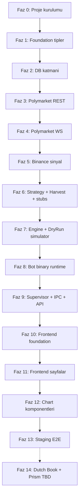

# Baiter-Pro Fazlı Geliştirme Planı

## Teslim Stratejisi Kararları

- **MVP modu:** İkili mod baştan — `RunMode::DryRun` ve `RunMode::Live` aynı engine'de switch'lenir; her fazda iki akış da paralel test edilir (mimari §16).
- **Strateji kapsamı:** Harvest FSM tam + `dutch_book.rs` ve `prism.rs` TBD stub (enum varyantı + `todo!()` runtime placeholder); detaylar Faz 14'te.
- **Frontend:** Backend-first — bot + supervisor curl/cli ile doğrulanana kadar frontend başlamaz. Faz 10'dan itibaren frontend.
- **Test:** Integration-only — `tests/{slug_parser,clob_auth,dryrun_flow}.rs`. Unit test yalnızca kritik saf fonksiyonlar (HMAC vektörleri vb.) için.
- **Referans:** Çelişkide [docs/bot-platform-mimari.md](docs/bot-platform-mimari.md) + [docs.polymarket.com](https://docs.polymarket.com/) geçerli.

---

## Faz Haritası (üst düzey)

---

## Faz 0 — Proje Kurulumu (iskelet)

**Amaç:** Repoyu iskelet yapısına getir; `cargo build` ve `cargo test` yeşil.

**Dosyalar:**
- [Cargo.toml](Cargo.toml) — §6 taslağı (2 binary + lib, tüm dependencies)
- [rust-toolchain.toml](rust-toolchain.toml) — `channel = "1.91"` (alloy 2 MSRV)
- [src/lib.rs](src/lib.rs) — boş modül re-export iskeleti
- [src/bin/supervisor.rs](src/bin/supervisor.rs) — `fn main() { println!("supervisor"); }`
- [src/bin/bot.rs](src/bin/bot.rs) — `fn main() { println!("bot"); }`
- [migrations/0001_init.sql](migrations/0001_init.sql) — boş placeholder (Faz 2'de doldurulur)
- [.gitignore](.gitignore) — `target/`, `data/`, `.env`, `frontend/node_modules/`

**Mevcut `src/main.rs` silinir** (iskelete uygun değil).

**Bitiş kriteri:** `cargo build --bins` iki binary'yi derler; `cargo run --bin supervisor` ve `--bin bot` çalışır.

---

## Faz 1 — Foundation Tipler

**Amaç:** Tüm modüllerin import ettiği saf/stateless tipleri tanımla.

**Dosyalar:**
- [src/types.rs](src/types.rs) — `Outcome (UP/DOWN)`, `Side (BUY/SELL)`, `OrderType (GTC/GTD/FOK/FAK)`, `OrderStatus`, `TradeStatus (MATCHED/MINED/CONFIRMED/RETRYING/FAILED)` (mimari §11)
- [src/config.rs](src/config.rs) — `BotConfig`, `RunMode (Live/DryRun)`, `StrategyConfig`, `.env` yükleme (mimari §18)
- [src/slug.rs](src/slug.rs) — `SlugInfo`, `parse_slug`, asset/interval tablosu (`{asset}-updown-{interval}-{ts}`)
- [src/error.rs](src/error.rs) — `AppError` enum (thiserror)
- [src/time.rs](src/time.rs) — `t_minus_15`, `zone_pct`, UTC ms helpers (mimari §4 + §15)
- [tests/slug_parser.rs](tests/slug_parser.rs) — slug kenar durumları (geçerli/hatalı)

**Bitiş kriteri:** `cargo test slug_parser` geçer; `src/lib.rs` modül re-exports derlenir.

---

## Faz 2 — DB Katmanı (sqlx + migrations)

**Amaç:** Tüm tablo şemaları + CRUD/upsert fonksiyonları; WAL mode; `sqlx::query!` compile-time doğrulama.

**Dosyalar:**
- [migrations/0001_init.sql](migrations/0001_init.sql):
  - `bots`, `bot_credentials` (mimari §9a), `market_sessions`, `orders` (mimari §8), `trades` (mimari §10), `logs`, `market_resolved` (mimari §9)
  - `PRAGMA journal_mode=WAL;`
- [migrations/0002_snapshots.sql](migrations/0002_snapshots.sql):
  - `orderbook_snapshots` (mimari §6), `pnl_snapshots` (mimari §17)
- [src/db.rs](src/db.rs) — `SqlitePool` init + her tablo için `upsert_*` + `insert_*` + `query_*` fonksiyonları (tek dosya)

**Bitiş kriteri:** `cargo sqlx prepare` schema snapshot üretir; `sqlx migrate run` `data/baiter.db` oluşturur; tüm tablolar mevcut.

---

## Faz 3 — Polymarket REST (Gamma + CLOB + Auth)

**Amaç:** Market keşfi, emir gönderimi, auth imzalama — WebSocket olmadan tam REST işlevi.

**Dosyalar:**
- [src/polymarket.rs](src/polymarket.rs) — `pub mod gamma; pub mod clob; pub mod auth; pub mod ws;`
- [src/polymarket/gamma.rs](src/polymarket/gamma.rs) — `GET /markets/{slug}`, `GET /markets?active=true`, `startDate/endDate/clobTokenIds/tickSize/minOrderSize` parse (api/polymarket-gamma.md)
- [src/polymarket/auth.rs](src/polymarket/auth.rs) — L1 EIP-712 imza (`alloy` 2.0 + `signer-local`) + L2 HMAC-SHA256 (`hmac` + `base64::URL_SAFE`) — mimari §1
- [src/polymarket/clob.rs](src/polymarket/clob.rs):
  - Paylaşımlı `reqwest::Client` (pool_max_idle_per_host, tcp_nodelay, http2) — §⚡ Kural 3
  - `post_order` (GTC/FOK/GTD/FAK), `delete_order`, `delete_all_orders`, `get_book`, REST heartbeat döngüsü (mimari §4.1)
- [tests/clob_auth.rs](tests/clob_auth.rs) — rs-clob-client referans HMAC vektörleri ile eşleşme

**Bitiş kriteri:** `cargo test clob_auth` geçer; Gamma'dan canlı market slug'ı çekilebilir; staging CLOB'a (`clob-staging.polymarket.com`) imzalı test emri gönderilir (manuel curl yerine birim fonksiyon).

---

## Faz 4 — Polymarket WebSocket (Market + User)

**Amaç:** `best_bid_ask`, `book`, `price_change`, `market_resolved` + `order`, `trade MATCHED` event'lerini parse + mpsc'ye yönlendir.

**Dosyalar:**
- [src/polymarket/ws.rs](src/polymarket/ws.rs):
  - `tokio-tungstenite` ile subscribe
  - PING/PONG (`overview` §), reconnect + backoff
  - Market WS: `BestBidAsk`, `Book`, `PriceChange`, `MarketResolved`, `custom_feature_enabled`
  - User WS: `Order (PLACEMENT/UPDATE/CANCELLATION)`, `Trade (MATCHED → ...)`
  - `mpsc::Sender<PolymarketEvent>` — §⚡ Kural 6 (WS okuyucu bloke olmaz)

**Bitiş kriteri:** Canlı market'e subscribe; CLI flag'i ile binary olarak event count print; 10 dakika boyunca reconnect test.

---

## Faz 5 — Binance Sinyal Katmanı

**Amaç:** `btcusdt@aggTrade` akışından CVD + BSI (Hawkes) + OFI + `signal_score` 0-10.

**Dosyalar:**
- [src/binance.rs](src/binance.rs) (mimari §14):
  - aggTrade WS subscribe + parse
  - `CVD` (Σ ΔS × side), `BSI` (Hawkes decay), `OFI`, `signal_score` composite
  - `Arc<RwLock<BinanceSignalState>>` — engine her tick okur

**Bitiş kriteri:** 5 dakika canlı çalışır; `signal_score` 0-10 aralığında, `ts_ms` + 4 metrik JSON satır olarak log'lanır.

---

## Faz 6 — Strategy Foundation + Harvest + Stubs

**Amaç:** Strategy enum + MetricMask + Harvest FSM + stub iskeletler.

**Dosyalar:**
- [src/strategy.rs](src/strategy.rs) — `Strategy { DutchBook, Harvest, Prism }`, `MetricMask`, `MarketZone (DeepTrade/NormalTrade/AggTrade/FakTrade/StopTrade)`, `ZoneSignalMap` (mimari §15)
- [src/strategy/metrics.rs](src/strategy/metrics.rs) — `StrategyMetrics { imbalance, avg_sum, position_delta, effective_score }`, `MarketPnL` (mimari §17)
- [src/strategy/harvest.rs](src/strategy/harvest.rs) — OpenDual → SingleLeg → ProfitLock FSM (strategies.md §2 tam)
- [src/strategy/dutch_book.rs](src/strategy/dutch_book.rs) — `pub fn decide(...) -> Decision { todo!("TBD: strategies.md §1") }` (stub)
- [src/strategy/prism.rs](src/strategy/prism.rs) — stub (strategies.md §3)

**Bitiş kriteri:** `cargo build` tüm strateji dosyalarını derler; `Strategy::Harvest` decide() FSM geçişleri unit fonksiyon ile test edilir (inline `#[cfg(test)]`).

---

## Faz 7 — Engine + DryRun Simülatör

**Amaç:** MarketSession yaşam döngüsü + decision loop + RunMode::DryRun fill simülatörü.

**Dosyalar:**
- [src/engine.rs](src/engine.rs):
  - `MarketSession` (bot × market)
  - decision loop: WS event → metrics update → strategy.decide() → `RunMode` switch → clob.post_order **veya** simulator.fill()
  - `Simulator` struct: best_bid/best_ask üzerinden deterministik fill (slip yok, fee=0.02%)
  - §⚡ Kural 1-2 uyumu (state önceden hazır, emir yolu 0 block)
- [tests/dryrun_flow.rs](tests/dryrun_flow.rs) — uçtan uca DryRun: Gamma mock market + fake WS event stream → Harvest → Simulator → PnL hesabı

**Bitiş kriteri:** `cargo test dryrun_flow` Harvest senaryosunu geçer; DryRun ve Live kod yolları aynı `Decision` tipi ile ayrılır.

---

## Faz 8 — Bot Binary Runtime

**Amaç:** `cargo run --bin bot -- --bot-id 1` ile tek başına çalışan bot; stdout üzerinden `[[EVENT]]` satırları yayar.

**Dosyalar:**
- [src/ipc.rs](src/ipc.rs) — `FrontendEvent { OrderPlaced, Fill, PnLUpdate, BotStateChanged, BestBidAsk }` enum + `[[EVENT]] {json}` serialize/parse (mimari §⚡ Kural 5) + heartbeat dosya I/O (mimari §4.1)
- [src/bin/bot.rs](src/bin/bot.rs):
  - `main()`: CLI args → bot_id → DB'den BotConfig + credentials (fallback `.env`) → Gamma slug → engine init → tokio::select! { run_engine, SIGTERM }
  - SIGTERM handler (mimari §18.2): WS kapat → `DELETE /orders` → heartbeat durdur → stdout flush → exit 0
  - Emir sonrası `tokio::spawn(db.upsert_order)` + `println!("[[EVENT]] {json}")` — §⚡ Kural 4

**Bitiş kriteri:** DB'de bir bot kaydı + credential elle insert edilir; `cargo run --bin bot -- --bot-id 1` DryRun çalışır; stdout'ta `[[EVENT]]` satırları görülür; SIGTERM alınca 4 adım temiz çıkış.

---

## Faz 9 — Supervisor + API + SSE

**Amaç:** Çok bot yönetimi, HTTP API, log-tail, SSE push.

**Dosyalar:**
- [src/supervisor.rs](src/supervisor.rs):
  - `spawn_bot`: `tokio::process::Command` ile bot binary launch; stdout/stderr pipe
  - `log_tail` task: satır `[[EVENT]]` prefix'li → `ipc::FrontendEvent` parse → `broadcast::Sender<FrontendEvent>`; değilse `db.insert_log`
  - Crash loop: exponential backoff (1s, 2s, 4s, 8s, max 60s); exit code 0 ise "user-stopped", retry etmez
  - Heartbeat check: `HEARTBEAT_DIR/{bot_id}.heartbeat` mtime 30s üzeri → bot unhealthy
- [src/api.rs](src/api.rs):
  - `GET /api/bots`, `POST /api/bots`, `DELETE /api/bots/:id`, `POST /api/bots/:id/start|stop`
  - `GET /api/bots/:id/logs` (polling), `GET /api/bots/:id/orders`, `GET /api/bots/:id/trades`
  - `GET /api/bots/:id/markets/:session/pnl` (mimari §17)
  - `GET /api/events` — SSE handler, `broadcast::Receiver` → `sse::Event::data(json)`
  - CORS: `tower-http` frontend dev için
- [src/bin/supervisor.rs](src/bin/supervisor.rs):
  - migrations run → DB pool → broadcast channel → AppState → axum::serve
  - Startup: DB'de `state = RUNNING` olan botları otomatik spawn (crash recovery)

**Bitiş kriteri:** `cargo run --bin supervisor`; 2 bot paralel çalıştırılır (DB'ye elle insert + start API); `curl -N /api/events` SSE akışı görür; `curl /api/bots/1/pnl` JSON döner; supervisor Ctrl+C → tüm child'lara SIGTERM.

---

## Faz 10 — Frontend Foundation

**Amaç:** Vite + React + TS + Tailwind + shadcn kurulumu; API/SSE/tipler hazır; boş sayfa iskeletleri.

**Dosyalar:**
- [frontend/package.json](frontend/package.json) — §7.1 taslağı
- [frontend/vite.config.ts](frontend/vite.config.ts) — proxy `/api → http://localhost:3000`
- [frontend/tailwind.config.ts](frontend/tailwind.config.ts), [postcss.config.js](frontend/postcss.config.js), [components.json](frontend/components.json)
- [frontend/src/index.css](frontend/src/index.css) — Tailwind directives + shadcn CSS vars (dark mode)
- [frontend/src/main.tsx](frontend/src/main.tsx), [App.tsx](frontend/src/App.tsx) — Router + ThemeProvider + `<Toaster />`
- [frontend/src/lib/utils.ts](frontend/src/lib/utils.ts) — `cn()` helper
- [frontend/src/api.ts](frontend/src/api.ts) — fetch wrapper + EventSource
- [frontend/src/types.ts](frontend/src/types.ts) — backend DTO'lar (Bot, Order, Trade, PnL, Log, Market, BestBidAskEvent)
- [frontend/src/hooks.ts](frontend/src/hooks.ts) — `useBots`, `useSSE`, `usePnL`, `useLogs`, `usePriceStream`
- shadcn CLI ile eklenecek: `button`, `input`, `form`, `select`, `dialog`, `table`, `badge`, `progress`, `scroll-area`, `sonner`, `card`, `tabs`

**Bitiş kriteri:** `npm run dev` 5173 port açar; `/api/bots` proxy üzerinden çağrılır; dark mode toggle çalışır; shadcn button ekranda görünür.

---

## Faz 11 — Frontend Sayfalar (Chart hariç)

**Amaç:** Bot CRUD + log stream + navigation. Chart Faz 12'de.

**Dosyalar:**
- [frontend/src/pages/Dashboard.tsx](frontend/src/pages/Dashboard.tsx) — `BotList` + global PnL özet
- [frontend/src/pages/NewBot.tsx](frontend/src/pages/NewBot.tsx) — `BotForm` full-page
- [frontend/src/pages/BotDetail.tsx](frontend/src/pages/BotDetail.tsx) — Tabs: Overview/Logs/PnL/Orders (chart placeholder)
- [frontend/src/components/BotForm.tsx](frontend/src/components/BotForm.tsx) — react-hook-form + Zod; alanlar: slug, strategy, run_mode, order_usdc, signal_weight, credentials (opsiyonel)
- [frontend/src/components/BotList.tsx](frontend/src/components/BotList.tsx) — shadcn `Table` + `Badge` (RUNNING/STOPPED/FAILED) + start/stop/delete aksiyonlar
- [frontend/src/components/LogStream.tsx](frontend/src/components/LogStream.tsx) — `ScrollArea` + SSE canlı tail (`useSSE`)
- [frontend/src/components/PnLWidget.tsx](frontend/src/components/PnLWidget.tsx) — `pnl_if_up/down/mtm` sayısal gösterim
- [frontend/src/components/MetricsPanel.tsx](frontend/src/components/MetricsPanel.tsx) — `imbalance/AVG SUM/POSITION Δ` card grid
- [frontend/src/components/ZoneTimeline.tsx](frontend/src/components/ZoneTimeline.tsx) — `Progress` + bölge `Badge`

**Bitiş kriteri:** Frontend üzerinden yeni bot oluşturulur → backend'de spawn olur → log stream canlı görünür → bot silinir; her aksiyon toast bildirir.

---

## Faz 12 — Chart Komponentleri (lightweight-charts)

**Amaç:** PriceChart 4-line + SpreadChart 2-histogram + PnLChart + SignalChart.

**Dosyalar:**
- [frontend/src/components/PriceChart.tsx](frontend/src/components/PriceChart.tsx) — §7.6 tam kod (YES bid/ask + NO bid/ask)
- [frontend/src/components/SpreadChart.tsx](frontend/src/components/SpreadChart.tsx) — §7.7 tam kod (YES/NO spread histogram)
- [frontend/src/components/PnLChart.tsx](frontend/src/components/PnLChart.tsx) — `pnl_if_up/down` (SSE) + `mtm_pnl` (1s polling) multi-line
- [frontend/src/components/SignalChart.tsx](frontend/src/components/SignalChart.tsx) — binance_signal area chart (SSE)

**Bitiş kriteri:** BotDetail Overview sekmesinde 4 chart canlı çizer; PriceChart'ta YES/NO komplementerliği (toplam ≈ 1) görsel kontrol; SpreadChart altta hizalı; tema değişiminde renkler otomatik adapte.

---

## Faz 13 — Staging E2E Validasyon

**Amaç:** `clob-staging.polymarket.com` üzerinde küçük boyutlu gerçek emir + fill + frontend doğrulama.

**Adımlar:**
- Staging API anahtarı → `.env` veya UI'dan bot credential olarak kaydet
- 1 Harvest botu Live mode, `order_usdc = 1.0` ile başlat
- Beklenenler: Market WS bağlanır → BestBidAsk chart çizer → strateji OpenDual yapar → User WS `order PLACEMENT LIVE` → sonra `MATCHED trade` → PnL push → SpreadChart + PriceChart + PnLChart güncellenir
- Supervisor SIGTERM → tüm açık emirler cancel olur
- Crash recovery: bot binary kill → supervisor yeniden spawn → state restore

**Bitiş kriteri:** 1 saatlik canlı oturum hatasız; 3 pencere boyunca emir → fill → PnL → market_resolved akışı tam; frontend real-time görsel tutarlı.

---

## Faz 14 — Dutch Book + Prism (parking)

**Ön koşul:** Kullanıcı [strategies.md §1](docs/strategies.md) ve [§3](docs/strategies.md) TBD detaylarını doldurur.

**Dosyalar:**
- [src/strategy/dutch_book.rs](src/strategy/dutch_book.rs) — stub'dan tam FSM'e
- [src/strategy/prism.rs](src/strategy/prism.rs) — stub'dan tam FSM'e
- [tests/dryrun_flow.rs](tests/dryrun_flow.rs) — her iki strateji için senaryo eklenir
- BotForm'da strategy select'te varyantlar enable edilir

**Bitiş kriteri:** Her iki strateji DryRun'da çalışır; staging'de 1 pencere canlı test geçer.

---

## Her Fazda Sabit Kontrol Listesi

1. `cargo fmt` + `cargo clippy -- -D warnings` temiz
2. Fazın integration testi (varsa) yeşil
3. Bir önceki fazın regresyonu yok (`cargo test --all`)
4. Dokümanda değişen alan varsa [proje-iskeleti.md](docs/proje-iskeleti.md) veya [bot-platform-mimari.md](docs/bot-platform-mimari.md) güncellenir
5. Fazda eklenen dependency `Cargo.toml` ve `rust-polymarket-kutuphaneler.md` ile uyumlu

---

## Paralel Çalışma Fırsatları

- **Faz 3 + Faz 4** aynı anda yürütülebilir (farklı dosyalar, tek bağımlılık = `auth.rs`).
- **Faz 5 (Binance)** Faz 3-4'ten bağımsız, tek başına ilerler.
- **Faz 11 + Faz 12** aynı anda yürütülebilir (Faz 10 bitince; sayfa iskeleti + chart ayrı komponentler).

---

## Kaynak Referanslar

| Konu | Doküman |
|---|---|
| Ana mimari, §⚡ Kural 1-6, SQLite DDL | [docs/bot-platform-mimari.md](docs/bot-platform-mimari.md) |
| Strateji FSM'leri | [docs/strategies.md](docs/strategies.md) |
| CLOB REST + WS şema | [docs/api/polymarket-clob.md](docs/api/polymarket-clob.md) |
| Gamma REST şema | [docs/api/polymarket-gamma.md](docs/api/polymarket-gamma.md) |
| Rust crate sürümleri | [docs/rust-polymarket-kutuphaneler.md](docs/rust-polymarket-kutuphaneler.md) |
| Dosya-modül eşlemesi | [docs/proje-iskeleti.md](docs/proje-iskeleti.md) |