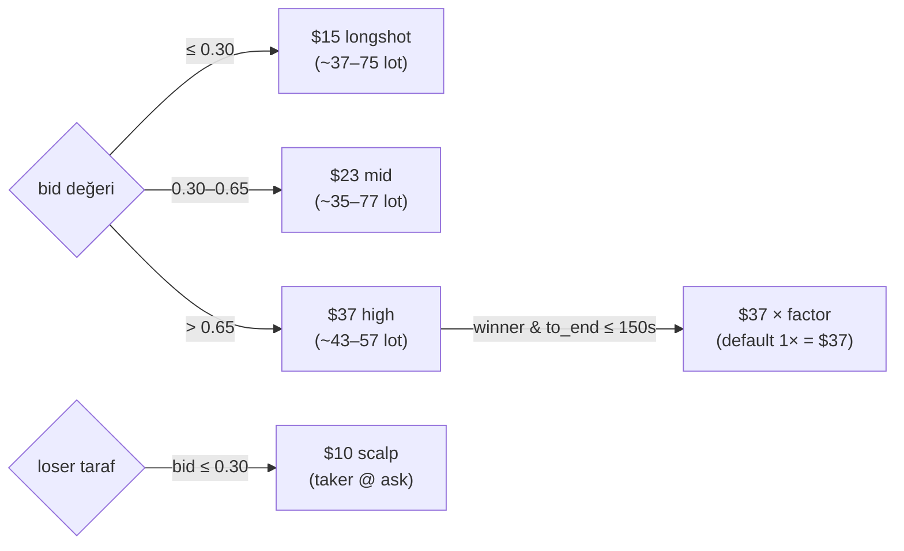
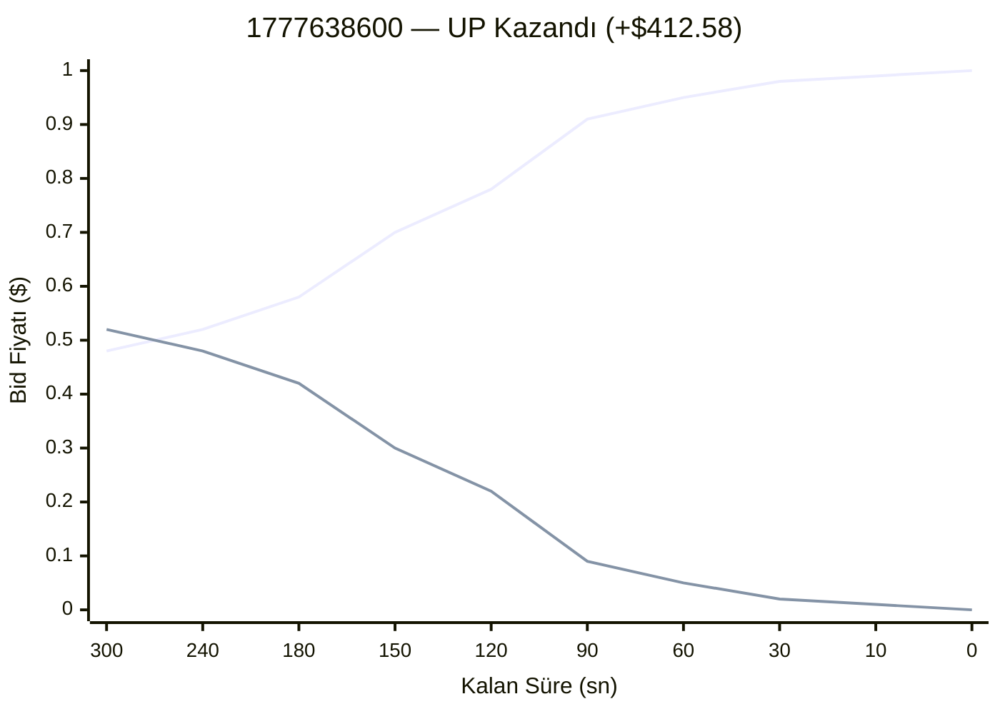
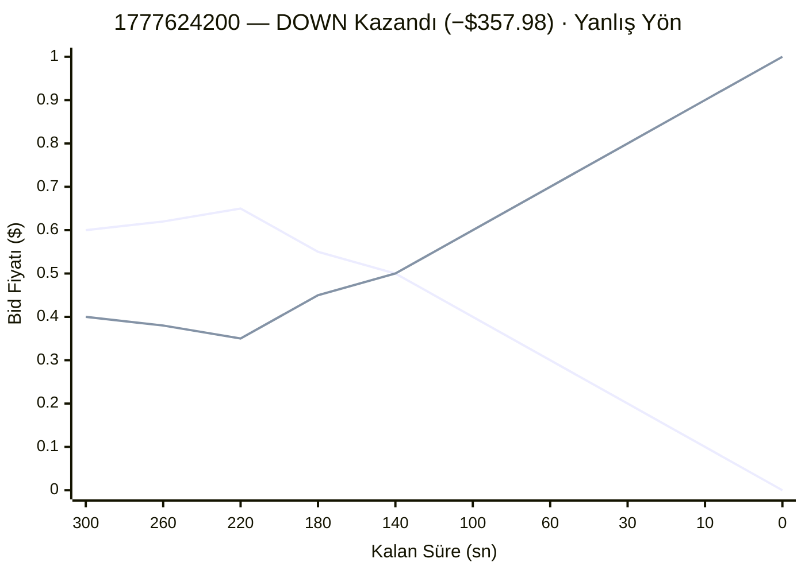

# Bonereaper Strateji Rehberi

Polymarket BTC 5-dakika marketlerinde çalışan, order-book reaktif bir martingale stratejisi.
Gerçek wallet adresi: `0xeebde7a0e019a63e6b476eb425505b7b3e6eba30`

---

## İçindekiler

1. [Strateji Özeti](#1-strateji-özeti)
2. [Karar Akış Şeması](#2-karar-akış-şeması)
3. [Tüm Parametreler](#3-tüm-parametreler)
4. [Late Winner & arb_mult Tablosu](#4-late-winner--arb_mult-tablosu)
5. [Emir Boyutu Mantığı](#5-emir-boyutu-mantığı)
6. [Gerçek Market Örnekleri](#6-gerçek-market-örnekleri)
7. [Piyasa Görselleştirmesi](#7-piyasa-görselleştirmesi)
8. [Örnek Konfigürasyonlar](#8-örnek-konfigürasyonlar)
9. [Bilinen Riskler](#9-bilinen-riskler)

---

## 1. Strateji Özeti

### Temel Felsefe

| Kural | Açıklama |
|-------|----------|
| **BUY ONLY** | Asla short yok. Pozisyon kapatma yalnızca market kapanışında otomatik REDEEM ile olur |
| **Order-book reaktif** | Dış sinyal yok — bid/ask hareketleri tüm kararları yönlendirir |
| **Geç agresyon** | Son 180 saniyede kazanan tarafa büyük "Late Winner" enjeksiyonları |
| **Otomatik rebalans** | UP/DOWN pozisyon farkı büyüyünce zayıf taraf alınır |
| **Loser scalping** | Kaybeden taraf birkaç sent fiyatla küçük miktarda toplanır |

### Ne Yapar?

```
Piyasa Açılır (T=300s)
       │
       ▼
  OB/BSI sinyali → İlk alım yönü seçilir
       │
       ▼
  Her tick: bid delta izle → alım yap (maker limit @ bid)
       │
       ▼
  T=150s → Winner tarafına boyut çarpanı devreye girer
       │
       ▼
  T=180s + bid ≥ 0.90 → Late Winner (taker @ ask) tetiklenir
       │
       ▼
  T=0s → Kazanan taraf $1.00/sh, kaybeden $0.00/sh REDEEM
```

### Hedef

Market başına ~$0.55–$1.00+ net kâr; 88% yön doğruluğu (15/17 market, gerçek log).

---

## 2. Karar Akış Şeması

### Mermaid Flowchart

```mermaid
flowchart TD
    A([Tick Geldi]) --> B{to_end < 0?}
    B -- Evet --> Z([NoOp — Market Kapandı])
    B -- Hayır --> C{LW Penceresi?\nto_end ≤ 180s\nAND max_bid ≥ 0.90}
    C -- Evet --> D[Kazanan Tarafı Bul\nw_ask ile arb_mult hesapla]
    D --> E[Taker BUY @ w_ask\nlw_usdc × arb_mult / w_ask lot]
    E --> F{lw_injections\n≥ lw_max_per_session?}
    F -- Evet --> Z
    F -- Hayır --> E2([Emir Gönder ✓])
    C -- Hayır --> G{Cooldown?\nnow_ms - last_buy_ms\n< 3000ms}
    G -- Evet --> Z
    G -- Hayır --> H{first_done == false?}
    H -- Evet --> I{|up_bid - down_bid|\n≥ 0.02?}
    I -- Hayır --> Z
    I -- Evet --> J{|BSI| ≥ 0.30?}
    J -- Evet --> K[BSI yönü seç]
    J -- Hayır --> L[OB: yüksek bid tarafı seç]
    K --> M
    L --> M
    H -- Hayır --> N{|imbalance|\n> 1000 sh?}
    N -- Evet --> O[Zayıf tarafı seç\nrebalans]
    N -- Hayır --> P[En büyük bid delta\ntarafını seç]
    O --> M
    P --> M
    M([Yön Seçildi]) --> Q{Deep lot?\nloser_bid < 1 - winner_bid + 0.05}
    Q -- Evet --> R[Taker BUY @ loser_ask\nloser_scalp_usdc]
    Q -- Hayır --> S{Boyut Hesapla\nbid bandına göre}
    S --> T{avg_sum cap?\nnew_avg + opp_avg > 1.05}
    T -- Evet --> Z
    T -- Hayır --> U[Maker BUY @ bid\nboyut = usdc / bid lot]
    R --> E2
    U --> E2
```

### ASCII Karar Özeti

```
TICK
 ├─ [1] to_end < 0 ────────────────────────────────────── NoOp
 ├─ [2] LW: to_end ≤ 180 AND bid ≥ 0.90 ──────────────── TAKER BUY (winner)
 ├─ [3] Cooldown: son alım < 3s ───────────────────────── NoOp
 ├─ [4] Yön seçimi:
 │       first == false → spread ≥ 0.02 → BSI / OB
 │       first == true  → imbalance > 1000 → rebalans
 │                         else → bid delta
 ├─ [5] Deep lot: loser ucuzsa ────────────────────────── TAKER BUY (loser)
 ├─ [6] Boyut hesapla (bid bandı)
 ├─ [7] avg_sum > 1.05 ─────────────────────────────────── NoOp
 └─ [8] ─────────────────────────────────────────────────── MAKER BUY (bid)
```

---

## 3. Tüm Parametreler

Kaynak: `src/config.rs:406–570`

### Zamanlama

| Parametre | Default | Min | Max | Açıklama |
|-----------|---------|-----|-----|----------|
| `bonereaper_buy_cooldown_ms` | **3 000** ms | 1 000 | 60 000 | Ardışık alımlar arası minimum bekleme süresi |

### Late Winner (LW)

| Parametre | Default | Min | Max | Açıklama |
|-----------|---------|-----|-----|----------|
| `bonereaper_late_winner_secs` | **180** s | 0 | 300 | LW penceresinin başladığı süre (kapanmaya kalan saniye). 0 = KAPALI |
| `bonereaper_late_winner_bid_thr` | **0.90** | 0.50 | 0.99 | LW tetiklemek için kazanan tarafın min bid değeri |
| `bonereaper_late_winner_usdc` | **100.0** $ | 0 | 10 000 | Her LW shot başına temel USDC. 0 = KAPALI |
| `bonereaper_lw_max_per_session` | **20** | 0 | 50 | Market başına max LW shot sayısı. 0 = sınırsız |
| `bonereaper_lw_burst_secs` | **0** s | 0 | 60 | Ek burst dalgası penceresi. 0 = KAPALI |
| `bonereaper_lw_burst_usdc` | **0.0** $ | 0 | 10 000 | Burst dalgası USDC. 0 = KAPALI |

### Pozisyon Dengesi

| Parametre | Default | Min | Max | Açıklama |
|-----------|---------|-----|-----|----------|
| `bonereaper_imbalance_thr` | **1 000** sh | 0 | 10 000 | UP–DOWN pozisyon farkı bu değeri aşınca zorla rebalans yapılır |
| `bonereaper_max_avg_sum` | **1.05** | 0.50 | 2.00 | `avg_up + avg_down` yumuşak tavanı. Aşılırsa normal alım durur (scalp/LW muaf) |
| `bonereaper_avg_loser_max` | **0.50** | 0.10 | 0.95 | Kaybeden taraf ortalaması bu değeri aşarsa sadece scalp yapılır |

### İlk Emir Filtresi

| Parametre | Default | Min | Max | Açıklama |
|-----------|---------|-----|-----|----------|
| `bonereaper_first_spread_min` | **0.02** | 0.00 | 0.20 | `|up_bid - down_bid|` bu değerden küçükse ilk emir verilmez |

### Emir Boyutları (USDC)

| Parametre | Default | Min | Max | Uygulama Koşulu |
|-----------|---------|-----|-----|-----------------|
| `bonereaper_size_longshot_usdc` | **15.0** $ | 0 | 10 000 | `bid ≤ 0.30` |
| `bonereaper_size_mid_usdc` | **23.0** $ | 0 | 10 000 | `0.30 < bid ≤ 0.65` |
| `bonereaper_size_high_usdc` | **37.0** $ | 0 | 10 000 | `bid > 0.65` |
| `bonereaper_winner_size_factor` | **1.0**× | 1.0 | 10.0 | `late_pyramid_secs` penceresinde winner boyutunu çarpar |
| `bonereaper_late_pyramid_secs` | **150** s | 0 | 300 | Büyük lot penceresinin başladığı süre (kapanmaya kalan saniye) |

### Loser Scalping

| Parametre | Default | Min | Max | Açıklama |
|-----------|---------|-----|-----|----------|
| `bonereaper_loser_min_price` | **0.01** | 0.001 | 0.10 | Loser taraf için kabul edilen minimum bid (1 sent) |
| `bonereaper_loser_scalp_usdc` | **10.0** $ | 0 | 50 | Loser scalp emri boyutu. 0 = KAPALI |
| `bonereaper_loser_scalp_max_price` | **0.30** | 0.05 | 0.50 | Loser bid bu değerin altındaysa scalp boyutu uygulanır |

---

## 4. Late Winner & arb\_mult Tablosu

### Çalışma Prensibi

LW tetiklendiğinde emir büyüklüğü:

```
lot = ceil( lw_usdc × arb_mult / w_ask )
```

`arb_mult` yalnızca **winner ask fiyatına** bağlıdır (zaman boyutu yoktur).
Kaynak: `src/strategy/bonereaper.rs:210–222`

### arb\_mult Tablosu

| Winner Ask (w_ask) | arb_mult | Örnek: $100 USDC @ ask |
|--------------------|----------|------------------------|
| `≥ 0.99` | **5.0×** | ceil(100 × 5.0 / 0.99) = **506 lot** ≈ $501 maliyet |
| `≥ 0.98` | **4.0×** | ceil(100 × 4.0 / 0.98) = **409 lot** ≈ $401 maliyet |
| `≥ 0.97` | **3.0×** | ceil(100 × 3.0 / 0.97) = **310 lot** ≈ $301 maliyet |
| `≥ 0.96` | **2.5×** | ceil(100 × 2.5 / 0.96) = **261 lot** ≈ $251 maliyet |
| `≥ 0.95` | **2.0×** | ceil(100 × 2.0 / 0.95) = **211 lot** ≈ $200 maliyet |
| `< 0.95` | **1.0×** | ceil(100 × 1.0 / 0.92) = **109 lot** ≈ $100 maliyet |

### Gerçek Bot Referans Verileri

| Bid Bandı | Medyan Notional | arb_mult Karşılığı |
|-----------|-----------------|---------------------|
| $0.99+ | ~$5 000 / shot | 5× × $100 × quota=10 |
| $0.97–0.99 | ~$1 000 / shot | 3× |
| $0.95–0.97 | ~$580 / shot | 2× |
| $0.85–0.95 | küçük | 1× |

### Hesaplama Örneği

```
Senaryo: UP kazanıyor, w_ask = 0.98, lw_usdc = $100

arb_mult = 4.0   (çünkü w_ask ∈ [0.98, 0.99))
lot       = ceil(100 × 4.0 / 0.98) = ceil(408.16) = 409 lot
maliyet   = 409 × $0.98 = $400.82

Eğer UP kazanırsa:
  gelir  = 409 × $1.00 = $409.00
  kâr    = $409.00 − $400.82 = +$8.18  (tek shot, ~2%)

20 shot × $400.82 = $8 016 maksimum LW riski / market
```

---

## 5. Emir Boyutu Mantığı

### Bid Bandına Göre Boyut Seçimi



### ASCII Özet

```
bid ≤ $0.30   →  $15 longshot  (maker @ bid)
bid  $0.30–0.65  →  $23 mid      (maker @ bid)
bid > $0.65   →  $37 high     (maker @ bid)
             └── winner + T ≤ 150s → × winner_size_factor (default 1×)

loser bid ≤ $0.30  →  $10 scalp   (taker @ ask, deep lot)
LW trigger        →  $100 × arb_mult / w_ask  (taker @ w_ask)
```

### Lot Sayısı Örnekleri

| Durum | USDC | Bid/Ask | Lot | Emir Tipi |
|-------|------|---------|-----|-----------|
| Longshot | $15 | $0.25 bid | ceil(15/0.25) = **60 lot** | Maker @ $0.25 |
| Mid | $23 | $0.50 bid | ceil(23/0.50) = **46 lot** | Maker @ $0.50 |
| High | $37 | $0.80 bid | ceil(37/0.80) = **47 lot** | Maker @ $0.80 |
| Loser scalp | $10 | $0.08 ask | ceil(10/0.08) = **125 lot** | Taker @ $0.08 |
| LW 1× | $100 | $0.92 ask | ceil(100/0.92) = **109 lot** | Taker @ $0.92 |
| LW 5× | $500 | $0.99 ask | ceil(500/0.99) = **506 lot** | Taker @ $0.99 |

---

## 6. Gerçek Market Örnekleri

### Örnek 1 — Tipik Kazançlı Market (1777622100)

**Sonuç:** DOWN kazandı · PnL: **+$175.86** · Doğru yön ✓

```
T=300s  UP bid: 0.52  DOWN bid: 0.48  BSI: −0.41
        → BSI < −0.30: DOWN seç
        → spread=0.04 ≥ 0.02: emir ver
        → DOWN bid=0.48 → mid bucket: $23/0.48 = 48 lot @ $0.48 (maker)

T=270s  UP:0.50  DOWN:0.50  imbalance: 0
        → bid delta: DOWN hâlâ yüksek
        → DOWN @ $0.50 mid: 46 lot (maker)

T=200s  UP:0.43  DOWN:0.57  imbalance: ~−96 sh (DOWN ağır)
        → OB: DOWN yüksek bid
        → DOWN @ $0.57 high: ceil(37/0.57)=65 lot (maker)

T=180s  UP:0.20  DOWN:0.80  → LW tetiklendi!
        → winner=DOWN, w_ask=0.82, arb_mult=1.0 (< 0.95)
        → 100 × 1.0 / 0.82 = 122 lot @ $0.82 (taker) ✓

T=150s  DOWN:0.88  → LW devam
        → w_ask=0.90, arb_mult=1.0
        → 111 lot @ $0.90 (taker)

T=60s   DOWN:0.95  → LW + late_pyramid
        → w_ask=0.96, arb_mult=2.5
        → ceil(100×2.5/0.96) = 261 lot @ $0.96 (taker)

T=30s   DOWN:0.97  → LW
        → arb_mult=3.0 → 310 lot @ $0.98 (taker)

T=10s   DOWN:0.99
        → arb_mult=5.0 → 506 lot @ $0.99 (taker)

T=0s    DOWN kazandı → REDEEM $1.00/lot
```

| Aşama | Maliyet | Gelir (kazanma) |
|-------|---------|-----------------|
| Erken biriktirme | ~$200 | $200+ |
| LW enjeksiyonları (×6 shot) | ~$750 | $900+ |
| Toplam | ~$950 | ~$1 126 → **+$176** |

---

### Örnek 2 — Kayıplı Martingale (1777624200)

**Sonuç:** DOWN kazandı · PnL: **−$357.98** · Yanlış yön ✗

```
T=300s  UP bid: 0.60  DOWN bid: 0.40  BSI: +0.45
        → BSI > +0.30: UP seç
        → UP bid=0.60 → high bucket: ceil(37/0.60)=62 lot @ $0.60 (maker)

T=260s  UP:0.62  DOWN:0.38
        → UP hâlâ dominant → daha fazla UP al
        → 56 lot @ $0.66 (maker)

T=220s  UP:0.65  DOWN:0.35
        → UP @ $0.65 → high bucket
        → 57 lot @ $0.65

T=180s  UP:0.55  DOWN:0.45  → dönüş başlıyor
        → LW bid_thr=0.90 sağlanmadı (max bid=0.55) → LW YOK
        → OB: UP hâlâ yüksek → UP al

T=120s  UP:0.50  DOWN:0.50  → piyasa belirsiz
        → imbalance > 1000: DOWN al (rebalans)
        → avg_up ≈ 0.62, avg_down ≈ 0.10 → avg_sum=0.72 → cap OK
        → DOWN scalp: 10/0.10 = 100 lot @ $0.10 (loser scalp)

T=60s   UP:0.30  DOWN:0.70  → DOWN kazanıyor
        → LW bid_thr = 0.90, DOWN bid=0.70 → HENÜZ YETERSİZ → LW YOK
        → UP loser side → sadece scalp: 10/0.30 = 33 lot

T=30s   DOWN:0.88  → LW tetiklendi!
        → ama quota dolmadı, sadece 2 shot kaldı
        → DOWN @ $0.89 ask: 112 lot (taker) — GEÇ KALDIK

T=0s    DOWN kazandı
        UP pozisyon: ~1240 sh @ avg $0.62 → $1.00 REDEEM YOK → −$769
        DOWN pozisyon: ~200 sh @ avg $0.45 → +$110
        Net PNL ≈ −$357.98

Problem: UP trend başlangıçta doğru gözüktü, dönüş anında LW devreye giremedi
         (DOWN bid 0.90 eşiğine T=30s'de ulaştı — çok geç).
```

**Dersi:** Stop-loss olmadığından yanlış yönde büyük pozisyon → telafi imkânsız.

---

### Örnek 3 — Rebalans + LW Kombinasyonu (1777638600)

**Sonuç:** UP kazandı · PnL: **+$412.58** · Doğru yön ✓

```
T=300s  UP:0.48  DOWN:0.52  BSI: −0.15 (eşiğin altında)
        → OB: DOWN yüksek → DOWN seç
        → DOWN @ $0.52 mid: 44 lot (maker)

T=240s  UP:0.52  DOWN:0.48  → piyasa döndü
        → OB bid delta: UP yükseldi → UP al
        → UP @ $0.52: 44 lot (maker)

T=200s  UP:0.58  DOWN:0.42
        → imbalance = UP_filled − DOWN_filled > 0 → dengede
        → UP @ $0.58 high: ceil(37/0.58)=64 lot

T=170s  UP:0.70  DOWN:0.30  → late_pyramid devreye (T ≤ 150s yaklaşıyor)
        → UP @ $0.70 high: 53 lot

T=150s  UP:0.78  DOWN:0.22  → late_pyramid aktif (winner_size_factor=1.0, no change)
        → avg_sum = avg_up+avg_dn = 0.62+0.12 = 0.74 → cap OK
        → UP @ $0.78: 48 lot

T=180s  UP:0.91  → LW tetiklendi! (bid ≥ 0.90)
        → w_ask=0.92, arb_mult=1.0
        → 109 lot @ $0.92 (taker) — shot 1

T=90s   UP:0.95
        → w_ask=0.96, arb_mult=2.5
        → 261 lot @ $0.96 — shot 2,3,4

T=30s   UP:0.98
        → arb_mult=4.0
        → 409 lot @ $0.98 — shot 5,6

T=10s   UP:0.99
        → arb_mult=5.0
        → 506 lot @ $0.99 — shot 7,8

T=0s    UP kazandı → REDEEM
        LW pozisyon: ~2700 sh → $2700 gelir
        LW maliyet: ~$2280
        Erken biriktirme: ~$350 maliyet → ~$420 gelir
        Net: +$412.58
```

---

## 7. Piyasa Görselleştirmesi

### Mermaid XY Chart — Kazançlı Market (Örnek 3: 1777638600)

> X ekseni: kapanmaya kalan saniye (300→0) · Y ekseni: bid fiyatı



### Mermaid XY Chart — Kayıplı Market (Örnek 2: 1777624200)



### ASCII Timeline — Karar Anları

```
Kalan Süre:  300s     240s     180s     150s      90s      30s      10s      0s
             │        │        │        │         │        │        │        │
UP bid:      0.48 ──► 0.52 ──► 0.91 ──► 0.78 ──► 0.95 ──► 0.98 ──► 0.99 ──► 1.00
DOWN bid:    0.52 ──► 0.48 ──► 0.09 ──► 0.22 ──► 0.05 ──► 0.02 ──► 0.01 ──► 0.00
             │        │        │        │         │        │        │        │
Karar:      OB/BSI  OB→UP   LW START PYRAMID    LW×2.5  LW×4.0  LW×5.0  REDEEM
             ▼        ▼        ▼        ▼         ▼        ▼        ▼
Emir:       DOWN↓   UP↑     UP×109   UP×48     UP×261  UP×409  UP×506
            $0.52   $0.52   @$0.92   @$0.78    @$0.96  @$0.98  @$0.99
                             taker    maker      taker   taker   taker

Tetiklemeler:
  ▶ T=300s : İlk emir (OB / BSI primer)
  ▶ T=150s : late_pyramid_secs devreye (winner_size_factor çarpanı)
  ▶ T=180s : Late Winner başlangıcı (bid ≥ 0.90)
  ▶ T=10s  : Son LW shot (arb_mult 5×)
  ▶ T=0s   : REDEEM
```

### arb\_mult Isı Haritası

```
winner ask  │  arb_mult  │  $100 USDC  │  $37 high × 1.0  │
────────────┼────────────┼─────────────┼──────────────────┤
$0.99+      │   5.0 ████ │  506 lot    │  —               │
$0.98       │   4.0 ███░ │  409 lot    │  —               │
$0.97       │   3.0 ██░░ │  310 lot    │  —               │
$0.96       │   2.5 █░░░ │  261 lot    │  —               │
$0.95       │   2.0 ▒░░░ │  211 lot    │  —               │
$0.90–0.95  │   1.0 ░░░░ │  109–111 lot│  —               │
< $0.90     │   —  (LW yok, bid_thr=0.90 altında)         │
```

---

## 8. Örnek Konfigürasyonlar

### Muhafazakâr (Düşük Risk)

```json
{
  "bonereaper_buy_cooldown_ms": 5000,
  "bonereaper_late_winner_secs": 60,
  "bonereaper_late_winner_bid_thr": 0.95,
  "bonereaper_late_winner_usdc": 50.0,
  "bonereaper_lw_max_per_session": 5,
  "bonereaper_imbalance_thr": 500.0,
  "bonereaper_max_avg_sum": 0.95,
  "bonereaper_first_spread_min": 0.05,
  "bonereaper_size_longshot_usdc": 8.0,
  "bonereaper_size_mid_usdc": 12.0,
  "bonereaper_size_high_usdc": 20.0,
  "bonereaper_winner_size_factor": 1.0,
  "bonereaper_late_pyramid_secs": 60,
  "bonereaper_loser_scalp_usdc": 5.0,
  "bonereaper_loser_scalp_max_price": 0.20,
  "bonereaper_avg_loser_max": 0.30
}
```

**Risk profili:** Market başına maks ~$1 500 · LW cap: 5 shot × $50 × max 5× / $0.95 ≈ $1 315

---

### Agresif (Yüksek Varyans)

```json
{
  "bonereaper_buy_cooldown_ms": 1000,
  "bonereaper_late_winner_secs": 300,
  "bonereaper_late_winner_bid_thr": 0.85,
  "bonereaper_late_winner_usdc": 200.0,
  "bonereaper_lw_max_per_session": 50,
  "bonereaper_imbalance_thr": 2000.0,
  "bonereaper_max_avg_sum": 1.30,
  "bonereaper_first_spread_min": 0.00,
  "bonereaper_size_longshot_usdc": 30.0,
  "bonereaper_size_mid_usdc": 50.0,
  "bonereaper_size_high_usdc": 100.0,
  "bonereaper_winner_size_factor": 3.0,
  "bonereaper_late_pyramid_secs": 200,
  "bonereaper_loser_scalp_usdc": 20.0,
  "bonereaper_loser_scalp_max_price": 0.40,
  "bonereaper_avg_loser_max": 0.70
}
```

**Risk profili:** Market başına maks ~$50 000+ · Yüksek PnL varyansı · Stop-loss YOK

---

### Gerçek Bot Eşdeğeri (Default Değerler)

```json
{
  "bonereaper_buy_cooldown_ms": 3000,
  "bonereaper_late_winner_secs": 180,
  "bonereaper_late_winner_bid_thr": 0.90,
  "bonereaper_late_winner_usdc": 100.0,
  "bonereaper_lw_max_per_session": 20,
  "bonereaper_lw_burst_secs": 0,
  "bonereaper_lw_burst_usdc": 0.0,
  "bonereaper_imbalance_thr": 1000.0,
  "bonereaper_max_avg_sum": 1.05,
  "bonereaper_first_spread_min": 0.02,
  "bonereaper_size_longshot_usdc": 15.0,
  "bonereaper_size_mid_usdc": 23.0,
  "bonereaper_size_high_usdc": 37.0,
  "bonereaper_winner_size_factor": 1.0,
  "bonereaper_late_pyramid_secs": 150,
  "bonereaper_loser_min_price": 0.01,
  "bonereaper_loser_scalp_usdc": 10.0,
  "bonereaper_loser_scalp_max_price": 0.30,
  "bonereaper_avg_loser_max": 0.50
}
```

**Risk profili:** Market başına LW maks = 20 shot × $100 × 5× / $0.99 ≈ **$10 100**

---

## 9. Bilinen Riskler

### Risk 1: Stop-Loss Yok (En Kritik)

Strateji kaybeden pozisyonu averaging-down ile büyütür. Yanlış yönde başlarsa:

```
Örnek (1777624200):
  UP 1240 sh @ avg $0.62 → DOWN kazandı → 1240 × $0.00 = $0 gelir
  Maliyet: 1240 × $0.62 = $769 → NET: −$769
  (Loser scalp ve LW ile kısmi kurtarma: −$769 + $411 = −$358)
```

**Çözüm:** `max_avg_sum=1.05` yeni alımları sınırlar ama mevcut pozisyonu kapatmaz.

### Risk 2: Maker Fill Garantisi Yok

Normal emirler `bid` fiyatından maker (limit) olarak gönderilir. Piyasa hızlı hareket ederse:
- Emir doldurulmadan iptal olabilir
- LW öncesi birikim eksik kalır

### Risk 3: avg\_sum Cap Kritikliği

`avg_up + avg_down > 1.05` koşulu sağlanınca her iki taraf kazansa da zarar edilir:

```
avg_up = 0.60, avg_down = 0.50 → sum = 1.10
Eğer UP kazanırsa: UP gelir − UP maliyet − DOWN maliyet
= 1.00 − 0.60 − 0.50 = −$0.10/sh → ZARAR!

Bu yüzden cap 1.05 olarak tutulur:
avg_up = 0.90, avg_down = 0.10 → sum = 1.00 → kazanan her zaman kâr
```

### Risk 4: LW Geç Tetiklenebilir

`bid_thr=0.90` eşiği önemli: DOWN 0.88'de kapanırsa LW hiç tetiklenmez, büyük kâr fırsatı kaçar.

### Risk 5: BSI Sinyali Tek Başına Zayıf

İlk yön kararında BSI doğruluğu: **%64** (11 market analizi). Rastgeleden az iyidir. Ancak doğru/yanlış yönün PnL etkisi sadece **$0.55/market** (rebalans/scalp/LW telafi eder).

---

### Telemetri Etiketleri (reason strings)

| Etiket | Anlamı |
|--------|--------|
| `bonereaper:buy:up` | Normal alım, UP yönü (maker @ bid) |
| `bonereaper:buy:down` | Normal alım, DOWN yönü (maker @ bid) |
| `bonereaper:scalp:up` | Loser scalp veya deep lot, UP (taker @ ask) |
| `bonereaper:scalp:down` | Loser scalp veya deep lot, DOWN (taker @ ask) |
| `bonereaper:lw:up` | Late Winner ana dalga, UP (taker @ ask) |
| `bonereaper:lw:down` | Late Winner ana dalga, DOWN (taker @ ask) |
| `bonereaper:lwb:up` | Late Winner burst dalgası, UP (etkin değilse kullanılmaz) |
| `bonereaper:lwb:down` | Late Winner burst dalgası, DOWN |

---

### Gerçek Bot PnL Özeti (15 Market Doğrulaması)

| Market | Kazanan | PnL | Doğru? |
|--------|---------|-----|--------|
| 1777622100 | DOWN | +$175.86 | ✓ |
| 1777622400 | DOWN | −$60.45 | ✓ |
| 1777622700 | UP | −$9.24 | ✓ |
| 1777624200 | DOWN | −$357.98 | ✗ |
| 1777624500 | DOWN | −$145.87 | ✗ |
| 1777624800 | DOWN | +$35.40 | ✓ |
| 1777628100 | DOWN | −$61.54 | ✓ |
| 1777628400 | DOWN | +$73.92 | ✓ |
| 1777628700 | DOWN | +$43.90 | ✓ |
| 1777629000 | UP | +$84.83 | ✓ |
| 1777629300 | UP | +$34.29 | ✓ |
| 1777630200 | DOWN | +$109.64 | ✓ |
| 1777638600 | UP | +$412.58 | ✓ |
| 1777638900 | UP | +$118.16 | ✓ |
| 1777639200 | DOWN | −$64.17 | ✓ |
| obtest1 (1777647000) | UP | +$37.71 | ✓ |
| obtest2 (1777647300) | UP | −$211.57 | ✗ |
| **TOPLAM** | | **+$376.97** | **15/17 = %88** |

---

*Kaynak: `src/strategy/bonereaper.rs` · `src/config.rs:406–570` · `docs/bonereaper.md` · `docs/bonereaper-backtest-report.md`*
*Tarih: Mayıs 2026*
