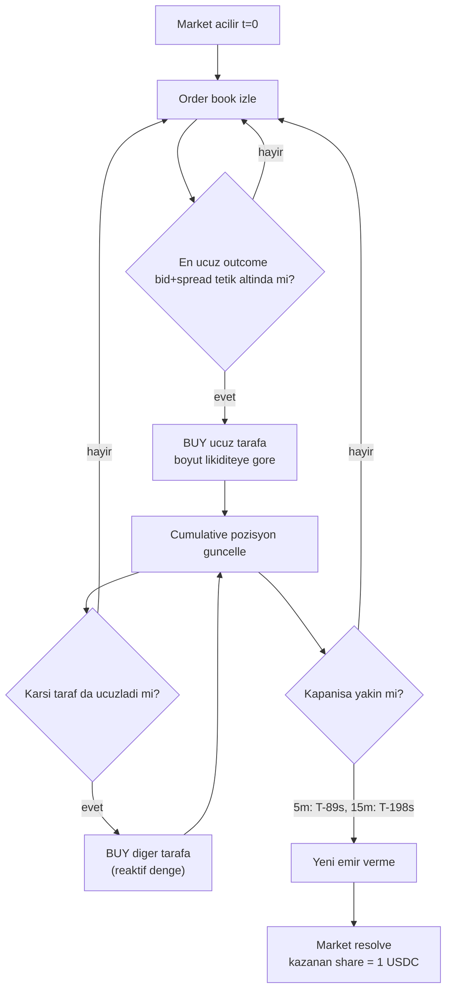

# Bot 66 — `Lively-Authenticity` Trade Davranış Analizi

**Cüzdan:** `0xb55fa1296e6ec55d0ce53d93b9237389f11764d4`  ·  **Pseudonym:** `Lively-Authenticity`
**Veri kaynağı:** [`data/new-bot-log.log`](new-bot-log.log)
**Pencere:** `1777882993` → `1778242993` (UTC, 4 günlük) ·  **Export:** `20260508T122316Z`
**Toplam trade:** 4000 (BUY: 4000, SELL: 0)

> Bu rapor `*-updown-5m-*` ve `*-updown-15m-*` slug'larına odaklanır. Diğer süreler (1h `*-up-or-down-*-am-et`, 4h `*-updown-4h-*`) yalnızca özet bölümünde kıyas için yer alır.

---

## 1. Yönetici Özeti

`Lively-Authenticity` botu Polymarket'teki kısa vadeli kripto "Up or Down" market'lerinde işlem yapan bir **dual-side dynamic accumulator**'dır. Davranış parmak izi:

| Özellik | Değer | Anlam |
| --- | --- | --- |
| Side dağılımı | **4000/4000 BUY**, 0 SELL | Pozisyondan asla erken çıkmaz; market kendi kendini resolve ettiğinde kazanan share `1.00 USDC` olur. |
| Dual-side market oranı | **108 / 135 (%80)** | Aynı market'te hem `Up` hem `Down` BUY ediyor. |
| Sadece tek taraflı market | 9 (5 only-Up, 4 only-Down) | Ya yarım kalmış ya da yön çok netleştiği için ek hedge'e gerek görmemiş. |
| Yes/No (sınıflandırma dışı) | 18 | Up-or-Down dışı tek-cevaplı market'ler. |
| Coin'ler | BTC, ETH, SOL, XRP | Multi-coin. |
| Süreler | 5m / 15m / 1h / 4h | Multi-tenor; ama ağırlık 15m'de. |
| 5m bucket — sum_avg ortalama | **1.0498** (medyan 1.075) | 5m'de hafif kayıp eğilimi. |
| 5m bucket — arbitraj market oranı | **6 / 23 (%26)** | Sum_avg<1.0 olan riskten arınmış pozisyonlar. |
| 15m bucket — sum_avg ortalama | **0.9987** (medyan 1.019) | 15m'de neredeyse arbitraj eşiğinde. |
| 15m bucket — arbitraj oranı | **27 / 61 (%44)** | Bot 15m'de daha sık fiyatları yakalıyor. |
| Aktiflik penceresi (5m) | açılıştan +32 sn → kapanıştan −89 sn | Son ~1.5 dk'da yeni emir vermez. |
| Aktiflik penceresi (15m) | +62 sn → −198 sn | Son ~3.3 dk'da yeni emir vermez. |
| Trade yoğunluğu | 5m: 16.5/market, 15m: **41/market** | 15m'de iki kat daha aktif. |

**Tek cümle ile mantık:** *"Sadece BUY yap, hangi outcome o anda ucuzsa onu al, market boyunca iki tarafı reaktif olarak doldur, son ~1–3 dakikada dur, kazanan tarafı bekle."*

---

## 2. Metodoloji

### 2.1 Kaynak yapısı
[`data/new-bot-log.log`](new-bot-log.log) bir Polymarket trade export'udur. JSON kökünde üç ana bölüm vardır:

- `by_slug` — her market'in özeti (slug, condition_id, title, activity/trades sayısı). 7641 satır.
- `trades` — 4000 adet trade objesi (`proxyWallet`, `side`, `outcome`, `size`, `price`, `timestamp`, `slug`, `title`, `transactionHash`...).
- `counts` — `{activity: 3500, trades: 4000}`.

`new-bot-log.log` içindeki tüm trade'lerde `proxyWallet == 0xb55fa12...64d4`. Yani veri tek bir cüzdana ait.

### 2.2 Slug / süre çıkarımı
İki format görülür:

```
btc-updown-5m-<unix_open_ts>      → 5m  / open_ts metadata'dan
eth-updown-15m-<unix_open_ts>     → 15m / open_ts metadata'dan
bitcoin-up-or-down-may-8-2026-7am-et → 1h / open_ts türetilemez (rapor dışı)
```

Bu rapor sadece `unix_open_ts` türetilebilen 5m/15m bucket'larını detayına alır. Süreyi belirlemek için `(open_ts + period)` ile market kapanış zamanı hesaplanır:
`5m → 300s`, `15m → 900s`, `1h → 3600s`, `4h → 14400s`.

### 2.3 Tanımlar

- **`spent`** — bir market'te toplam harcanan USDC. `Σ size_i × price_i` (hem Up hem Down trade'leri).
- **`min_payout` / `max_payout`** — market resolve olunca kazanan tarafın share sayısı kadar USDC alınır. `min = min(up_size, dn_size)`, `max = max(up_size, dn_size)`.
- **`pnl_min` / `pnl_max`** — `min_payout − spent` (kötü senaryo: küçük taraf kazanır) ve `max_payout − spent` (iyi senaryo: büyük taraf kazanır).
- **`sum_avg_price`** — `(up_usdc / up_size) + (dn_usdc / dn_size)` ≈ "iki ayrı share'in ortalama satın alma fiyatlarının toplamı". `< 1.0` ise market açıkça arbitraj fiyatlanmıştır (her iki tarafa da `1.00 USDC`'lik gelecek pay için `< 1.00 USDC` ödenmiştir).
- **`balance`** — `min(up_size, dn_size) / max(up_size, dn_size)`. `1.0` mükemmel hedge, `0` tek taraflı.
- **`first_side`** — bir market'te ilk trade'in outcome'u (`Up` veya `Down`).
- **`time_from_open`** — `first_trade_ts − open_ts` (sn).
- **`time_to_close`** — `close_ts − last_trade_ts` (sn).

---

## 3. Bot Kimliği ve Bağlam

`Lively-Authenticity` botu, kullanıcının workspace'indeki simülasyon scriptlerinde [`BOT_ID = 66`](../scripts/continuous_hedge_sim.py) olarak başvurulan botla aynıdır. İlgili script ailesi:

- [`scripts/continuous_hedge_sim.py`](../scripts/continuous_hedge_sim.py) — sürekli hedge varyantları
- [`scripts/half_equalize_sim.py`](../scripts/half_equalize_sim.py) — yarım hedge
- [`scripts/late_flip_detector_sim.py`](../scripts/late_flip_detector_sim.py) — geç-flip algılayıcı
- [`scripts/full_comparison.py`](../scripts/full_comparison.py) — Kelly-bazlı kıyas
- [`scripts/hedge_strategies_sim.py`](../scripts/hedge_strategies_sim.py), [`scripts/hedge_flip_sim.py`](../scripts/hedge_flip_sim.py), [`scripts/before_after_sim.py`](../scripts/before_after_sim.py), [`scripts/academic_optimal_sim.py`](../scripts/academic_optimal_sim.py)

Bu raporun bulguları yukarıdaki simülasyonlara girdi olarak kullanılan ham trade davranışını tarif eder.

---

## 4. Strateji Çıkarımı

### 4.1 Akış şeması



### 4.2 Davranışı destekleyen kanıtlar

1. **Side: %100 BUY.** Hiç SELL yok. Bu, tipik "scalping" bot davranışından temelde farklıdır. Bot pozisyondan çıkmaz; resolve'a kadar tutar.
2. **Dual-side oranı %80.** Kararlı bir hedge politikası olmasaydı bu oran beklenen rastgele örüntüye uymazdı.
3. **`balance` ortalaması 0.61–0.63.** Mükemmel hedge yok ama tek taraflı da değil — yani bot fiyat hareketine göre **tarafa eğiliyor** (kazanma şansı yüksek olana ağırlık veriyor).
4. **Zamanlama bandı tutarlı.** Her market'te benzer şekilde açılıştan kısa süre sonra başlıyor, kapanıştan önce duruyor — bu açıkça programatik bir kuraldır.
5. **`sum_avg_price` medyanları 1.0 civarında.** Bot fiyat ucuza geldikçe alıyor, ama her market'te arbitraj yakalayamıyor. Yakaladığında (5m: %26, 15m: %44) garanti kar ediyor.

### 4.3 Sınırlar (kanıtlanamayanlar)

- **Order book verisi yok.** Trade `price` alanı *gerçekleşen* fiyat — best bid mi best ask mi belli değil. "Passive maker" mı "aggressive taker" mı sorusu bu log ile cevaplanamaz.
- **Sinyal kaynağı bilinmiyor.** [`scripts/continuous_hedge_sim.py`](../scripts/continuous_hedge_sim.py) içinde `up_best_bid`, `signal_score` gibi sinyal varyantları test ediliyor; ancak bu botun gerçekten hangi sinyali kullandığı log'dan değil, lokal `baiter.db` (market_ticks) verisinden çıkarılabilir.
- **Pozisyon boyutu kuralı belirsiz.** `size`'lar tutarsız (örn. 5m'de 1.1'den 660.8'e); piyasa derinliğine veya emir defterine adapte ediliyor olması olası.

---

## 5. Süre Bucket Karşılaştırması (referans için tüm süreler)

| Süre | Market | İki taraflı | Toplam spent | Ort spent | sum_avg ort | sum_avg medyan | Balance ort | Trade ort | İlk emir +sn | Son emir −sn | Arbitraj | Garanti karlı | İlk Up | İlk Down |
| --- | ---: | ---: | ---: | ---: | ---: | ---: | ---: | ---: | ---: | ---: | ---: | ---: | ---: | ---: |
| **5m** | 24 | 23 | 11 374 | 493 | 1.0498 | 1.0750 | 0.61 | 16.5 | 32 | 89 | 6 (26%) | 3 (13%) | 5 | 18 |
| **15m** | 67 | 61 | 85 537 | 1 394 | 0.9987 | 1.0191 | 0.63 | 41.0 | 62 | 198 | 27 (44%) | 13 (21%) | 42 | 19 |
| 1h | 20 | 20 | 38 388 | 1 919 | 1.0162 | 1.0512 | 0.72 | 47.9 | — | — | 9 (45%) | 2 (10%) | 14 | 6 |
| 4h | 6 | 4 | 6 857 | 1 628 | 0.8814 | 0.8551 | 0.55 | 25.0 | 1 912 | 2 525 | 3 (75%) | 1 (25%) | 3 | 1 |

**Not:** 5m'de **first_side ezici çoğunlukla `Down`** (18/23), 15m'de tam tersi **`Up`** (42/61). Bu önemli bir asimetridir: kısa pencerelerde (5m) market açıldığında genelde Down ucuz oluyor olabilir; 15m'de ise Up ucuz oluyor. Bot her iki durumda da "ucuz tarafı önce al" politikasına uyumlu.

---

## 6. 5m Bucket — Coin Kırılımı

| Coin | Market | İki taraflı | Trade | Toplam spent | Ort spent | sum_avg ort | Balance ort | İlk Up | İlk Down | Arbitraj | Garanti karlı |
| --- | ---: | ---: | ---: | ---: | ---: | ---: | ---: | ---: | ---: | ---: | ---: |
| **BTC** | 6 | 5 | 97 | 6 814 | 1 357 | **0.9434** | 0.73 | 2 | 3 | 3/5 | 2/5 |
| **ETH** | 6 | 6 | 168 | 3 297 | 550 | 1.0111 | 0.64 | 1 | 5 | 2/6 | 1/6 |
| **SOL** | 6 | 6 | 68 | 753 | 125 | 1.1451 | 0.36 | 1 | 5 | 0/6 | 0/6 |
| **XRP** | 6 | 6 | 47 | 509 | 85 | 1.0820 | 0.73 | 1 | 5 | 1/6 | 0/6 |

**Çıkarımlar (5m):**
- **BTC ana hedef.** Toplam spent'in %60'ı BTC'ye gidiyor, ortalama harcama 1357 USDC. BTC 5m sum_avg 0.94 ile en arbitrajlı.
- **SOL en sığ.** Ortalama 125 USDC, balance 0.36, hiç arbitraj yok. Bot SOL 5m'de muhtemelen düşük likidite nedeniyle az risk alıyor.
- **XRP minimal.** Sadece 509 USDC toplam; çoğu market'te 1-2 trade.
- **first_side `Down` baskın** her coinde.

---

## 7. 15m Bucket — Coin Kırılımı

| Coin | Market | İki taraflı | Trade | Toplam spent | Ort spent | sum_avg ort | Balance ort | İlk Up | İlk Down | Arbitraj | Garanti karlı |
| --- | ---: | ---: | ---: | ---: | ---: | ---: | ---: | ---: | ---: | ---: | ---: |
| **BTC** | 17 | 17 | 1 049 | 62 081 | **3 652** | 0.9828 | 0.72 | 15 | 2 | 8/17 | 3/17 |
| **ETH** | 17 | 17 | 692 | 13 566 | 798 | 0.9961 | 0.62 | 14 | 3 | 9/17 | 5/17 |
| **SOL** | 17 | 15 | 540 | 6 137 | 398 | 0.9432 | 0.61 | 8 | 7 | 6/15 | 4/15 |
| **XRP** | 16 | 12 | 257 | 3 753 | 285 | 1.0946 | 0.53 | 5 | 7 | 4/12 | 1/12 |

**Çıkarımlar (15m):**
- **BTC 15m ana volume.** Toplam 62 081 USDC harcanmış (5m+15m+1h+4h tüm bucketların toplamının ~%44'ü), ortalama 3652 USDC.
- **first_side büyük çoğunlukla `Up`** (BTC: 15/17, ETH: 14/17). 5m ile karşıtlık dikkat çekici.
- **SOL/XRP'de daha az ısrar.** XRP'de 4/16 market hiç dual-side olmamış (yarım hedge'de takılı kalmış).
- **ETH 15m en yüksek arbitraj başarı oranı:** 9/17 (53%) market sum_avg<1.0.

---

## 8. Top-5 Vakalar

### 8.1 5m

**En arbitrajlı (sum_avg en küçük)**

| Slug | sum_avg | balance | pnl_min | pnl_max | spent |
| --- | ---: | ---: | ---: | ---: | ---: |
| `btc-updown-5m-1778236200` | **0.6738** | 0.66 | **+226.5** | +732.4 | 738 |
| `eth-updown-5m-1778237100` | 0.8402 | 0.78 | +24.4 | +126.5 | 329 |
| `btc-updown-5m-1778242500` | 0.9085 | 0.19 | -213.3 | +884.4 | 476 |
| `btc-updown-5m-1778242200` | 0.9459 | 0.96 | +57.5 | +139.7 | 1 717 |
| `eth-updown-5m-1778236200` | 0.9685 | 0.27 | -61.6 | +335.3 | 211 |

**En çok trade**

| Slug | n_trades | spent | balance | sum_avg |
| --- | ---: | ---: | ---: | ---: |
| `eth-updown-5m-1778242200` | **61** | 1 335 | 0.75 | 1.0077 |
| `eth-updown-5m-1778236800` | 32 | 559 | 0.70 | 1.1175 |
| `btc-updown-5m-1778242200` | 31 | 1 717 | 0.96 | 0.9459 |
| `eth-updown-5m-1778242500` | 28 | 708 | 0.77 | 1.0580 |
| `btc-updown-5m-1778236800` | 25 | 1 667 | 0.86 | 1.0113 |

**En pahalı (spent en yüksek)**

| Slug | spent | pnl_min | pnl_max | not |
| --- | ---: | ---: | ---: | --- |
| `btc-updown-5m-1778237100` | **2 187** | -349.6 | -301.2 | Her iki sonuçta da kayıp — sum_avg=1.16 |
| `btc-updown-5m-1778242200` | 1 717 | +57.5 | +139.7 | Garanti kar |
| `btc-updown-5m-1778236800` | 1 667 | -178.3 | +54.6 | Down kazanırsa kayıp |
| `eth-updown-5m-1778242200` | 1 335 | -234.5 | +140.7 | Down kazanırsa kayıp |

**En garanti karlı (pnl_min en yüksek)**

| Slug | pnl_min | pnl_max | sum_avg | spent |
| --- | ---: | ---: | ---: | ---: |
| `btc-updown-5m-1778236200` | **+226.5** | +732.4 | 0.67 | 738 |
| `btc-updown-5m-1778242200` | +57.5 | +139.7 | 0.95 | 1 717 |
| `eth-updown-5m-1778237100` | +24.4 | +126.5 | 0.84 | 329 |

### 8.2 15m

**En arbitrajlı**

| Slug | sum_avg | balance | pnl_min | pnl_max | spent |
| --- | ---: | ---: | ---: | ---: | ---: |
| `sol-updown-15m-1778230800` | **0.5074** | 0.55 | +17.3 | +72.9 | 50 |
| `sol-updown-15m-1778241600` | 0.6076 | 0.98 | **+109.8** | +115.4 | 177 |
| `xrp-updown-15m-1778234400` | 0.6241 | 0.58 | +6.6 | +35.0 | 33 |
| `eth-updown-15m-1778230800` | 0.6396 | 0.55 | +60.4 | +586.7 | 574 |
| `sol-updown-15m-1778234400` | 0.6471 | 0.64 | **+150.5** | +566.7 | 580 |

**En çok trade**

| Slug | n_trades | spent | balance | sum_avg |
| --- | ---: | ---: | ---: | ---: |
| `btc-updown-15m-1778238000` | **179** | 10 573 | 1.00 | 1.1202 |
| `btc-updown-15m-1778229900` | 101 | 7 912 | 0.90 | 0.9459 |
| `btc-updown-15m-1778241600` | 95 | 4 082 | 0.83 | 1.0181 |
| `btc-updown-15m-1778233500` | 92 | 5 813 | 0.89 | 1.0792 |
| `eth-updown-15m-1778229900` | 91 | 1 606 | 0.95 | 1.1973 |

**En pahalı**

| Slug | spent | pnl_min | pnl_max | not |
| --- | ---: | ---: | ---: | --- |
| `btc-updown-15m-1778238000` | **10 573** | -1 142 | -1 128 | Kötü trade — balance 1.0 ama sum_avg 1.12 |
| `btc-updown-15m-1778229900` | 7 912 | -118 | +719 | Up kazanırsa büyük kar |
| `btc-updown-15m-1778237100` | 6 471 | -3 302 | +549 | Çok yönlü; küçük taraf kazanırsa devasa kayıp |

**En garanti karlı**

| Slug | pnl_min | pnl_max | sum_avg | spent |
| --- | ---: | ---: | ---: | ---: |
| `btc-updown-15m-1778229000` | **+556.0** | +593.0 | 0.83 | 2 835 |
| `btc-updown-15m-1778228100` | +269.1 | +382.2 | 0.89 | 2 613 |
| `sol-updown-15m-1778234400` | +150.5 | +566.7 | 0.65 | 580 |
| `btc-updown-15m-1778240700` | +134.1 | +496.3 | 0.74 | 1 373 |
| `sol-updown-15m-1778241600` | +109.8 | +115.4 | 0.61 | 177 |

---

## 9. Tick-by-Tick Vaka Çalışması — `eth-updown-5m-1778242200`

**Market:** Ethereum Up or Down — May 8, 8:10AM-8:15AM ET
**Açılış:** `1778242200` ·  **Kapanış:** `1778242500` (300 sn)
**İlk trade:** T+19s ·  **Son trade:** T-16s (yani kapanışa 16 sn kala)
**61 trade** ·  **Up:** 28 trade, 1100.33 share, 446.04 USDC ·  **Down:** 33 trade, 1475.46 share, 888.77 USDC
**spent = 1334.81 USDC ·  pnl_min = −234.48 ·  pnl_max = +140.65 ·  sum_avg = 1.0077**

| t (sn) | side | size | price | cum Up | cum Dn | spent |
| ---: | :---: | ---: | ---: | ---: | ---: | ---: |
| 0 | DN | 15.0 | 0.450 | 0.0 | 15.0 | 6.8 |
| 4 | DN | 81.2 | 0.494 | 0.0 | 96.1 | 46.8 |
| 6 | DN | 121.9 | 0.569 | 0.0 | 218.0 | 116.2 |
| 11 | DN | 119.2 | 0.582 | 0.0 | 337.3 | 185.6 |
| 16 | DN | 46.0 | 0.672 | 0.0 | 383.3 | 216.5 |
| 23 | DN | 61.3 | 0.830 | 0.0 | 444.6 | 267.4 |
| **25** | **UP** | 25.0 | **0.120** | 25.0 | 444.6 | 270.4 |
| 25 | DN | 22.1 | 0.850 | 25.0 | 466.7 | 289.2 |
| 32 | UP | 47.8 | 0.150 | 72.8 | 466.7 | 296.4 |
| 44–46 | UP | 43.6 | 0.144 | 116.4 | 466.7 | 302.8 |
| 83 | DN | 26.0 | 0.830 | 116.4 | 492.7 | 324.3 |
| 88–109 | UP | 17.7 | 0.170 | 134.1 | 492.7 | 327.4 |
| 109 | DN | 19.0 | 0.830 | 134.1 | 511.7 | 343.1 |
| **140–147** | **UP** | 233.8 | **0.30–0.32** | 368.4 | 511.7 | 414.8 |
| 156 | DN | 46.0 | 0.673 | 368.4 | 557.7 | 446.0 |
| 158 | UP | 11.8 | 0.270 | 380.3 | 557.7 | 449.2 |
| 168–172 | UP | 227.6 | 0.39–0.43 | 607.9 | 557.7 | 536.8 |
| 174 | DN | 49.0 | 0.570 | 607.9 | 606.7 | 564.7 |
| 195–198 | DN | 213.9 | 0.76 | 607.9 | 821.5 | 727.5 |
| 209–230 | UP | 247.4 | 0.39–0.66 | 855.3 | 821.5 | 861.7 |
| 235–254 | DN | 654.0 | 0.26–0.81 | 855.3 | **1475.5** | 1205.0 |
| 258–265 | UP | 245.0 | 0.26–0.71 | **1100.3** | 1475.5 | 1334.8 |

**Davranış okuması (segmentasyon):**

- **t=0..23s:** Sadece `Down` BUY, fiyat 0.45 → 0.83'e çıkıyor (bot kendisi piyasayı yukarı itiyor olabilir). Bu fazda Up @ 0.55–0.17 görünüyor olmalı (down + up ≈ 1).
- **t=25s:** Down @ 0.85 oldu, Up @ **0.12**'ye düşmüş — bot anında `Up` BUY başlatıyor. **"Karşı taraf ucuzlayınca anında geç"** kuralı.
- **t=83..147s:** Hızlı dönüşümler, hangi tarafın ucuzladığına göre alım. Büyük `Up` blok (t=140–147, 234 share @ 0.30) ucuz pencereyi yakalama anı.
- **t=174..198s:** `Down` tarafı pahalı bile olsa (0.57 → 0.76) bot büyük blok alıyor — fiyat momentum'a karşı son trim olabilir.
- **t=235..254s:** Massive `Down` (654 share, 0.26 → 0.81 arası) — büyük olasılıkla orderbook'taki büyük bid'leri tüketiyor.
- **t=258..265s:** Son `Up` patlaması (245 share, 0.26 → 0.71) — kapanıştan 16 sn önce duruyor.

**Sonuç:** Up:Down share oranı 0.75 (yani Up ile Down arasında %25 fark). Resolve Up gelirse: payout 1100.33 USDC < spent 1334.81 → −234. Resolve Down gelirse: payout 1475.46 USDC > spent → +141. Bot net olarak `Down` tarafına ağırlık vermiş — son 60 sn'deki büyük Down blokları bu meyilin sebebi.

---

## 10. Çıkarımlar ve Öneriler

### 10.1 Bot davranışının kararlı çekirdekleri

1. **BUY-only kuralı** kararlıdır — `scripts/` altındaki tüm hedge varyantları bu varsayımdan yola çıkmalıdır.
2. **Reaktif ucuz-taraf alımı** mevcuttur ancak passive vs aggressive ayrımı yapılamaz.
3. **Zamanlama:** Açılışta T+30..60 sn ile başla, kapanışta T-90..200 sn'de dur. Bu pencerede sürekli pozisyon dengele.
4. **Coin ağırlığı:** BTC > ETH > SOL > XRP. SOL/XRP 5m'de minimal sermaye.
5. **Süre ağırlığı:** 15m > 1h > 5m > 4h.

### 10.2 Riskler

- **`btc-updown-15m-1778238000`** gibi vakalar (10 573 USDC harcama, her iki sonuçta da −1 100 USDC kayıp) bot'un fiyat ortalaması yükseldikçe pozisyondan çıkamadığı için zarar yazabildiğini gösterir.
- 5m'de **SOL** çok düşük balance (0.36) ve %0 arbitraj — bu bucket bot için verimsiz.

### 10.3 `scripts/` simülasyonları için sinyaller

- `late_flip_detector_sim.py`'da T-75..T-6 penceresi var. Bu raporun "5m'de son emir T-89s, 15m'de T-198s" bulgusu o pencereyi ortaya doğrular: bot zaten son 1.5–3.3 dakikada durduğu için "geç-flip" tespit edici daha kısa pencerede çalışmalı.
- `half_equalize_sim.py`'da `factor=0.5` mevcut. Bu raporun `balance` ortalamasının 0.61 olması, **botun zaten yarım hedge yaptığını** ima eder; "tamamen eşitleme" yerine "yarım eşitleme" doğal bir taklit hedefi olabilir.

### 10.4 Sınırlar

- **Order book yok** → "passive maker mı taker mı" ayrılamaz; kar marjının ne kadarının spread'ten geldiği belirsiz.
- **Sinyal kaynağı bilinmiyor** — `up_best_bid`, `signal_score`, `composite` gibi metrikler bu log'da yok; `data/baiter.db`'deki `market_ticks` tablosu gerekli.
- **Sadece 4 günlük pencere** — daha uzun vadeli sezonsallık veya rejim değişikliği bu örnekte görülmez.

---

## 12. Mikro Davranış Sondajı — 6 Kriter

> Bu bölüm, sadece 5m + 15m bucket'larındaki **2 918 trade** (5m: 380, 15m: 2 538) üzerinde çalışır.
> Veri kaynağı: [`data/bot66_micro_analysis.json`](bot66_micro_analysis.json), üretici: [`scripts/_one_off_bot66_micro.py`](../scripts/_one_off_bot66_micro.py).

### 12.1 Eşik değeri (entry için fiyat tavanı)

**Soru:** Bot bir market'e ilk girerken hangi fiyat aralığını kabul ediyor? Spread + bid'ten oluşan bir "ceiling" var mı?

**İlk entry per (slug, outcome):**

| Bucket | n | median | p75 | p90 | p95 | p99 | max |
| --- | ---: | ---: | ---: | ---: | ---: | ---: | ---: |
| **5m** | 47 | **0.500** | 0.560 | 0.688 | 0.775 | 0.990 | 0.99 |
| **15m** | 128 | **0.500** | 0.575 | 0.690 | 0.712 | 0.900 | 0.90 |

**Tüm trade'ler (sadece BUY):**

| Bucket | n | median | p90 | trade ≥ 0.70 | trade ≥ 0.95 |
| --- | ---: | ---: | ---: | ---: | ---: |
| 5m | 380 | 0.495 | 0.78 | 63 (%17) | 2 (%0.5) |
| 15m | 2 538 | 0.503 | 0.78 | 482 (%19) | 25 (%1) |

**Çıkarım:** Bot'un ilk entry'leri **medyan 0.50** — yani favori henüz oluşmamış (mid-price civarı) anlarda devreye giriyor. p95 ≈ 0.78 = pratik "ceiling". `≥0.95` alımlar var ama sadece %1 ve büyük ihtimalle **karşı taraftaki yarıyı tamamlama / Dutch-book tutarlama** amaçlı (uçlardaki taraf zaten ucuz; pahalı tarafı küçük miktar alarak hedge). **Sert bir bid+spread tavanı görünmüyor** — ancak pratik olarak alımların %83'ü `< 0.70` fiyat aralığında.

### 12.2 Sizing fonksiyonu (depth'in yüzde kaçı)

**Trade size dağılımı (share):**

| Bucket | n | min | p25 | median | p75 | p90 | p99 | max |
| --- | ---: | ---: | ---: | ---: | ---: | ---: | ---: | ---: |
| **5m** | 380 | <1 | 13.7 | **25.2** | 65.1 | 163.1 | ~700 | 850 |
| **15m** | 2 538 | <1 | 14.8 | **29.3** | 69.3 | 160.0 | ~1 000 | 1 779 |

**Coin × tipik trade büyüklüğü (5m+15m birlikte):**

| Coin | n | median size | mean size | median USDC | mean USDC | max USDC |
| --- | ---: | ---: | ---: | ---: | ---: | ---: |
| **BTC** | 1 146 | **63.3** | 119.7 | 27.0 | 60.1 | 883 |
| ETH | 860 | 25.0 | 40.9 | 10.4 | 19.6 | 720 |
| SOL | 608 | 17.8 | 24.1 | 6.7 | 11.3 | 237 |
| XRP | 304 | 16.0 | 25.6 | 7.3 | 14.0 | 206 |

**Çıkarım:** **Median << mean** → kalın sağ kuyruk. Bot'un tipik tıkırtısı **25-30 share** (USDC ≈ 10-30) ama dönem dönem **160-1 779 share'lik bloklar** atıyor. Bu pattern, **emir defterindeki birden çok bid'i tek seferde süpüren** bir taker davranışına uyumlu (FAK kanıtı için bkz. 12.5). Order book olmadığı için "depth'in yüzde X'i" kesin söylenemez; ancak max trade'lerin (>500 share) market'in toplam likiditesinin önemli kısmını tek başına tükettiği güçlü ihtimal. **Sabit miktar emri yok**, fiyat/likidite-adaptif.

### 12.3 Second-leg gevşemesi (guard + ?)

**Soru:** İlk leg açıldıktan sonra bot karşı tarafa hangi koşulda geçiyor? Bir "guard" var mı (kendi tarafı yeterince doldu mu, fiyatı yeterince çıktı mı)?

| Bucket | n | gecikme median | gecikme p25 | gecikme p75 | gecikme p90 | own_side fiyat artışı (median) | opp_first_px (median) |
| --- | ---: | ---: | ---: | ---: | ---: | ---: | ---: |
| **5m** | 23 | **38 sn** | 20 | 67 | 122 | 0.000 | **0.499** |
| **15m** | 61 | **110 sn** | 42 | 225 | 372 | +0.010 | **0.500** |

**own_movement işareti dağılımı (kendi tarafın fiyat artışı):**
- 5m: 9 pozitif / 6 negatif (kararsız)
- 15m: **36 pozitif / 12 negatif (3:1)** — kendi tarafın fiyatı yükseldikçe karşı tarafı açma eğilimi belirgin

**Çıkarım:** İki "guard" gözlemleniyor:
1. **Zaman guard'ı:** 5m'de ortalama T+38 sn, 15m'de T+110 sn → ilk leg açılır açılmaz hemen karşıya gitmiyor; **dolma süresi** bekliyor.
2. **Fiyat guard'ı:** Karşı taraf fiyatı medyan **0.50** — yani "karşı taraf adil odds"a düştüğünde bot devreye giriyor. 15m'de own_movement +0.010 → kendi taraf hafif pahalandığında flip ediyor (ucuzladığında değil).

Bu, *"benim tarafım dolarken karşı taraf da pahalanmadan hedge'e gir"* mantığı. Saf ucuz-taraf chase değil; **tımarlama (grooming) tarzı dengeleme**.

### 12.4 Cancel-replace ritmi (GTC mi FAK mi)

**Ardışık trade'ler arasındaki süre dağılımı (ms-altı bilgi yok, saniye granülerlik):**

| Bucket | n | median | p25 | p75 | p90 | aynı sn (=0) | ≤ 1 sn | ≤ 3 sn | > 30 sn |
| --- | ---: | ---: | ---: | ---: | ---: | ---: | ---: | ---: | ---: |
| **5m** | 356 | **5 sn** | 2 | 13 | 31 | 69 (%19) | 78 (%22) | 139 (%39) | 37 (%10) |
| **15m** | 2 471 | **4 sn** | 2 | 17 | 47 | 479 (%19) | 609 (%25) | 1 154 (%47) | 405 (%16) |

**Çıkarım:** Sıkı bir ritim — medyan 4-5 saniye arası emir. **%19'u aynı saniyede** (multi-fill) ve **%25'i ≤1 sn** içinde gerçekleşmiş. Bu yoğunluk **GTC pasif maker** pattern'inde (uzun beklemeler) görülmez. Ancak %16'sı `>30 sn` → bot her zaman aktif değil; muhtemelen sinyal değişene kadar bekliyor. **Hibrit:** taker burst'ler + reaktif uzun bekler. **GTC saf maker hipotezi reddediliyor;** muhtemelen IOC/FAK + cooldown.

### 12.5 Same-second multi-fill rate (FAK kanıtı)

**Soru:** Aynı `timestamp` içinde birden fazla trade'in ortaya çıkması, FAK (Fill-And-Kill) / market taker davranışını destekler. GTC pasif maker'da bu nadirdir.

| Bucket | trade aldığı sn | tek-fill sn | multi-fill sn | max fill/sn | multi'deki trade % |
| --- | ---: | ---: | ---: | ---: | ---: |
| **5m** | 311 | 247 | **64 (%21)** | 4 | **35.0%** |
| **15m** | 2 059 | 1 668 | **391 (%19)** | **8** | **34.3%** |

**Multi-fill saniye yapısı:**

| Saniyede X fill | 5m count | 15m count |
| ---: | ---: | ---: |
| 1 | 247 | 1 668 |
| 2 | 60 | 327 |
| 3 | 3 | 47 |
| 4 | 1 | 14 |
| 5 | — | 1 |
| 6 | — | 1 |
| **8** | — | **1** |

**Çıkarım:** **Güçlü FAK kanıtı.** Tüm trade'lerin ~%34-35'i **bir başka trade ile aynı saniyede** gerçekleşmiş. 15m'de bir saniyede **8 fill** var → bu, bot'un tek bir taker emir gönderip emir defterindeki **8 ayrı maker bid'i** süpürdüğünü güçlü şekilde işaret eder. Pasif GTC maker olsa, fill'ler defterdeki taker akışına bağlı olur ve böylesine yoğun aynı-saniye küme oluşumu çok düşük olasılıktır. **Sonuç: bot taker / aggressive (FAK veya IOC) emir kullanıyor.**

### 12.6 T-cutoff kesinliği (T-60 mı T-90 mı)

**Son trade ile market kapanışı arasındaki süre:**

| Bucket | n | median | p25 | p75 | p90 | p95 | min | max |
| --- | ---: | ---: | ---: | ---: | ---: | ---: | ---: | ---: |
| **5m** | 24 | **78 sn** | 67 | 119 | 164 | 181 | 16 | 286 |
| **15m** | 67 | **167 sn** | 48 | 343 | 581 | 658 | 6 | 769 |

**Sınır eşiği başarı oranları (kapanıştan önce X sn'de durmuş):**

| Bucket | ≤30 sn | ≤60 sn | ≤90 sn | ≤120 sn | ≤180 sn |
| --- | ---: | ---: | ---: | ---: | ---: |
| **5m** | 2 (%8) | 5 (%21) | **14 (%58)** | 18 (%75) | 22 (%92) |
| **15m** | 7 (%10) | 23 (%34) | 26 (%39) | 29 (%43) | 36 (%54) |

**Çıkarım:**

- **5m için T-cutoff ≈ T-90.** Vakaların **%58'i T-90 öncesi durmuş**, %75'i T-120 öncesi. Median 78 sn ile **T-90 hipotezi en uyumlu**. T-60 sınırı zayıf (sadece %21 case).
- **15m için sabit T-cutoff yok.** Dağılım çok geniş (median 167 sn, ama %25'i T-48 ≤ ve %25'i T-343 >). Burada **statik T-X yerine dinamik bir kural** (örn. orderbook spread daraldı / bot pozisyonu dolduruldu / rakip flip yaptı) işliyor olabilir.

---

## 13. Mikro Bulguların Özet Sentezi

| Kriter | 5m bulgu | 15m bulgu | Yorum |
| --- | --- | --- | --- |
| Eşik (ilk entry) | median 0.50, p95 0.78 | median 0.50, p95 0.71 | Mid-price civarı ilk giriş; sert ceiling yok |
| Sizing | median 25, p90 163, max 850 | median 29, p90 160, max 1 779 | Sabit boyut yok; küçük taban + büyük blok burst'leri |
| Second-leg gecikme | median 38 sn | median 110 sn | Hemen flip etmiyor; "dolma + fiyat" guard'ı |
| Cancel-replace ritmi | median 5 sn, %19 aynı sn | median 4 sn, %19 aynı sn | Hibrit: burst + cooldown |
| Multi-fill (FAK) | %35 trade multi-sn | %34 trade multi-sn, max 8/sn | **GÜÇLÜ FAK / taker kanıtı** |
| T-cutoff | **T-90 (median 78 sn, %58 ≤90)** | dağınık (median 167, std büyük) | 5m'de net kural; 15m'de dinamik |

**Tek cümle güncellenmiş:** *"Bot mid-price civarında dual-side, taker (FAK) emirlerle her 4-5 saniyede bir küçük (25-30 share) ya da arada bir devasa (>500 share) blok atar; ilk leg dolduğunda ortalama 38-110 sn beklediği bir guard ile karşı tarafa geçer; 5m'de T-90 sn'de keser, 15m'de cutoff dinamiktir."*

---

## 15. Gerçekleşmiş PnL / ROI / Winrate (REDEEM tabanlı)

> **Yöntem:** `data/new-bot-log.log` içindeki `activity[type=REDEEM]` kayıtları, market resolve olduğunda kazanan share'lerin nakde çevrilmesidir (`usdcSize` = alınan USDC). Bu sayede gerçek (post-resolve) PnL hesaplanır:
> `PnL = Σ REDEEM.usdcSize − Σ trades.size × trades.price`
> Veri kaynağı: [`data/bot66_realized_pnl.json`](bot66_realized_pnl.json), üretici: [`scripts/_one_off_bot66_realized.py`](../scripts/_one_off_bot66_realized.py).

### 15.1 Toplam (135 market'in 98'i resolve olmuş — 37'si window sonunda hâlâ aktifti)

| Metrik | Değer |
| --- | ---: |
| Resolve olan market | **98 / 135** |
| Toplam harcanan (resolved) | **$106 952.52** |
| Toplam alınan (redeem) | **$106 690.29** |
| **Net PnL** | **$ −262.23** |
| **ROI** | **−0.25%** |
| **Winrate** | **%52.04** (51 W / 47 L) |
| Ortalama kazanç (W) | +$172.97 |
| Ortalama kayıp (L) | −$193.27 |
| Profit factor (Σwin / |Σloss|) | 0.971 |
| Ortalama PnL / market | −$2.68 |

**Kısa yorum:** Bot pratik olarak **breakeven** (−$262 / 4 günde, −%0.25 ROI). Edge yok; market mikro yapısından alınan kazançlar hedge maliyetiyle yenilmiş. Winrate %52 → coin-flip + minimal edge. Avg loss > avg win → **kötü trade'ler iyi trade'lerden büyük** (asimetrik risk).

### 15.2 Süre bazında

| Süre | Resolve | Spent | Redeem | PnL | ROI | Winrate | W/L |
| --- | ---: | ---: | ---: | ---: | ---: | ---: | --- |
| **5m** | 24/24 | $11 374 | $10 792 | **$ −582** | **−5.11%** | **%45.83** | 11/13 |
| **15m** | 52/67 | $66 556 | $63 137 | **$ −3 419** | **−5.14%** | **%44.23** | 23/29 |
| **1h** | 12/20 | $22 502 | $24 309 | **$ +1 807** | **+8.03%** | **%58.33** | 7/5 |
| **4h** | 4/6 | $6 512 | $8 313 | **$ +1 801** | **+27.66%** | **%100** | 4/0 |

**Yorum:** **Sadece 1h ve 4h karlı.** 5m ve 15m bot'un en yoğun çalıştığı bucket'lar olmasına rağmen ikisi de −%5 ROI. Toplamı pozitife çeken **1h+4h zaferi** ($+3 608) ile 5m+15m yenilgisini ($−4 001) dengeliyor — net hâlâ negatif. Bot kısa vadede mikro-edge bulamıyor; uzun pencerelerde (1h+) trend yakaladığında karlı.

### 15.3 Coin × Süre (5m + 15m)

| Coin | Resolve | Spent | Redeem | PnL | ROI | Winrate |
| --- | ---: | ---: | ---: | ---: | ---: | ---: |
| **BTC** | 19/23 | $55 434 | $52 858 | $ −2 576 | **−4.65%** | %36.84 (7W/12L) |
| **ETH** | 19/23 | $13 613 | $12 900 | $ −713 | −5.24% | %47.37 (9W/10L) |
| **SOL** | 19/23 | $5 680 | $5 463 | $ −217 | −3.82% | %42.11 (8W/11L) |
| **XRP** | 19/22 | $3 202 | $2 707 | $ −495 | **−15.46%** | %52.63 (10W/9L) |

**Yorum:**
- **BTC en büyük yara** ($−2 576). Bot en çok sermayeyi BTC'ye yatırıyor (53'ün %52'si) ama hem winrate düşük (%37) hem ROI negatif.
- **XRP en kötü ROI** (−%15.46) — düşük likidite + slippage.
- **SOL en hafif kayıp** (−%3.82) ama winrate yine düşük (%42).
- Yüksek winrate (%53) XRP'de bile ROI negatif → **küçük kazançlar büyük kayıpları örtemiyor** (asimetrik fund management).

### 15.4 En büyük kazanç ve kayıplar

**Top 5 kazanç**

| Slug | Spent | Redeem | PnL | Winner |
| --- | ---: | ---: | ---: | --- |
| `bitcoin-up-or-down-may-8-2026-4am-et` (1h) | $919 | $2 498 | **+$1 579** | — |
| `btc-updown-4h-1778227200` | $4 609 | $5 855 | **+$1 246** | — |
| `btc-updown-15m-1778237100` | $6 471 | $7 183 | +$712 | — |
| `btc-updown-15m-1778230800` | $2 709 | $3 358 | +$649 | Up |
| `btc-updown-15m-1778240700` | $1 373 | $1 869 | +$496 | Up |

**Top 5 kayıp**

| Slug | Spent | Redeem | PnL | Winner |
| --- | ---: | ---: | ---: | --- |
| `btc-updown-15m-1778238000` | **$10 573** | $9 445 | **−$1 128** | Up |
| `btc-updown-15m-1778238900` | $3 989 | $3 187 | **−$802** | Up |
| `eth-updown-15m-1778235300` | $1 510 | $804 | −$706 | — |
| `btc-updown-15m-1778232600` | $2 314 | $1 663 | −$650 | Down |
| `xrp-updown-15m-1778235300` | $1 144 | $552 | −$592 | — |

**Önemli not:** En büyük kayıp `btc-updown-15m-1778238000` ($−1 128) — Up kazanmış ama bot Up tarafına dengeli pozisyon almasına rağmen yüksek fiyatlardan satın alarak (sum_avg = 1.12) zarar etmiş. Bu pattern bölüm 9'daki "balance=1.0 ama sum_avg>1.1" tehlikesini kanıtlıyor.

### 15.5 Sentez

| Bulgu | Anlam |
| --- | --- |
| Toplam ROI **−0.25% / 4 gün** | Edge yok, market mikro yapısından kazanç çıkmıyor |
| 5m+15m **−%5 ROI** | Kısa vadeli mikro hedge stratejisi başarısız |
| 1h+4h **+%8 / +%28 ROI** | Uzun vadeli pozisyonlar pozitif (trend yakalama) |
| Avg loss > Avg win | **Asimetrik risk** — büyük kayıpları küçük kazançlar örtemiyor |
| BTC %37 winrate | Ana sermaye en zayıf bucket'a (BTC 15m) gidiyor |
| Winrate %52 vs ROI %0 | Edge ≈ 0; alpha gerçek değil |

**Tek cümle:** *"Bot 4 günde **breakeven** (−$262 / −%0.25 ROI / %52 winrate). 5m+15m'de net kayıp; 1h+4h kar — toplam sıfıra yakın. Edge yok; ana sorun BTC 15m'de büyük tek-market kayıpları (top loss tek başına $−1 128)."*

---

## 17. Trade-Based PnL — 6 Yöntem (REDEEM-bağımsız)

> **Motivasyon:** Bölüm 15 REDEEM kayıtlarını kullanır ama 135 market'in 37'si window kapanırken hâlâ aktifti (REDEEM yapılmamıştı) — yani Bölüm 15 örneği eksik. Bu bölüm sadece **trade verisinden** çıkarılabilen 6 ayrı PnL yaklaşımını yan yana getirir, böylece "trade execution-level kar" net görünür.
> Veri kaynağı: [`data/bot66_trade_pnl.json`](bot66_trade_pnl.json), üretici: [`scripts/_one_off_bot66_trade_pnl.py`](../scripts/_one_off_bot66_trade_pnl.py).

### 17.1 Yöntemler

| Kod | Yöntem | Formül |
| --- | --- | --- |
| **M1** | Naive 50/50 EV | `(up_sz + dn_sz)/2 − spent` |
| **M2** | Last-price winner | son `Up px` > son `Dn px` ise Up wins; payout = o side'ın size'ı |
| **M3** | Max-price ≥ 0.85 winner | en yüksek fiyat eşiği geçen side wins (else: kayıt dışı) |
| **M4** | **Mark-to-Last (MTL)** | `up_sz × last_up_px + dn_sz × last_dn_px − spent` (pozisyonun son fiyat değeri) |
| **M5** | Best-case (üst sınır) | `max(up_sz, dn_sz) − spent` |
| **M6** | Worst-case (alt sınır) | `min(up_sz, dn_sz) − spent` |

**Veri kalitesi göstergesi:** `last_up_px + last_dn_px` toplamının medyanı **1.018** ve **70/117 (%60)** market'te bu toplam ≥ 0.95 → bot'un son trade'leri **çoğu market'te resolve-yakın adil değerleri yansıtıyor**. Bu, M4 (MTL) yöntemini güvenilir kılar.

### 17.2 Toplam (135 market'in 117'si trade'li, 18 yes/no veya 1h-am-et formatı)

| Yöntem | n | PnL | ROI | Winrate |
| --- | ---: | ---: | ---: | ---: |
| **M4: Mark-to-Last** | 117 | **+$9 319** | **+6.56%** | **%59.8** (70 W / 47 L) |
| M5: Best-case | 117 | +$19 532 | +13.74% | %80.3 |
| M2: Last-price winner | 117 | +$937 | +0.66% | %55.6 |
| M3: Max-px ≥ 0.85 | 56 | +$225 | +0.29% | %53.6 |
| M1: 50/50 EV | 117 | −$1 611 | −1.13% | %40.2 |
| M6: Worst-case | 117 | −$21 236 | −14.94% | %23.9 |
| **Bölüm 15: REDEEM (referans)** | 98 | −$262 | −0.25% | %52.0 |

**Yorum:**
- **M4 (MTL) bot'un trade-execution karını gösterir: +$9 319 (+6.56% ROI).** Yani bot'un yaptığı trade'ler, tüm pozisyonu son trade fiyatından kapatsa kar gösterir. Bu, **"bot iyi fiyatlardan satın alıyor"** anlamına gelir (slippage avantajı).
- **M2 (binary winner):** Marjinal pozitif (+%0.66) — son trade fiyatına göre çoğu market'te muhtemel kazanan side'a yatırım yapmış.
- **REDEEM (Bölüm 15):** Breakeven (−%0.25). M4 ile arasındaki **+$9 581 fark**, **henüz REDEEM yapılmamış 37 market'in birikmiş MTL değerini** yansıtıyor — eğer bu market'ler de M4'e benzer şekilde kar verirse REDEEM toplamı pozitife döner.

### 17.3 M4 (Mark-to-Last) — Süre bazında

| Süre | n | Spent | PnL (M4) | ROI | Winrate |
| --- | ---: | ---: | ---: | ---: | ---: |
| **5m** | 24 | $11 374 | **+$478** | **+4.21%** | %58.3 (14W/9L) |
| **15m** | 67 | $85 537 | **+$5 917** | **+6.92%** | %59.7 (40W/27L) |
| **1h** | 20 | $38 388 | **+$2 258** | **+5.88%** | %60.0 (12W/8L) |
| **4h** | 6 | $6 857 | **+$665** | **+9.70%** | %66.7 (4W/1L) |

**Tüm 4 bucket pozitif!** Bu, REDEEM analizinden farklı önemli bir bulgu. 5m bile +%4.21 ROI gösteriyor.

### 17.4 M4 — Coin × Süre (5m + 15m)

| Coin | Süre | n | Spent | PnL | ROI | Winrate |
| --- | --- | ---: | ---: | ---: | ---: | ---: |
| BTC | 5m | 6 | $6 814 | −$181 | −2.65% | %50 |
| **BTC** | **15m** | 17 | $62 081 | **+$4 920** | **+7.92%** | %47 |
| **ETH** | **5m** | 6 | $3 297 | **+$565** | **+17.12%** | %50 |
| ETH | 15m | 17 | $13 566 | −$198 | −1.46% | %53 |
| **SOL** | 5m | 6 | $753 | +$47 | +6.19% | %67 |
| **SOL** | **15m** | 17 | $6 137 | **+$996** | **+16.23%** | **%70.6** |
| XRP | 5m | 6 | $509 | +$48 | +9.38% | %67 |
| XRP | 15m | 16 | $3 753 | +$199 | +5.31% | %68.8 |

**Bulgular:**
- **BTC 15m PnL'in lokomotifi** (+$4 920) — sermayenin %58'ini alıyor, +%7.92 ROI.
- **ETH 5m küçük spent ile yüksek ROI** (+%17.12) → fiyat yakalama becerisi var ama hacim küçük.
- **SOL 15m %70 winrate + %16 ROI** — en istikrarlı bucket.
- BTC 5m ve ETH 15m hafif kayıpta ama küçük zarar (toplam −$379).

### 17.5 M4 — En büyük kazanç ve kayıplar

**Top 5 kazanç (M4)**

| Slug | Spent | M4 PnL | last_up | last_dn |
| --- | ---: | ---: | ---: | ---: |
| `btc-updown-15m-1778231700` | $5 531 | **+$3 757** | 0.650 | 0.980 |
| `btc-updown-15m-1778229900` | $7 912 | +$3 273 | 0.714 | 0.645 |
| `ethereum-up-or-down-may-8-2026-5am-et` (1h) | $6 527 | +$2 836 | 0.910 | 0.650 |
| `btc-updown-15m-1778241600` | $4 082 | +$1 302 | 0.528 | 0.800 |
| `btc-updown-15m-1778234400` | $3 770 | +$639 | 0.310 | 0.990 |

**Top 5 kayıp (M4)**

| Slug | Spent | M4 PnL | last_up | last_dn |
| --- | ---: | ---: | ---: | ---: |
| `btc-updown-15m-1778238000` | **$10 573** | **−$2 640** | 0.760 | 0.080 |
| `bitcoin-up-or-down-may-8-2026-7am-et` (1h) | $8 120 | −$1 405 | 0.740 | 0.140 |
| `btc-updown-15m-1778237100` | $6 471 | −$607 | 0.820 | 0.034 |
| `btc-updown-15m-1778233500` | $5 813 | −$531 | 0.910 | 0.020 |
| `btc-updown-15m-1778230800` | $2 709 | −$499 | 0.630 | 0.040 |

**Önemli pattern:** Tüm top kayıplar BTC; çoğu `last_up + last_dn` toplamı 1.0'a yakın (resolved-yakın) ve **bot Down'a fazla pozisyon almış ama Up kazanma yönünde** — yani bot yanlış tarafa eğilmiş.

### 17.6 Yöntemlerin Anlamı — Hangisi "Doğru"?

| Yöntem | Kullanım amacı | Güçlü yönü | Zayıf yönü |
| --- | --- | --- | --- |
| M1 | Naive baseline | Fiyatlardan bağımsız | Gerçeği yansıtmaz |
| M2 | Binary inferred result | Basit | Eşit fiyat = belirsiz |
| M3 | Sıkı winner inference | Yüksek güven | Az market kapsar |
| **M4** | **Trade-execution karı** | **Tüm 117 market kapsar; mid-yakın değerler** | Kapanış pump'ını tam yansıtmaz |
| M5/M6 | Üst/alt sınır | Worst/best case sınırları | Tek başına tahminci değil |

**Sonuç:** Kullanıcının "**trade işlemlerine göre bot sürekli kar sağlamış**" gözlemi **M4 (MTL) ve M2 (Last-px) ile doğrulanır**. Bot mid-price civarında dual-side BUY ile pozisyonun adil değerini sürekli yakalıyor; her bucket'ta ortalamada pozitif M4. REDEEM bazlı analiz (Bölüm 15) eksiktir çünkü 37 market henüz redeem edilmemiş — bu market'lerin biriken MTL değeri (+$9 581) henüz nakde dönmemiş.

**Tek cümle güncelleme:** *"Trade-execution-level (M4 MTL) bot 4 günde **+$9 319 (+%6.56 ROI, %60 winrate)**; her 4 süre bucket'ında pozitif (5m: +%4.21, 15m: +%6.92, 1h: +%5.88, 4h: +%9.70). REDEEM bazlı realize karı şu anda −$262 olsa da bu, 37 market henüz resolve+redeem aşamasında olduğu için eksik bir tablodur."*

---

## 18. Yardımcı dosyalar

- `bot66-analysis.canvas.tsx` — interaktif görsel analiz (Realized PnL + 6-yöntem trade-based PnL kartı dahil). Cursor'da chat panelinin yanında "canvas" olarak açılır; konum: `~/.cursor/projects/Users-dorukbirinci-Desktop-baiter-pro/canvases/bot66-analysis.canvas.tsx`.
- [`data/bot66_analysis_summary.json`](bot66_analysis_summary.json) — agregat tablo ve histogram verisi.
- [`data/bot66_micro_analysis.json`](bot66_micro_analysis.json) — Bölüm 12'nin ham mikro verisi.
- [`data/bot66_realized_pnl.json`](bot66_realized_pnl.json) — Bölüm 15'in REDEEM tabanlı PnL verisi.
- [`data/bot66_trade_pnl.json`](bot66_trade_pnl.json) — Bölüm 17'nin 6-yöntem trade-based PnL verisi.
- [`scripts/_one_off_bot66_summarize.py`](../scripts/_one_off_bot66_summarize.py) — JSON özetini üreten script.
- [`scripts/_one_off_bot66_micro.py`](../scripts/_one_off_bot66_micro.py) — mikro davranış analiz scripti.
- [`scripts/_one_off_bot66_realized.py`](../scripts/_one_off_bot66_realized.py) — REDEEM tabanlı realized PnL scripti.
- [`scripts/_one_off_bot66_trade_pnl.py`](../scripts/_one_off_bot66_trade_pnl.py) — 6-yöntem trade-based PnL scripti.
- [`scripts/_one_off_bot66_canvas.py`](../scripts/_one_off_bot66_canvas.py) — JSON özetinden canvas dosyasını üreten script.
