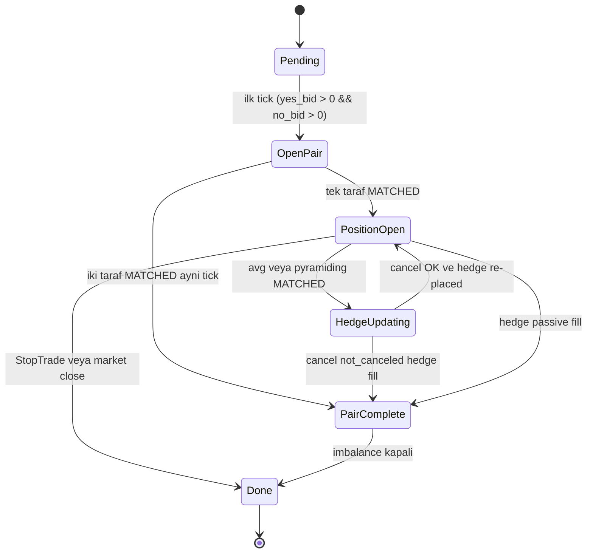

# Harvest v2 — Final İmplementasyon Dokümanı

> **Amaç:** `harvest` stratejisinin **bölge bazlı dual davranış** versiyonu. Eski v1 (`docs/strategies.md §2`'de yer alan, salt averaging-down odaklı "delta-neutral arbitraj") tamamen yerinden edilir; v2 aynı emir altyapısını kullanır ama akış kararlarını **market bölgesine** göre verir.
>
> **Felsefe:** Erken fazda riski kilitle (DeepTrade — sadece açılış), orta fazda hâlâ uygun fiyatla pair tamamlamayı dene (NormalTrade — averaging-down ile `avg_filled_side` düşür), son fazda trend varsa sırtla (AggTrade/FakTrade — yükselen tarafa pyramiding), pencere kapanırken durdur (StopTrade — tüm açıklar iptal).
>
> Ortak platform kuralları (emir boyutu formülü, global price guard, cooldown threshold rolleri, signal/zone harmanlanması) için bkz. [strategies.md](strategies.md) ve [bot-platform-mimari.md](bot-platform-mimari.md).

---

## 1. v1 → v2 farkı (özet)

| Konu | v1 (eski) | v2 (yeni) |
|---|---|---|
| Açılış | `OpenDual` — iki taraf bağımsız bid; sinyal kayması = market spread | `OpenPair` — sinyal yönlü taraf taker fiyatla, karşı taraf `hedge_price = avg_threshold − open_side_price` |
| Akış | `Pending → OpenDual → SingleLeg / DoubleLeg → Done` | `Pending → OpenPair → PositionOpen ↔ HedgeUpdating → PairComplete → Done` |
| NormalTrade davranışı | Averaging-down (single tarafta `last_fill_price`'ten düşük bid) | **Averaging-down** (yalnız `best_ask < avg_filled_side` koşuluyla, fiyat `best_bid`); karşı tarafa avg yok |
| AggTrade/FakTrade davranışı | Aynı averaging-down | **Pyramiding** (yükselen tarafa, `current > last_fill`, fiyat `best_ask + |delta|`) |
| Hedge | OpenDual'da iki taraf da bid; ProfitLock FAK ile çıkış | Açılışta tek hedge GTC; her avg fill'inde **cancel + re-place** (Yol 1, sequential safe) |
| `dual_timeout` | Var | **Kaldırıldı** (hedge zaten ProfitLock fiyatında, fill bekleme süresi yok) |
| `max_position_size` | 100 share cap | **Kaldırıldı** (pyramiding kuralı zaten yön/fiyat ile sınırlı; bot pencere içinde davranış sergiler) |
| Çıkış | `avg_sum ≤ avg_threshold` + balanced → `Done` (FAK gerekirse) | **Hedge fill** (passive veya cancel-race) → `PairComplete → Done`; aksi `StopTrade`'de `Done` |

Onaylanan 15 karar maddesinin tamamı bu dokümanda işlenmiştir; ayrıntı için bkz. §2–§16.

---

## 2. Konfigürasyon parametreleri

| Parametre | Tip | Default | Rol |
|---|---|---|---|
| `order_usdc` | `f64` | 5.0 | Emir başına notional (size = `max(⌈order_usdc/price⌉, api_min_order_size)`) |
| `avg_threshold` | `f64` | 0.98 | Pair maliyet tavanı; `hedge_price = avg_threshold − avg_filled_side` |
| `cooldown_threshold` | `u64` (ms) | 30_000 | (a) iki averaging arası min süre, (b) açık avg GTC max yaşı, (c) bölge geçişlerinde tek `last_averaging_ms` kaynağı |
| `signal_weight` | `f64` (0–10) | 0 | Composite skor + Binance harmanı; `delta` ölçeği |
| `min_price` / `max_price` | `f64` | 0.05 / 0.95 | Tüm planlanan emirler bu aralıkta clamp + tick snap |

**Kaldırılan v1 parametreleri:** `dual_timeout`, `max_position_size`. (Persist payload'da bu alanlar varsa Serde `default = ...` ile yutulur.)

**Pencere sonu davranışı:** Aktif emirler `StopTrade` bölgesi gelene kadar pasif beklenir; max-position cap yok. `StopTrade` gelir gelmez tüm açık emirler iptal edilir, yeni emir basılmaz.

---

## 3. Tanımlar

| Terim | Anlam |
|---|---|
| `composite_score` | RTDS + Binance harmanlanmış sinyal (0–10). `signal_weight = 0` → 5.0 (nötr). |
| `delta` | `(composite_score − 5) / 5 × spread`; `spread = max(0, best_ask − best_bid)` (tarafa göre okunur). Sıfır spread → 0. `signal_weight = 0` → 0. |
| `filled_side` | OpenPair'de fill olan ilk taraf (`Outcome::Up` veya `Outcome::Down`). Pair tamamlanmadan önce `PositionOpen` state'inde tutulur. |
| `rising_side` | Anlık fiyatı 0.5 üstünde olan outcome: `if best_bid_yes > 0.5 { Up } else { Down }`. AggTrade/FakTrade pyramiding kararı için. |
| `hedge_price` | OpenPair açılışında **karşı taraf** GTC fiyatı: `hedge_price = avg_threshold − open_side_price`. NormalTrade avg-down sonrası `avg_threshold − avg_filled_side` formülüyle güncellenir. |
| `avg_yes` / `avg_no` | Per-side VWAP (User WS `MATCHED` event'lerinden). |
| `avg_filled_side` | `match filled_side { Up => avg_yes, Down => avg_no }` kısayolu. |
| `last_fill_price_yes` / `last_fill_price_no` | Per-side son MATCHED fill fiyatı (kısmi fill dahil). Pyramiding "trend devam ediyor" kontrolü. |
| `imbalance` | `shares_yes − shares_no`. Pair tamamlama hedefi `imbalance ≈ 0`. |
| `pair_count` | `min(shares_yes, shares_no)`. Kâr formülü `(1 − pair_avg_cost) × pair_count`. |
| `last_averaging_ms` | En son **gönderilen** averaging veya pyramiding emrinin saati. Tek değer; bölgeler arası paylaşımlı. |

---

## 4. State machine



**Önemli geçiş notları:**

- `Pending → OpenPair` her tick yeniden denenir (book quote yoksa `Pending` kalır, log basılmaz).
- `OpenPair → PairComplete` doğrudan yol: aynı tick içinde her iki taraf da fill olduysa (örn. iki taker), `PositionOpen` state'i atlanır.
- `HedgeUpdating` transient bir alt-durum: avg/pyramiding emri MATCHED olduğunda cancel-first akışı için. Bu state'te yeni avg/pyramiding emri gönderilmez (atomic cycle).
- `StopTrade` her state'ten erişilebilir terminal — açık emirler iptal, `Done`.

---

## 5. OpenPair (T=0, açılış)

**Tetik:** `Pending` durumu + `yes_best_bid > 0 && no_best_bid > 0`. Quote yoksa `Pending` korunur.

**Endpoint:** İki ayrı `POST /order` (`Decision::PlaceOrders` iki `PlannedOrder` döner; engine sırayla yürütür — CLOB batch `/orders` kullanılmaz).

**Üç senaryo, tek formül:**

```text
delta_yes = (composite_score − 5) / 5 × yes_spread     // yes_spread = max(0, yes_ask − yes_bid)
delta_no  = (composite_score − 5) / 5 × no_spread      // simetrik

if composite_score > 5 (yükseliş yönü = UP):
    open_side       = Up
    open_price_raw  = yes_ask + delta_yes              // taker eşiği veya üstü
    hedge_price_raw = avg_threshold − open_price_raw   // ProfitLock garantili
    hedge_side      = Down

elif composite_score < 5 (yükseliş yönü = DOWN):
    open_side       = Down
    open_price_raw  = no_ask + |delta_no|
    hedge_price_raw = avg_threshold − open_price_raw
    hedge_side      = Up

else (≈ 5, nötr — signal_weight=0 dahil):
    delta = 0
    open_side       = Up                               // default; nötr de hep aynı
    open_price_raw  = yes_best_bid                     // pasif maker
    hedge_price_raw = avg_threshold − open_price_raw
    hedge_side      = Down

open_price  = clamp(snap(open_price_raw),  min_price, max_price)
hedge_price = clamp(snap(hedge_price_raw), min_price, max_price)
```

**Boyut:**
- Açılan taraf: `size = max(⌈order_usdc / open_price⌉, api_min_order_size)`
- Hedge: `size = max(⌈order_usdc / hedge_price⌉, api_min_order_size)`

**Reason etiketleri:**
- Açılan taraf: `harvest_v2:open:<side>` (örn. `harvest_v2:open:up`)
- Hedge: `harvest_v2:hedge:<side>` (örn. `harvest_v2:hedge:down`)

**Davranış:**
- Açılan taraf `delta > 0` ile ask üstüne kayar → büyük ihtimalle **taker fill**.
- Hedge `avg_threshold − open_price` ile pasif maker; market geri dönerse fill alır → `PairComplete`.
- İki taraf da aynı tick'te dolarsa (örn. iki taker eşiği) doğrudan `PairComplete`.

**`signal_weight = 0` davranışı:** `composite_score = 5.0` → nötr dalına düşer (`delta = 0`, açılan taraf = UP @ `yes_bid`). v1'deki "her iki taraf bağımsız taker eşiği" mantığından ayrılır; v2'de hedge **her zaman** `avg_threshold − open_price` ile garantilenir.

---

## 6. Bölge davranış matrisi

| Bölge | `zone_pct` | OpenPair | NormalTrade avg-down | Pyramiding | Hedge update | StopTrade iptal |
|---|---|:-:|:-:|:-:|:-:|:-:|
| `DeepTrade` | 0–10 % | ✓ (ilk tick) | ✗ | ✗ | ✓ (varsa) | ✗ |
| `NormalTrade` | 10–50 % | ✓ (henüz açılmadıysa) | ✓ | ✗ | ✓ | ✗ |
| `AggTrade` | 50–90 % | ✓ (henüz açılmadıysa) | ✗ | ✓ | ✓ | ✗ |
| `FakTrade` | 90–97 % | ✓ (henüz açılmadıysa) | ✗ | ✓ | ✓ | ✗ |
| `StopTrade` | 97–100 % | ✗ | ✗ | ✗ | ✗ | ✓ (tüm açıklar) |

**Dipnotlar:**
- "Hedge update" sütunu hâlâ aktif olan `PositionOpen` botları için: avg/pyramiding fill sonrası cancel-first akışı her bölgede çalışır (StopTrade hariç).
- DeepTrade'de averaging yok (Yorum M): ilk 30 saniyede `last_fill_price` henüz oturmamış olur ve cooldown=30sn zaten DeepTrade'i kapsar. Bot sadece açılış emirlerinin fill'ini bekler.
- NormalTrade ↔ AggTrade geçişinde `last_averaging_ms` tek değer; çifte tetiklenme olmaz.
- StopTrade'e geçildiğinde `Decision::CancelOrders([all_open_ids])` döner; state `Done`'a evolve edilir.

---

## 7. NormalTrade akışı — averaging-down

**Hedef:** `avg_filled_side`'ı düşürerek hedge'in (`avg_threshold − avg_filled_side`) erişilebilir hale gelmesini sağlamak.

**Tetik koşulu (Soru A → Yorum 2):**

```text
zone == NormalTrade
∧ filled_side belirli (PositionOpen)
∧ best_ask(filled_side) < avg_filled_side           ← matematiksel doğru: fill yeni avg'ı düşürmeli
∧ now − last_averaging_ms ≥ cooldown_threshold      ← cooldown
∧ best_bid(filled_side) ∈ [min_price, max_price]    ← global price guard
∧ açık avg GTC yok veya yaşı < cooldown             ← §11
```

> **Neden `best_ask < avg_filled_side`, `best_ask < last_fill_price` değil?** Amaç ortalamayı düşürmek. `last_fill_price` referansı yanıltıcı: `last_fill = 0.40` iken `avg = 0.48` ise, `best_ask = 0.45` zaten avg'ı düşürür ama `last_fill` eşiğinden geçemez ve fırsat kaçar.

**Aksiyon:**

```text
price = best_bid(filled_side)                        ← pasif maker (Soru B)
size  = max(⌈order_usdc / price⌉, api_min_order_size)
reason = "harvest_v2:avg_down:<side>"
emir   = PlannedOrder { Buy, GTC, filled_side, price, size, reason }
```

**Cooldown'da bid güncelleme:** Açık avg GTC yaşı `≥ cooldown_threshold` ise cancel + bir sonraki tick yeni `best_bid` ile tekrar değerlendirilir (mevcut `handle_open_averaging_for_side` örüntüsü).

**Karşı tarafa avg yok (Soru 3):** UP fill olduktan sonra DOWN fiyatı yükselmiş olsa bile NormalTrade'de DOWN'a hiç averaging emri açılmaz; sadece hedge GTC kitapta fill'i bekler.

---

## 8. AggTrade / FakTrade akışı — pyramiding

**Hedef:** Trend hâlâ tarafımızdaysa pozisyonu büyüt, ama yalnız "yükselen taraf" üzerine.

**`rising_side` tespiti:**

```text
rising_side = if best_bid_yes > 0.5 { Up } else { Down }
```

(Binary outcome: Polymarket'te `best_bid_no ≈ 1 − best_ask_yes`, dolayısıyla `best_bid_yes > 0.5` → UP şu an favori.)

**Tetik koşulu:**

```text
zone ∈ { AggTrade, FakTrade }
∧ filled_side belirli (PositionOpen)
∧ now − last_averaging_ms ≥ cooldown_threshold
∧ best_ask(rising_side) ∈ [min_price, max_price]
∧ "trend devam ediyor" — aşağıda detay
```

**"Trend devam ediyor" alt-koşulu:**
- **Eğer `rising_side == filled_side`** (aynı taraf pyramiding): `current_best_ask(rising_side) > last_fill_price_<rising_side>` (pure momentum, "son fill üzerinde olma" kuralı).
- **Eğer `rising_side != filled_side`** (karşı tarafa ilk pyramiding): `last_fill_price_<rising_side> = 0` olabilir (henüz hiç fill yok); trend kontrolü atlanır, `best_ask(rising_side)` yeterlidir.

**Aksiyon:**

```text
delta_rising = (composite_score − 5) / 5 × spread(rising_side)
price        = best_ask(rising_side) + |delta_rising|        ← taker eğilimli
size         = max(⌈order_usdc / price⌉, api_min_order_size)
reason       = "harvest_v2:pyramid:<rising_side>"
emir         = PlannedOrder { Buy, GTC, rising_side, price, size, reason }
```

> `delta`'nın **mutlak değeri** kullanılır — pyramiding kararı zaten "yükselen taraf" tespitiyle verildi; `delta` yön değil agresiflik belirler.

**Düşen tarafa hiç averaging yok:** `rising_side ≠ filled_side` ve `filled_side` artık düşen tarafsa, `filled_side`'a hiçbir koşulda yeni emir gönderilmez. Mevcut hedge GTC kitapta — fill alırsa pair tamamlanır.

**Sinyal dinamik:** Her tick `composite_score` taze okunur (kilitli değil). `signal_weight = 0` → `delta = 0` → fiyat = `best_ask(rising_side)` (saf taker eşiği), pyramiding hâlâ çalışır ama kayma yok.

---

## 9. Hedge update akışı (Yol 1 — sequential safe)

**Tetik (Yorum S):** Bir averaging veya pyramiding emri **MATCHED** event'i geldiğinde, `avg_filled_side` güncellenir (User WS `trade` veya DryRun passive simulator).

**HedgeUpdating substate:** Bu akış başladığı andan tamamlanmasına kadar yeni avg/pyramiding emri **gönderilmez**. Atomic cycle.

**9 adımlı akış:**

| # | Adım | Notes |
|---|---|---|
| 1 | Avg/pyramiding fill MATCHED | `avg_*`, `last_fill_price_*`, `imbalance` güncellenir |
| 2 | `new_hedge_price = avg_threshold − avg_filled_side` hesapla | Pyramiding'de `avg_filled_side` yükselebilir → `new_hedge_price` düşer |
| 3 | `new_hedge_price` global price guard'da clamp | `[min_price, max_price]` aralığı dışındaysa abort, hedge'i olduğu gibi bırak |
| 4 | Mevcut hedge GTC için cancel emri gönder (`Decision::CancelOrders([hedge_id])`) | State `HedgeUpdating` |
| 5 | CLOB cancel response bekle | Async — bir sonraki tick'te response işlenir |
| 6a | Response `not_canceled` listesi `hedge_id` içermiyor → cancel başarılı | → adım 7'ye geç |
| 6b | Response `not_canceled` listesi `hedge_id` içeriyor → hedge **fill olmuş** | → §10 partial-aware imbalance akışına geç |
| 7 | Yeni hedge planla: `size = imbalance.abs()`, `price = new_hedge_price` | imbalance kapatma odaklı — pair tamamlanırsa imbalance = 0 |
| 8 | `PlannedOrder { Buy, GTC, hedge_side, new_hedge_price, size, reason: "harvest_v2:hedge:<side>" }` gönder | Yeni hedge id `PositionOpen` state'ine yazılır |
| 9 | State `PositionOpen`'a geri döner | Yeni avg/pyramiding tetiklenebilir |

**Hedge size tercihi:** `imbalance.abs()` — amaç pair'i tamamlamak, yeni notional değil. (Açık uç §16'da: alternatif `order_usdc/new_hedge_price` formülü; v2 ilk implementasyonu `imbalance.abs()` ile başlar, üretimde gerekirse parametrize edilir.)

**Race condition korumaları:**
- `HedgeUpdating` substate yeni avg gönderimini bloklar — iki avg arası iki hedge update yarışması yok.
- Cancel emri yanıt gelmeden hedge re-place yapılmaz — çift hedge riski yok.
- Cancel `not_canceled` durumu (hedge fill ile cancel collision) §10 akışına yönlendirilir, hatasız ele alınır.

---

## 10. Partial hedge fill ve imbalance perspektifi (Soru C → Yorum Q)

GTC hedge emirleri partial fill alabilir (CLOB API: tek `POST /order`, çoklu `MATCHED` event'leri). v2 akışı pair-perspektifinden değil **imbalance-perspektifinden** yönetilir.

**Anahtar formüller:**

```text
pair_count          = min(shares_yes, shares_no)
imbalance           = shares_yes − shares_no
pair_avg_cost       = (avg_yes × pair_count + avg_no × pair_count) / (2 × pair_count)
                    = (avg_yes + avg_no) / 2     ← tüm shares pair'e dahilse
profit (eşitlikte)  = (1 − pair_avg_cost) × pair_count
```

**Senaryo: Hedge partial fill**

| T | Event | Durum |
|---|---|---|
| T=0 | OpenPair: UP @ 0.56 (size 9), hedge DOWN @ 0.42 (size 12) | shares_up=0, shares_no=0 |
| T+0.1s | UP MATCHED tam: 9 share | shares_up=9, shares_no=0, imbalance=+9 |
| T+30s | NormalTrade avg-down: UP @ 0.48 (size 11) MATCHED | shares_up=20, avg_up=0.516, imbalance=+20 |
| T+30.1s | Hedge update tetiklenir (§9 akışı) | new_hedge=0.464, cancel başlat |
| T+30.2s | Cancel response: `not_canceled` = [hedge_id] | Hedge **fill olmuş** — şimdi: shares_no = ? |
| T+30.3s | User WS `MATCHED` event'i: hedge 5 share fill (partial) | shares_no=5, imbalance=+15 |

**Akış:**

1. State `HedgeUpdating` → `PositionOpen` (cancel yok, hedge zaten fill)
2. Yeni hedge planla: `size = imbalance.abs() = 15`, `price = avg_threshold − avg_up = 0.464`
3. Yeni hedge GTC gönder; pair tamamlama hedefi aktif

**`PairComplete` koşulu:** `imbalance.abs() == 0` (veya `< api_min_order_size` — geri kalan share minimum altında ise zaten kapatılamaz, `Done`'a geçilir).

**Pair_count büyürken `pair_avg_cost`:** Her partial fill ile pair_count artar, avg_yes/avg_no güncellenir; `pair_avg_cost` her zaman `(avg_yes + avg_no) / 2` olarak hesaplanır (tüm shares pair'e dahil olduğunda).

---

## 11. Cooldown — tek `last_averaging_ms`, paylaşımlı

**Tek field, üç rol:**
1. İki avg/pyramiding emri arası min süre (`now − last_averaging_ms ≥ cooldown_threshold`)
2. Açık avg/pyramiding GTC max yaşı (`now − placed_at_ms ≥ cooldown_threshold` → cancel)
3. Bölgeler arası paylaşımlı (NormalTrade'de set edildiyse AggTrade'e geçildiğinde aynı sayaç kullanılır → çifte tetiklenme yok)

**Set zamanı:** Emir **gönderildiği** anda set edilir (fill anında değil; live emir de cooldown sayacı tetikler).

**Edge case:** Bölge geçişi sırasında (örn. `zone_pct = 50%` → AggTrade) son averaging'in üzerinden 10 sn geçmişse, AggTrade pyramiding 20 sn daha bekler. Bu istenen davranış (tek cooldown disiplini).

---

## 12. Sinyal etkisi

**Composite skor:** `effective_score ∈ [0, 10]`, RTDS + Binance harmanı; `signal_weight = 0` → 5.0 (nötr). Ayrıntı: [bot-platform-mimari.md §14](bot-platform-mimari.md).

**`delta` formülü (her tick taze okunur — kilitli değil):**

```text
delta = (composite_score − 5) / 5 × spread        // spread tarafa göre okunur
```

| `composite_score` | `delta` (yes_spread=0.02 ise) | OpenPair UP fiyatı (`yes_ask=0.55`) |
|---|---|---|
| 0.0 (max DOWN) | −0.020 | open_side = DOWN @ no_ask + 0.020 |
| 5.0 (nötr) | 0.0 | open_side = UP @ yes_bid (pasif maker) |
| 10.0 (max UP) | +0.020 | open_side = UP @ 0.570 (taker eşiği üstü) |

**Pyramiding'de:**
- Aynı taraf: `best_ask(rising_side) + |delta|` (mutlak; yön taraf seçimiyle belirlenir)
- Karşı taraf: aynı formül, taraf `rising_side`

**`signal_weight = 0` özet:**
- OpenPair: nötr dalı → UP @ yes_bid (default), hedge garantili
- NormalTrade avg-down: `delta`-bağımsız (sadece `best_bid` kullanılır)
- Pyramiding: `delta = 0` → fiyat = `best_ask(rising_side)` (saf taker)

---

## 13. Bölge × emir izin matrisi

| Bölge | OpenPair (Buy GTC × 2) | Avg-down (Buy GTC) | Pyramiding (Buy GTC) | Hedge re-place (Buy GTC) | Hedge passive fill | Cancel açıklar |
|---|:-:|:-:|:-:|:-:|:-:|:-:|
| DeepTrade | ✓ (ilk tick) | ✗ | ✗ | ✓ | ✓ | ✗ |
| NormalTrade | ✓ | ✓ | ✗ | ✓ | ✓ | ✗ |
| AggTrade | ✓ | ✗ | ✓ | ✓ | ✓ | ✗ |
| FakTrade | ✓ | ✗ | ✓ | ✓ | ✓ | ✗ |
| StopTrade | ✗ | ✗ | ✗ | ✗ | ✓ (mevcut) | ✓ (yeni emir hariç hepsi) |

**Notlar:**
- "OpenPair" ✓ olan bölgeler: state `Pending` ise açılış o bölgede de yapılabilir (geç açılış senaryosu — örn. bot AggTrade'de başlatıldı).
- StopTrade'de hedge **passive fill** hâlâ mümkün (User WS event); akış yine `PairComplete → Done`.
- Bölge geçişi anlık: aynı tick'te bölge değiştiyse o tick'in matrisi yeni bölgenin satırını kullanır.

---

## 14. Detaylı senaryolar (gerçek sayılarla)

> Ortak konfig: `avg_threshold=0.98`, `cooldown_threshold=30_000`, `order_usdc=5`, `api_min_order_size=5`, `signal_weight=10`, `min_price=0.05`, `max_price=0.95`.

### S1 — Happy path (OpenPair'de iki taraf taker)

```text
T=0   composite=8.0, yes_bid=0.51 ask=0.53 spread=0.02
                     no_bid=0.45  ask=0.47 spread=0.02
      delta_yes = (8-5)/5 × 0.02 = +0.012
      open_side  = UP @ snap(0.53 + 0.012) = 0.54
      hedge      = DOWN @ snap(0.98 - 0.54) = 0.44
      → POST UP@0.54(9) GTC, POST DOWN@0.44(11) GTC

T+0.1s UP @ 0.54 ≥ yes_ask=0.53 → taker fill: shares_up=9, avg_up=0.54
       DOWN @ 0.44 < no_ask=0.47 → maker, kitapta bekler
       imbalance=+9, state=PositionOpen{filled_side: Up}

T+5s   Market hareketsiz; DOWN_ask 0.46'ya düştü, hâlâ DOWN@0.44 fill olmuyor
       NormalTrade fazına geçildi, ama best_ask(up)=0.52 > avg_up=0.54 değil
       → trigger NO, NoOp

T+45s  DOWN_ask 0.43'e düştü → hedge DOWN@0.44 ≥ ask → passive fill
       shares_no=11, avg_no=0.44, imbalance=-2
       pair_count=9, kalan 2 NO tek yönlü
       state=PairComplete

T+45.1s imbalance.abs()=2 < api_min_order_size=5 → kapatılamaz
        state=Done, profit=(1 - (0.54+0.44)/2) × 9 = 0.27 USDC
```

### S2 — NormalTrade avg-down → hedge update → PairComplete

```text
T=0   composite=8.0 (UP)
      → UP @ 0.54(9), hedge DOWN @ 0.44(11)

T+0.1s UP taker fill: avg_up=0.54, imbalance=+9, PositionOpen{Up}

T+45s  NormalTrade (zone=30%); best_ask(up)=0.50 < avg_up=0.54 ✓
       cooldown_ok ✓; best_bid(up)=0.49
       → POST UP @ 0.49(11) GTC, reason="harvest_v2:avg_down:up"
       last_averaging_ms=T+45

T+50s  UP@0.49 MATCHED tam: shares_up=20, avg_up=(9×0.54+11×0.49)/20=0.5125
       Hedge update tetiklenir:
         new_hedge = 0.98 - 0.5125 = 0.4675 → snap 0.47
         CANCEL hedge_id (DOWN@0.44)
         state=HedgeUpdating

T+50.5s Cancel response: not_canceled=[] → cancel OK
        size = imbalance.abs() = 20
        POST DOWN @ 0.47(20) GTC
        state=PositionOpen{Up}

T+90s  NormalTrade hâlâ; best_ask(down)=0.46 → DOWN@0.47 passive fill 20 share
       shares_no=20, imbalance=0, pair_count=20
       avg_no=0.47, pair_avg_cost=(0.5125+0.47)/2=0.49125
       state=PairComplete → Done
       profit=(1-0.49125)×20=10.175 USDC
```

### S3 — AggTrade pyramiding (sinyal teyitli)

```text
T=0   OpenPair UP @ 0.55(9), hedge DOWN @ 0.43(12), UP fill
      avg_up=0.55, imbalance=+9, PositionOpen{Up}

T+150s zone=AggTrade (60%); best_bid_yes=0.62 > 0.5 → rising_side=Up
       rising_side==filled_side; current_best_ask(up)=0.64 > last_fill_price_up=0.55 ✓
       cooldown_ok ✓
       composite=8 → delta_yes = (8-5)/5 × spread(0.02) = 0.012
       price = 0.64 + 0.012 = 0.652 → snap 0.65
       size = max(⌈5/0.65⌉, 5) = 8
       → POST UP @ 0.65(8) GTC, reason="harvest_v2:pyramid:up"

T+155s UP@0.65 MATCHED: shares_up=17, avg_up=(9×0.55+8×0.65)/17=0.597
       Hedge update: new_hedge=0.98-0.597=0.383 → snap 0.38
       CANCEL hedge (DOWN@0.43); cancel OK
       POST DOWN @ 0.38(17) GTC

T+200s Market UP'a doğru → DOWN@0.38 fill olmuyor
       Pyramiding tekrar: best_ask(up)=0.72 > last_fill=0.65 ✓ → POST UP@0.73(7)
       (… cycle devam eder)
```

### S4 — Ters dönüş (UP fill → DOWN rising → karşı pyramiding)

```text
T=0   composite=8 → OpenPair UP @ 0.54(9), hedge DOWN @ 0.44(11), UP fill
      avg_up=0.54, PositionOpen{Up}

T+60s NormalTrade; best_ask(up)=0.52 < avg_up=0.54 ✓ → avg-down:
      POST UP @ 0.51(10), reason="avg_down:up"
T+65s Fill: avg_up=(9×0.54+10×0.51)/19=0.524
      Hedge update: new_hedge=0.456 → cancel + re-place DOWN@0.46(19)

T+200s zone=AggTrade; market DOWN'a döndü
       best_bid_yes=0.30, best_ask_yes=0.32 → rising_side = Down (best_bid_no=0.68)
       rising_side != filled_side (filled_side=Up)
       last_fill_price_no=0 (DOWN hiç fill olmadı) → trend kontrolü atlanır
       composite=2 → delta_no = (2-5)/5 × spread(no=0.02) = -0.012, |delta|=0.012
       price = best_ask(no) + 0.012 = 0.69 + 0.012 = 0.702 → snap 0.70
       → POST DOWN @ 0.70(7) GTC, reason="harvest_v2:pyramid:down"

T+205s DOWN@0.70 fill (taker): shares_no=7, avg_no=0.70
       imbalance = 19-7 = +12
       Hedge update: new_hedge_price = 0.98 - avg_filled_side = ?
       NOT: avg_filled_side = avg_up=0.524 (filled_side hâlâ Up; rising != filled)
       → new_hedge = 0.98 - 0.524 = 0.456; mevcut hedge zaten 0.456; cancel-replace gereksiz
       (Optimizasyon: yeni hedge fiyatı eski ile aynıysa skip)
       state = PositionOpen{Up} devam, kitapta DOWN@0.46(19) hedge + DOWN@0.70 ek pozisyon

T+250s Market DOWN'da kalır → hedge DOWN@0.46 hiç fill olmaz
       Pencere sonunda (StopTrade) tüm açıklar iptal
       Final shares_up=19, shares_no=7
       Kazanan: DOWN → ödeme = 7 × $1
       Maliyet: 19×0.524 + 7×0.70 = 9.956 + 4.90 = 14.856
       Bakiye: 7 - 14.856 = -7.856 → büyük zarar
       (Bu senaryo S4'ün riskini gösteriyor; ters dönüşte pyramiding kayıp tarafa karşı koruma vermez. Açık uç §16'da: rising_side != filled_side durumunda pyramiding'i optsiyonel kapatma flag'i)
```

### S5 — Partial hedge fill + imbalance kapatma

(Bkz. §10 senaryosu, T tablosu — buradaki state geçişleri tek başına yeterli.)

### S6 — StopTrade'de tüm emirler iptal

```text
T=0    OpenPair UP @ 0.54(9), hedge DOWN @ 0.44(11), UP fill
T+220s NormalTrade avg-down: POST UP @ 0.50(10)
T+260s Pyramiding (AggTrade): POST UP @ 0.62(8) — kitapta bekliyor
T+285s zone_pct=97% → StopTrade
       Decision::CancelOrders([hedge_id, pyramid_id, …])
       state → Done
       profit = (1 - avg_pair_cost) × pair_count_at_close
```

---

## 15. Mevcut metrik kataloğuyla uyum

| Metrik | v1 kullanımı | v2 kullanımı | Notes |
|---|---|---|---|
| `avg_yes`, `avg_no` | ProfitLock + DoubleLeg eşik | OpenPair hedge formülü, NormalTrade avg-down koşulu, hedge update | Aktif |
| `last_fill_price_yes`, `last_fill_price_no` | Averaging "price_fell" | Pyramiding "trend devam ediyor" | Aktif (rol değişti) |
| `imbalance` | DoubleLeg imbalance close | Hedge size, PairComplete koşulu | Aktif (merkezi rol) |
| `shares_yes`, `shares_no` | OpenDual fill kontrolü, max_position | OpenPair fill, pair_count | Aktif |
| `avg_sum` | DoubleLeg `avg_sum ≤ avg_threshold` eşiği | **Kullanılmıyor** | Tek-eşik kontrolü kalktı; pair tamamlanması imbalance ile yönetilir |
| `imbalance_cost` | (v1'de tanımlı, kullanım yok) | Kullanılmıyor | — |

`StrategyMetrics` struct değişikliği gerekmez — `avg_sum` field'ı kalır (diğer stratejiler için), v2 `decide()` okumaz.

---

## 16. Migration ve legacy

**Persist uyumluluğu:**
- `HarvestState::ProfitLock` enum varyantı kalır (legacy persist'ler için Serde Deserialize uyumluluğu); v2 `decide` katmanı bu state'i tek tick içinde `Done`'a evolve eder.
- `HarvestState::OpenDual { deadline_ms }` ve `SingleLeg { filled_side, entered_at_ms }` ve `DoubleLeg` varyantları **kaldırılabilir** (v2 yeni varyantlar tanımlar: `OpenPair`, `PositionOpen { filled_side, hedge_id }`, `HedgeUpdating { filled_side, hedge_id_being_cancelled }`, `PairComplete`); migration adımı: eski varyantlar Serde alternative ile parse edilip ilk tick'te `Pending`'e indirgenir veya bot fresh restart gerektirilir.
- Yeni `BotConfig` alanları yok (mevcut `avg_threshold`, `cooldown_threshold`, `order_usdc`, `signal_weight` aynen kullanılır); kaldırılan `dual_timeout`, `max_position_size` Serde `default = ...` ile yutulur (eski payload'lar parse edilir, değer ignore edilir).

**Açık botlara etki:** Implementasyon turunda kod yerinden değiştirildiği için **mevcut açık v1 botları** bir sonraki tick'te v2 akışına geçer. Kritik: `OpenDual` state'inde olan botlar için `OpenDual → Pending` indirgemesi (yeni tick'te v2 OpenPair akışı) önerilen geçiş; alternatif olarak migration script ile `Done`'a indirgenebilir. Bu turda doküman; kod ayrı turda netleşecek.

**Reason etiketleri (DryRun passive simulator + log filtreleri):**
- `harvest_v2:open:up` / `harvest_v2:open:down` (OpenPair açılan taraf)
- `harvest_v2:hedge:up` / `harvest_v2:hedge:down` (OpenPair veya re-place hedge)
- `harvest_v2:avg_down:up` / `harvest_v2:avg_down:down` (NormalTrade)
- `harvest_v2:pyramid:up` / `harvest_v2:pyramid:down` (AggTrade/FakTrade)

Mevcut `engine::simulate_passive_fills` ve `📥 passive_fill` log akışı bu etiketlerle otomatik uyumlu (reason field'ı opaque string).

---

## 17. Açık uçlar (implementasyon turunda netleşecek)

1. **Hedge re-place size formülü:** `imbalance.abs()` (pair tamamlama odaklı, önerilen) vs. `max(⌈order_usdc/new_hedge_price⌉, api_min_order_size)` (notional sabitli). v2 ilk implementasyon `imbalance.abs()` ile başlar; üretimde gerekirse `BotConfig.hedge_size_mode` parametresiyle seçilebilir.
2. **Ters dönüş pyramiding (S4 riski):** `rising_side != filled_side` durumunda karşı tarafa pyramiding **opsiyonel** olabilir (`BotConfig.opposite_pyramid_enabled = false` default). Bu, kayıp tarafı zıt yönde büyütmeyi önler. Bu turda doküman default davranışı: enabled (yukarıdaki §8 metni).
3. **Hedge fiyat güncellemesi hassasiyeti:** Yeni `new_hedge_price` mevcut hedge fiyatıyla aynıysa (snap sonrası), cancel-replace gereksiz — skip optimizasyonu. Implementasyonda 1 tick toleransla çalışır.
4. **`OpenDual` legacy state migration:** Persist'ten `OpenDual` okunursa `Pending`'e mi indirgenir, yoksa açık emirler taranıp `PositionOpen` veya `OpenPair` state'ine mi taşınır? Implementasyon turunda netleşir.
