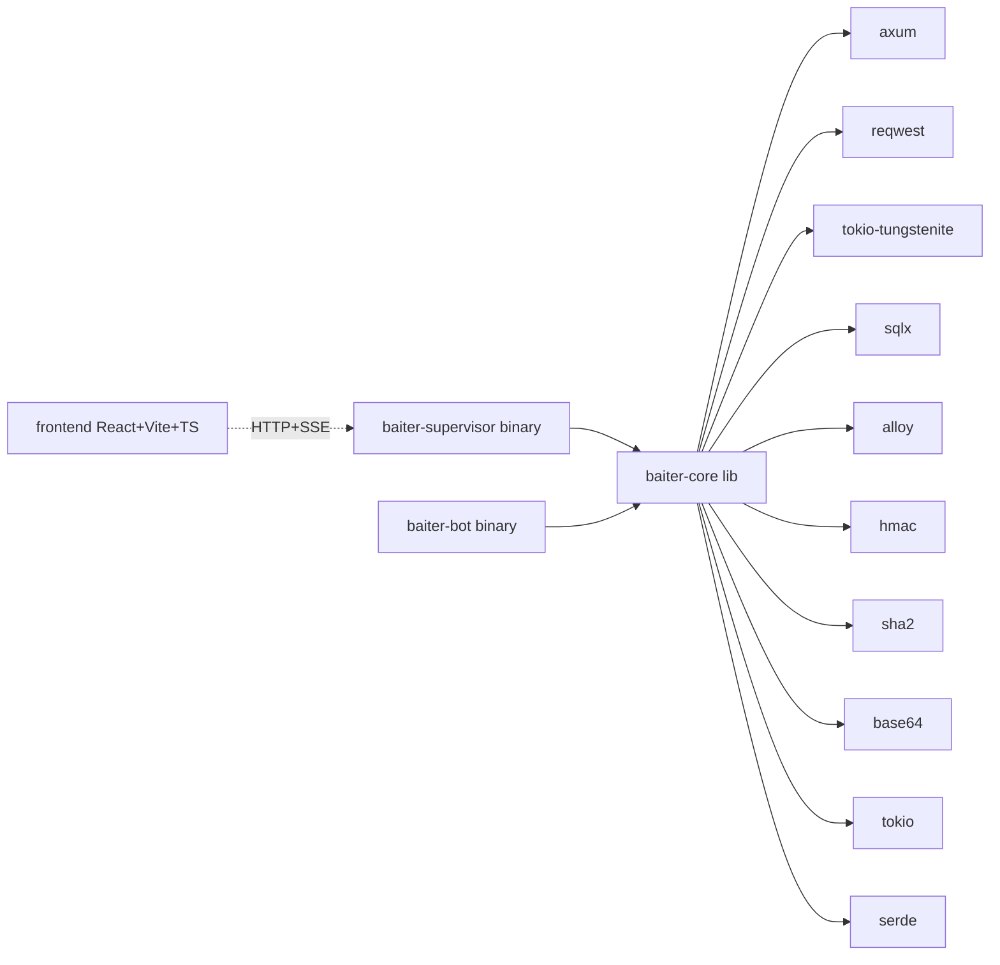

# Proje İskeleti ve Dizin Yapısı

> Bu doküman, [bot-platform-mimari.md](bot-platform-mimari.md) ve [strategies.md](strategies.md) ile uyumlu **Rust backend + React frontend** iskeletinin üst düzey yapısını tanımlar. Amaç: implementasyona başlamadan önce her dosyanın sorumluluğunu ve dizin sınırlarını netleştirmek.
>
> **Çelişki durumunda** her zaman [bot-platform-mimari.md](bot-platform-mimari.md) (ana mimari) ve [docs.polymarket.com](https://docs.polymarket.com/) (resmi API) geçerlidir.

---

## 1. Üst Düzey Karar Özeti

| Karar | Seçim | Gerekçe |
|---|---|---|
| **Rust düzeni** | Cargo **workspace** — 3 crate | Supervisor/bot ayrı PID (§1 mimari); paylaşılan kod tek lib'de toplanır |
| **SQLite** | `sqlx` (async, compile-time query check, migrations) | Fire-and-forget yazım (§Kural 4) + async mimari uyumu |
| **Frontend** | React + Vite + TypeScript | 1 sn polling + SSE push hibrit (§2, §⚡ Kural 5) |
| **HTTP sunucu** | Axum 0.8.9 (mevcut [Cargo.toml](../Cargo.toml)) | Hyper tabanlı, ince routing |
| **WebSocket** | `tokio-tungstenite` 0.29.0 | Market + User + Binance aggTrade |
| **EIP-712 imza** | `alloy` 2.0.0 (local-signer + eip712 features) | CLOB order signing + L1 auth |
| **HMAC-SHA256** | `hmac` + `sha2` + `base64` (URL_SAFE) | L2 auth header üretimi |
| **CLOB SDK** | **Kullanılmıyor** — elle entegrasyon | Düşük gecikme + tam kontrol (§⚡ Kural 3) |

---

## 2. Yüksek Seviye Topoloji

```
┌────────────────────────────────────────────────────────────────┐
│                       React Frontend (Vite)                    │
│                  1 sn polling + SSE push dinler                │
└──────────────────────────┬─────────────────────────────────────┘
                           │ HTTP / SSE (tek port)
                           ▼
┌────────────────────────────────────────────────────────────────┐
│                  baiter-supervisor (ana binary)                │
│   ┌────────────┐  ┌──────────────┐  ┌─────────────────────┐   │
│   │  Axum API  │  │   Spawner    │  │  Log tail + Health  │   │
│   │  + SSE hub │  │  (Command)   │  │     monitoring      │   │
│   └────────────┘  └──────┬───────┘  └──────────┬──────────┘   │
│          │                │                    │              │
│          └────────────────┼────────────────────┘              │
│                     SQLite (WAL) ◄─┐                          │
└─────────────────────────────────────┼──────────────────────────┘
                           │ spawn    │ heartbeat / logs
           ┌───────────────┼──────────┤
           ▼               ▼          ▼
      ┌────────┐     ┌────────┐  ┌────────┐
      │ bot-A  │     │ bot-B  │  │ bot-C  │  ← baiter-bot (her biri ayrı PID)
      └───┬────┘     └────────┘  └────────┘
          │ (bot-A örneği)
          ├── Gamma REST (slug discovery)
          ├── CLOB REST (POST /order, DELETE, heartbeat, /book)
          ├── Market WS (book, price_change, best_bid_ask, market_resolved)
          ├── User WS (order, trade)  — live modda
          └── Binance USD-M Futures aggTrade WS (signal)
```

Her `baiter-bot` süreci kendi WebSocket bağlantılarını, strateji motorunu ve REST heartbeat döngüsünü yönetir; supervisor yalnızca **spawn / health / log-tail / SQLite** işlerini üstlenir (§1 mimari).

---

## 3. Dizin Yapısı

```
baiter-pro/
├── Cargo.toml                     # Workspace kökü
├── Cargo.lock
├── rust-toolchain.toml            # rust-version = "1.91" (alloy 2 MSRV)
├── README.md
├── .env                           # .gitignore (mevcut)
├── .env.example                   # Mevcut
├── .gitignore
│
├── docs/                          # Mevcut dokümanlar
│   ├── bot-platform-mimari.md
│   ├── strategies.md
│   ├── rust-polymarket-kutuphaneler.md
│   ├── proje-iskeleti.md          # Bu doküman
│   └── api/
│       ├── polymarket-clob.md
│       └── polymarket-gamma.md
│
├── crates/                        # Cargo workspace üyeleri
│   ├── baiter-core/               # 📚 Paylaşılan library
│   │   ├── Cargo.toml
│   │   ├── migrations/            # sqlx migrations (.sql dosyaları)
│   │   │   ├── 0001_init.sql              # bots, market_sessions, orders, trades
│   │   │   ├── 0002_orderbook.sql         # WS book/price_change anlık görüntü
│   │   │   ├── 0003_logs.sql              # bot stdout tail
│   │   │   └── 0004_pnl_snapshots.sql     # MarketPnL periyodik snapshot
│   │   └── src/
│   │       ├── lib.rs
│   │       ├── error.rs                   # thiserror enums (CoreError)
│   │       ├── config/
│   │       │   ├── mod.rs
│   │       │   ├── bot_config.rs          # BotConfig, RunMode, order_usdc, signal_weight
│   │       │   ├── strategy_config.rs     # StrategyConfig (tagged union)
│   │       │   └── env.rs                 # .env loader (dotenvy)
│   │       ├── types/
│   │       │   ├── mod.rs
│   │       │   ├── outcome.rs             # UP/DOWN eşleme + ham string
│   │       │   ├── side.rs                # BUY/SELL
│   │       │   ├── order_type.rs          # GTC/FOK/GTD/FAK
│   │       │   ├── order_status.rs        # POST status + WS order status
│   │       │   └── trade_status.rs        # MATCHED→MINED→CONFIRMED + RETRYING/FAILED
│   │       │
│   │       ├── slug.rs                    # {asset}-updown-{interval}-{ts} parser + validate
│   │       │
│   │       ├── polymarket/
│   │       │   ├── mod.rs
│   │       │   ├── gamma/
│   │       │   │   ├── mod.rs
│   │       │   │   ├── client.rs          # GET /markets/slug/{slug}, /markets?active=true&closed=false
│   │       │   │   └── models.rs          # Market, Event, clobTokenIds, startDate/endDate
│   │       │   │
│   │       │   ├── clob/
│   │       │   │   ├── mod.rs
│   │       │   │   ├── client.rs          # Paylaşımlı reqwest::Client (connection pool)
│   │       │   │   ├── auth.rs            # L1 EIP-712 + L2 HMAC-SHA256 (URL_SAFE base64)
│   │       │   │   ├── order_signing.rs   # alloy ile EIP-712 order signing
│   │       │   │   ├── orders.rs          # POST /order, POST /orders, DELETE /order(s)
│   │       │   │   ├── book.rs            # GET /book → tick_size, min_order_size
│   │       │   │   ├── heartbeat.rs       # §4.1 5s döngü, heartbeat_id yönetimi
│   │       │   │   └── models.rs          # Order req/resp, tradeIDs, status
│   │       │   │
│   │       │   └── ws/
│   │       │       ├── mod.rs
│   │       │       ├── market.rs          # wss://.../ws/market; custom_feature_enabled
│   │       │       ├── user.rs            # wss://.../ws/user; order, trade
│   │       │       ├── events.rs          # event_type enums (book, price_change, ...)
│   │       │       ├── ping.rs            # 10s PING/PONG (§WebSocket işletimi)
│   │       │       └── reconnect.rs       # Exponential backoff + abonelik yenileme
│   │       │
│   │       ├── binance/
│   │       │   ├── mod.rs
│   │       │   ├── ws.rs                  # wss://fstream.binance.com/ws/{sym}@aggTrade
│   │       │   ├── signal.rs              # CVD, BSI (Hawkes), OFI, signal_score (0-10)
│   │       │   └── state.rs               # Arc<RwLock<BinanceSignalState>>
│   │       │
│   │       ├── strategy/
│   │       │   ├── mod.rs
│   │       │   ├── metrics.rs             # StrategyMetrics, MetricMask, katalog formülleri
│   │       │   ├── position_delta.rs      # POSITION Δ türetimi
│   │       │   ├── pnl.rs                 # MarketPnL (§17)
│   │       │   ├── zone.rs                # MarketZone enum + ZoneSignalMap
│   │       │   ├── effective_score.rs     # signal_weight + zone sig_active → effective_score
│   │       │   ├── dutch_book.rs          # TBD — strategies.md'ye göre doldurulacak
│   │       │   ├── harvest.rs             # OpenDual → SingleLeg → ProfitLock FSM
│   │       │   └── prism.rs               # TBD — strategies.md'ye göre doldurulacak
│   │       │
│   │       ├── engine/
│   │       │   ├── mod.rs
│   │       │   ├── market_session.rs      # Tek pencere yaşam döngüsü (T−15 → endDate)
│   │       │   ├── transition.rs          # Pencere sonu → sonraki markete geçiş
│   │       │   ├── decision.rs            # WS event → strateji kararı (§⚡ Kural 1,2,6)
│   │       │   └── simulator.rs           # RunMode::DryRun fill simülasyonu (§16)
│   │       │
│   │       ├── db/
│   │       │   ├── mod.rs
│   │       │   ├── pool.rs                # sqlx::SqlitePool (WAL mode)
│   │       │   ├── bots.rs                # bots tablosu CRUD
│   │       │   ├── market_sessions.rs     # §7 pre-register + pencere başında update
│   │       │   ├── orders.rs              # §8 order_id upsert (PLACEMENT/UPDATE/CANCEL)
│   │       │   ├── trades.rs              # §10-11 trade.id upsert (status ilerlemesi)
│   │       │   ├── orderbook.rs           # §6 WS book/price_change snapshot
│   │       │   ├── logs.rs                # Supervisor stdout tail → logs tablosu
│   │       │   ├── pnl.rs                 # MarketPnL persist
│   │       │   └── market_resolved.rs     # §9 tek kaynak: WS payload (uydurma yok)
│   │       │
│   │       ├── ipc/
│   │       │   ├── mod.rs
│   │       │   ├── frontend_event.rs      # FrontendEvent enum (SSE payload)
│   │       │   └── heartbeat_file.rs      # bots/<id>.heartbeat mtime takibi
│   │       │
│   │       └── time.rs                    # T−15 hesap, zone_pct, UTC ms helpers
│   │
│   ├── baiter-supervisor/         # 🎛️ Ana binary: HTTP API + process manager
│   │   ├── Cargo.toml
│   │   └── src/
│   │       ├── main.rs                    # Axum serve + state + task kurulumu
│   │       ├── state.rs                   # AppState { db_pool, sse_tx, bot_registry }
│   │       ├── api/
│   │       │   ├── mod.rs                 # Router + CORS + tracing
│   │       │   ├── bots.rs                # CRUD, /start, /stop, /status
│   │       │   ├── logs.rs                # Sayfalı + SSE akışı
│   │       │   ├── pnl.rs                 # GET /api/bots/{id}/markets/{sid}/pnl (§17)
│   │       │   ├── sessions.rs            # Market oturumları ve geçmiş pencereler
│   │       │   └── sse.rs                 # SSE broker (FrontendEvent → client)
│   │       ├── supervisor/
│   │       │   ├── mod.rs
│   │       │   ├── spawner.rs             # tokio::process::Command ile bot spawn
│   │       │   ├── registry.rs            # bot_id → PID / child handle
│   │       │   ├── backoff.rs             # 1s→2s→4s→8s, max 5 deneme (§1)
│   │       │   ├── health.rs              # heartbeat file mtime + SQLite last_active
│   │       │   ├── log_tail.rs            # ChildStdout → logs tablosu (satır satır)
│   │       │   └── shutdown.rs            # SIGTERM → SIGKILL graceful stop
│   │       └── migrations.rs              # sqlx migrate!(...) açılışta uygula
│   │
│   └── baiter-bot/                # 🤖 Per-bot binary (supervisor tarafından spawn)
│       ├── Cargo.toml
│       └── src/
│           ├── main.rs                    # CLI: bot_id al, DB'den config oku, runtime başlat
│           ├── runtime.rs                 # Ana döngü: market transition, WS orchestration
│           ├── heartbeat_writer.rs        # bots/<id>.heartbeat dosyasını periyodik güncelle
│           ├── clob_session.rs            # CLOB REST heartbeat + auth state (live mod)
│           ├── market_ws_task.rs          # Market WS task + strateji motoruna mpsc
│           ├── user_ws_task.rs            # User WS task (live mod; dryrun'da yok)
│           ├── binance_task.rs            # Binance aggTrade WS task
│           ├── strategy_loop.rs           # Event → state update → emir kararı
│           └── db_writer.rs               # Fire-and-forget DB task (tokio::spawn)
│
├── frontend/                      # ⚛️ React + Vite + TypeScript
│   ├── package.json
│   ├── vite.config.ts                     # Dev proxy: /api → http://localhost:3000
│   ├── tsconfig.json
│   ├── tsconfig.node.json
│   ├── index.html
│   ├── .env.example                       # VITE_API_BASE_URL
│   ├── .gitignore
│   └── src/
│       ├── main.tsx
│       ├── App.tsx                        # Router
│       ├── api/
│       │   ├── client.ts                  # fetch wrapper
│       │   ├── bots.ts                    # CRUD + start/stop/delete
│       │   ├── logs.ts                    # Sayfalı log fetch
│       │   ├── pnl.ts
│       │   └── sse.ts                     # EventSource wrapper
│       ├── hooks/
│       │   ├── useBots.ts                 # 1 sn polling (§2)
│       │   ├── useSSE.ts                  # Push event subscription (§⚡ Kural 5)
│       │   ├── usePnL.ts                  # mtm_pnl polling + pnl_if_* push
│       │   └── useLogs.ts                 # SSE + sayfa karışımı
│       ├── components/
│       │   ├── BotList.tsx
│       │   ├── BotForm.tsx                # slug, strategy, run_mode, order_usdc, signal_weight
│       │   ├── BotDetail.tsx
│       │   ├── StrategyFields/
│       │   │   ├── DutchBookFields.tsx
│       │   │   ├── HarvestFields.tsx      # up_bid, down_bid, avg_threshold, cooldown_ms, max_position_size
│       │   │   └── PrismFields.tsx
│       │   ├── LogStream.tsx              # Live tail (SSE)
│       │   ├── PnLWidget.tsx              # pnl_if_up / pnl_if_down / mtm_pnl
│       │   ├── MetricsPanel.tsx           # imbalance, AVG SUM, POSITION Δ, binance_signal
│       │   └── ZoneBadge.tsx              # MarketZone göstergesi
│       ├── pages/
│       │   ├── Dashboard.tsx
│       │   ├── BotDetailPage.tsx
│       │   └── NewBotPage.tsx
│       ├── types/                         # Backend DTO ile birebir tipler
│       │   ├── bot.ts
│       │   ├── order.ts
│       │   ├── trade.ts
│       │   ├── pnl.ts
│       │   ├── log.ts
│       │   └── sse.ts
│       └── styles/
│           └── global.css
│
└── scripts/                       # Yardımcı scriptler (opsiyonel)
    ├── migrate.sh                         # sqlx migrate run
    └── dev.sh                             # Workspace build + frontend dev paralel
```

---

## 4. Crate Bağımlılık Grafiği



- `baiter-core` **hiçbir binary crate'e** bağlı değildir (lib disiplini).
- `baiter-supervisor` ve `baiter-bot` birbirlerine **bağlı değildir** — aralarında veri akışı yalnızca **SQLite** + **stdout log-tail** + **heartbeat dosyası**dır (§1 IPC kuralı).

---

## 5. Modül Sorumluluk Matrisi (özet)

| Alan | baiter-core | baiter-supervisor | baiter-bot | frontend |
|---|:---:|:---:|:---:|:---:|
| Polymarket Gamma REST | ✓ | — | ✓ (tüketici) | — |
| Polymarket CLOB REST + WS | ✓ | — | ✓ (tüketici) | — |
| Binance aggTrade WS | ✓ | — | ✓ (tüketici) | — |
| Strateji motoru (dutch_book / harvest / prism) | ✓ | — | ✓ (tüketici) | — |
| `MetricMask` / `StrategyMetrics` / `MarketPnL` | ✓ | — | ✓ (tüketici) | — |
| `MarketZone` + `ZoneSignalMap` | ✓ | — | ✓ (tüketici) | — |
| SQLite schema + sqlx migrations | ✓ | (apply) | (yazım) | — |
| HTTP API (Axum routes) | — | ✓ | — | (tüketici) |
| SSE broker | — | ✓ | (yazar — DB'ye event) | (tüketici) |
| Process spawn + health + backoff | — | ✓ | — | — |
| Log tail (child stdout → SQLite) | — | ✓ | (stdout yazar) | — |
| Fire-and-forget DB yazımı (§Kural 4) | ✓ (helpers) | — | ✓ | — |
| Frontend UI + 1 sn polling + SSE dinleme | — | — | — | ✓ |
| Bot form (slug validate, strateji params) | — | — | — | ✓ |

---

## 6. Paylaşılan Lib: `baiter-core` API Taslağı (public yüzey)

```rust
// crates/baiter-core/src/lib.rs
pub mod config;       // BotConfig, RunMode, StrategyConfig
pub mod types;        // Outcome, Side, OrderType, OrderStatus, TradeStatus
pub mod slug;         // SlugInfo, parse_slug
pub mod polymarket;   // gamma::*, clob::*, ws::*
pub mod binance;      // Signal state + aggTrade task
pub mod strategy;     // Strategy, MetricMask, StrategyMetrics, MarketPnL, MarketZone
pub mod engine;       // MarketSession, DecisionEngine, Simulator
pub mod db;           // SqlitePool wrappers, migrations
pub mod ipc;          // FrontendEvent, HeartbeatFile
pub mod time;
pub mod error;        // CoreError (thiserror)
```

Her modül kendi içinde **detaylı** alt-modül hiyerarşisine sahiptir (bkz. §3 dizin yapısı).

---

## 7. Workspace `Cargo.toml` Taslağı

```toml
[workspace]
resolver = "2"
members = [
    "crates/baiter-core",
    "crates/baiter-supervisor",
    "crates/baiter-bot",
]

[workspace.package]
version      = "0.1.0"
edition      = "2021"
rust-version = "1.91"          # alloy 2 MSRV

[workspace.dependencies]
# Async + HTTP
tokio            = { version = "1.52.1", features = ["rt-multi-thread", "macros", "net", "time", "sync", "process", "signal"] }
reqwest          = { version = "0.13.2", default-features = false, features = ["json", "rustls", "http2"] }
axum             = { version = "0.8.9",  default-features = false, features = ["http1", "json", "tokio", "macros"] }
tower            = "0.5.3"
tower-http       = { version = "0.6.8", features = ["cors", "trace"] }

# WebSocket
tokio-tungstenite = { version = "0.29.0", features = ["rustls-tls-webpki-roots"] }

# Serde + JSON
serde      = { version = "1.0.228", features = ["derive"] }
serde_json = "1.0.149"

# Kripto + imza
alloy  = { version = "2.0.0", default-features = false, features = ["std", "eip712", "signer-local", "sol-types"] }
k256   = "=0.13.4"
hmac   = "0.13.0"
sha2   = "0.11.0"
base64 = "0.22.1"
hex    = "0.4.3"

# DB
sqlx = { version = "0.8", default-features = false, features = ["runtime-tokio-rustls", "sqlite", "macros", "migrate", "chrono"] }

# Zaman + id + url
uuid   = { version = "1.23.1", features = ["v4", "serde"] }
chrono = { version = "0.4.44", features = ["serde"] }
url    = "2.5.8"

# Tracing + hata
thiserror          = "2.0.18"
anyhow             = "1.0.102"
tracing            = "0.1.44"
tracing-subscriber = { version = "0.3.23", features = ["env-filter"] }

# Env
dotenvy = "0.15.7"
```

> **Not:** `sqlx` sürümü [rust-polymarket-kutuphaneler.md](rust-polymarket-kutuphaneler.md) tablosunda yok; implementasyonda crates.io'dan güncel kararlı sürüm doğrulanacak.

Her crate `Cargo.toml`'u `[dependencies]` bölümünde `tokio.workspace = true` biçimini kullanır.

---

## 8. Kritik Tasarım Sınırları (hatırlatma)

Bu iskelet aşağıdaki ana mimari kurallara uyar:

- **§⚡ Kural 1** — Emir yolu sıfır blok: `baiter-bot/src/strategy_loop.rs` POST'tan hemen sonra `tokio::spawn` ile DB/log/SSE yazımını tetikler.
- **§⚡ Kural 2** — State önceden hazır: `baiter-core/strategy/metrics.rs` her WS event sonrasında `Arc<RwLock<StrategyMetrics>>` günceller; strateji motoru `read()` ile anında okur.
- **§⚡ Kural 3** — Connection pooling: `baiter-core/polymarket/clob/client.rs` tek paylaşımlı `reqwest::Client` (pool_max_idle_per_host, tcp_nodelay).
- **§⚡ Kural 4** — Fire-and-forget DB/log: `baiter-bot/db_writer.rs` tüm yazımları `tokio::spawn` arka planda yapar.
- **§⚡ Kural 5** — Anlık push: `baiter-supervisor/api/sse.rs` kritik event'leri frontend'e anında iletir.
- **§⚡ Kural 6** — WS okuyucu önceliği: `baiter-bot/market_ws_task.rs` mpsc ile strateji motoruna; heartbeat ayrı task.

---

## 9. İmplementasyon Sırası (öneri)

Bu doküman yalnızca **iskelet** tanımıdır; implementasyon aşağıdaki sırayla yapılabilir (iskelet dışında, ayrı plan gerekir):

1. **Workspace kurulumu** — `crates/` yapısı, workspace `Cargo.toml`, 3 crate placeholder
2. **`baiter-core` temelleri** — `types`, `slug`, `config`, `error`, `time`
3. **SQLite migrations + `db/` katmanı** — tablolar ve upsert helperları
4. **Polymarket Gamma client** — slug discovery
5. **Polymarket CLOB REST client + auth** — L1/L2, HMAC URL_SAFE, EIP-712 order signing
6. **CLOB heartbeat döngüsü** — §4.1
7. **Market WS + User WS** — subscription, PING/PONG, reconnect
8. **Binance aggTrade WS + signal hesabı** — CVD/BSI/OFI/signal_score
9. **Strateji motoru temeli** — `MetricMask`, `StrategyMetrics`, `MarketZone`, `MarketPnL`
10. **`harvest` tam implementasyonu** — OpenDual → SingleLeg → ProfitLock FSM
11. **`baiter-bot` runtime** — market session, transition, fire-and-forget DB
12. **`baiter-supervisor`** — spawn, health, log-tail, SSE broker
13. **Axum API** — CRUD, start/stop, logs, PnL, SSE
14. **Frontend (React + Vite)** — dashboard, bot form, log stream, PnL widget
15. **`dutch_book` ve `prism` stratejileri** — [strategies.md](strategies.md) TBD bölümleri netleştirildikten sonra
16. **RunMode::DryRun simülatör** — §16
17. **Entegrasyon testleri + e2e** — staging CLOB (`clob-staging.polymarket.com`) üzerinde

---

## 10. Doküman Haritası

| Konu | Kaynak |
|---|---|
| Ana mimari, akış, SQLite, metrik kataloğu, §⚡ kuralları | [bot-platform-mimari.md](bot-platform-mimari.md) |
| Strateji detayları (dutch_book, harvest, prism) | [strategies.md](strategies.md) |
| Polymarket CLOB REST + WebSocket resmi özet | [api/polymarket-clob.md](api/polymarket-clob.md) |
| Polymarket Gamma REST resmi özet | [api/polymarket-gamma.md](api/polymarket-gamma.md) |
| Rust crate ve sürüm rehberi | [rust-polymarket-kutuphaneler.md](rust-polymarket-kutuphaneler.md) |
| **Proje iskeleti ve dizin yapısı** (bu doküman) | [proje-iskeleti.md](proje-iskeleti.md) |

---

*İskelet ve modül ayrımları implementasyon sırasında (özellikle §3 alt-modül isimleri) netleşebilir. Asıl mimari kurallar [bot-platform-mimari.md](bot-platform-mimari.md) ile korunur; bu doküman yalnızca dosya/dizin yerleşimini netleştirir.*
